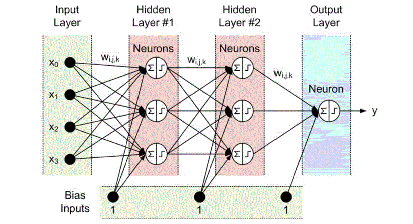

#  Behavior Cloning 자동차 제어 파이프라인

## 1️. Blender 데이터 수집

https://github.com/user-attachments/assets/ae59b44d-aa61-4658-b216-20b1203af106

**직진하는 데이터(완벽히 직진하지는 않음)**

### 수집되는 데이터

**상태 정보 (State):**
- `g_pos_x, g_pos_y, g_pos_z`: 차량 위치 (Genesis 좌표계, m)
- `g_qw, g_qx, g_qy, g_qz`: 차량 자세 (쿼터니언)
- `g_lin_vx, g_lin_vy, g_lin_vz`: 선속도 (m/s)
- `g_ang_vx, g_ang_vy, g_ang_vz`: 각속도 (rad/s)

**제어 정보 (Action):**
- `steer_L, steer_R`: 좌/우 앞바퀴 조향각 (rad)
- `spin_FL, spin_FR, spin_RL, spin_RR`: 네 바퀴 회전속도 (rad/s)

---

###  데이터 추출 공식

#### **1. 위치 변환 (Blender → Genesis)**
```
[g_pos_x]   [ 0  -1   0]   [pos_B_x]
[g_pos_y] = [ 1   0   0] × [pos_B_y]
[g_pos_z]   [ 0   0   1]   [pos_B_z]
                R_B2G
```

**각 변수 설명:**
- `pos_B`: Blender 좌표계에서의 위치 (전방=-Y, 우측=+X, 위=+Z)
- `g_pos`: Genesis 좌표계에서의 위치 (전방=+X, 우측=+Y, 위=+Z)
- `R_B2G`: Blender → Genesis 좌표 변환 행렬 (Z축 기준 +90도 회전)

**왜 위치 변환을 하는가 :**
두 시뮬레이터의 좌표계가 다르기 때문
- Blender의 -Y → Genesis의 +X (전방): `g_pos_x = -pos_B_y`
- Blender의 +X → Genesis의 +Y (우측): `g_pos_y = pos_B_x`
- Blender의 +Z → Genesis의 +Z (위): `g_pos_z = pos_B_z`

---

#### **2. 선속도**
```
vel_B(t) = [pos_B(t) - pos_B(t-1)] / Δt

[g_lin_vx]   [ 0  -1   0]   [vel_B_x]
[g_lin_vy] = [ 1   0   0] × [vel_B_y]
[g_lin_vz]   [ 0   0   1]   [vel_B_z]
                 R_B2G
```

**각 변수 설명:**
- `pos_B(t)`: 현재 프레임의 Blender 위치
- `pos_B(t-1)`: 이전 프레임의 Blender 위치
- `Δt`: 프레임 간 시간 간격 (초)
- `vel_B`: Blender 좌표계에서의 속도 벡터
- `g_lin_v`: Genesis 좌표계에서의 선속도

**왜 위 식을 적용했는가 :**
속도는 위치의 시간 미분.   
물리 엔진의 내부 속도 대신, 실제 위치 변화를 측정하여 수치 미분으로 계산  
 계산 후 Genesis 좌표계로 변환

---

#### **3. 각속도 (쿼터니언 미분)**
```
Δq = q(t-1)* ⊗ q(t)

ω_B = axis(Δq) × angle(Δq) / Δt <- 각속도 = 회전축 × (회전각 / 시간)

[g_ang_vx]   [ 0  -1   0]   [ω_B_x]
[g_ang_vy] = [ 1   0   0] × [ω_B_z]
[g_ang_vz]   [ 0   0   1]   [ω_B_y]
                 R_B2G
```

**각 변수 설명:**
- `q(t)`: 현재 프레임의 쿼터니언 (자세)
- `q(t-1)*`: 이전 프레임 쿼터니언의 켤레 (역회전)
- `Δq`: 두 프레임 사이의 상대 회전
- `axis(Δq)`: 회전축 방향 (단위 벡터)
- `angle(Δq)`: 회전 각도 (라디안)
- `ω_B`: Blender 좌표계에서의 각속도 벡터

**왜 이 식을 적용했는가 :**
각속도는 자세의 시간 미분.  
쿼터니언의 변화량에서 회전축과 회전각을 추출하여 각속도를 구함.  

  

## 2. MLP 설계




**6 -> 64 -> 64 -> 2**

###  전체 구조 개요
```
Input: 6D → Hidden: 64D → Hidden: 64D → Output: 2D
```

---

###  계층별 상세 구조

#### **Layer 1: Input → Hidden 1**
```
x ∈ ℝ⁶  (입력: 6차원 상태 벡터)
   ↓
z₁ = W₁·x + b₁,  W₁ ∈ ℝ⁶⁴ˣ⁶, b₁ ∈ ℝ⁶⁴
   ↓
h₁ = ReLU(z₁) = max(0, z₁)
   ↓
h₁ ∈ ℝ⁶⁴
```

**파라미터 수:** `6 × 64 + 64 = 448`

---

#### **Layer 2: Hidden 1 → Hidden 2**
```
h₁ ∈ ℝ⁶⁴
   ↓
z₂ = W₂·h₁ + b₂,  W₂ ∈ ℝ⁶⁴ˣ⁶⁴, b₂ ∈ ℝ⁶⁴
   ↓
h₂ = ReLU(z₂) = max(0, z₂)
   ↓
h₂ ∈ ℝ⁶⁴
```

**파라미터 수:** `64 × 64 + 64 = 4,160`

---

#### **Layer 3: Hidden 2 → Output**
```
h₂ ∈ ℝ⁶⁴
   ↓
z₃ = W₃·h₂ + b₃,  W₃ ∈ ℝ²ˣ⁶⁴, b₃ ∈ ℝ²
   ↓
y = tanh(z₃) = (e^z₃ - e^(-z₃))/(e^z₃ + e^(-z₃))
   ↓
y ∈ ℝ²  (출력: [-1, 1]²)
```

**파라미터 수:** `2 × 64 + 2 = 130`

---

### 전체 파라미터

**총 파라미터:** `448 + 4,160 + 130 = 4,738`

---

## 입력을 6차원을 설계한 이유(왜 위치/자세를 사용하면 안 되는가?)

### **입력: 차량의 속도 정보만 사용**
```python
x = [g_lin_vx, g_lin_vy, g_lin_vz, g_ang_vx, g_ang_vy, g_ang_vz]ᵀ
```

#### **1. 선속도 3개 (m/s)**
- `g_lin_vx`: **전방 속도** - 차량이 앞으로 얼마나 빠르게 가는가
- `g_lin_vy`: **좌우 속도** - 드리프트나 미끄러짐
- `g_lin_vz`: **상하 속도** - 점프나 낙하 (지면 주행 시 거의 0)

#### **2. 각속도 3개 (rad/s)**
- `g_ang_vx`: **Roll 각속도** - 좌우 기울기 변화
- `g_ang_vy`: **Pitch 각속도** - 앞뒤 기울기 변화  
- `g_ang_vz`: **Yaw 각속도** - 좌우 회전 (조향과 밀접한 관련)

---


### **시나리오: 직진 주행 학습**

---

### **케이스 1: 위치를 입력으로 사용하는 경우** (잘못된 경우)

#### **학습 데이터:**

Blender에서 차량이 원점에서 시작해서 직진하는 데이터 수집:
```
프레임 1: pos = (0, 0) → 직진 → action = [0, 0.8]
프레임 2: pos = (1, 0) → 직진 → action = [0, 0.8]
프레임 3: pos = (2, 0) → 직진 → action = [0, 0.8]
...
프레임 100: pos = (99, 0) → 직진 → action = [0, 0.8]
```

**신경망이 학습하는 패턴:**
```
"pos = (0, 0)일 때 → 직진"
"pos = (1, 0)일 때 → 직진"
"pos = (2, 0)일 때 → 직진"
...
```

#### **문제 발생: Genesis에서 다른 위치에서 시작**
```
Genesis에서 pos = (100, 50)에서 시작
       ↓
신경망: "어? (100, 50)는 학습 데이터에 없는데?"
       ↓
결과: 엉뚱한 제어 or 정지
```

**왜?**
- 신경망은 **(0, 0) ~ (99, 0) 구간**만 학습했음
- **(100, 50)이라는 위치**는 처음 봄
- 위치 자체가 제어 결정에 영향을 줌 → **위치 의존적**

---

###  **케이스 2: 속도만 사용하는 경우** (올바른 경우)

#### **학습 데이터:**
```
프레임 1: vel = (0, 0) → 가속 → action = [0, 0.8]
프레임 2: vel = (1, 0) → 유지 → action = [0, 0.7]
프레임 3: vel = (3, 0) → 유지 → action = [0, 0.7]
프레임 4: vel = (5, 0) → 유지 → action = [0, 0.6]
...
```

**신경망이 학습하는 패턴:**
```
"속도가 0일 때 → 강하게 가속"
"속도가 1 m/s일 때 → 조금 가속"
"속도가 5 m/s일 때 → 속도 유지"
```

#### **Genesis에서 어디서든 작동:**
```
Genesis에서 pos = (100, 50), vel = (0, 0)에서 시작
       ↓
신경망: "속도가 0이네? → 강하게 가속!"
       ↓
결과:  정상 작동

Genesis에서 pos = (-50, 200), vel = (0, 0)에서 시작
       ↓
신경망: "속도가 0이네? → 강하게 가속!"
       ↓
결과:  정상 작동
```

**왜?**
- 신경망은 **속도 패턴**만 학습했음
- **위치와 무관**하게 "현재 얼마나 빠른가"만 중요
- 어디서든 동일한 속도면 → 동일한 제어

---

##  자세(방향) 문제도 동일

###  **케이스 1: 자세를 입력으로 사용** (잘못된 경우)

#### **학습 데이터: 북쪽(0°)으로만 주행**
```
Blender에서 차량이 항상 북쪽(yaw = 0°)을 향하며 직진:

프레임 1: yaw = 0° → 직진 → action = [0, 0.8]
프레임 2: yaw = 0° → 직진 → action = [0, 0.8]
프레임 3: yaw = 0° → 직진 → action = [0, 0.8]
```

**신경망이 학습:**
```
"북쪽(0°)을 향할 때 → 직진하면 됨"
```

#### **문제 발생: Genesis에서 동쪽(90°)을 향함**
```
Genesis에서 yaw = 90° (동쪽)로 시작
       ↓
신경망: "어? 90°는 학습 안 했는데?"
       ↓
결과: 이상한 제어 (북쪽으로 가려고 함)
```

**왜?**
- 신경망은 **절대 방향(북쪽)**과 제어를 연결지음
- 다른 방향에서는 학습한 패턴이 맞지 않음

---

###  **케이스 2: 각속도만 사용** (올바른 경우)

#### **학습 데이터:**
```
프레임 1: ang_vz = 0 → 직진 중 → action = [0, 0.8]
프레임 2: ang_vz = 0.5 → 좌회전 중 → action = [0.3, 0.7]
프레임 3: ang_vz = -0.3 → 우회전 중 → action = [-0.2, 0.7]
```

**신경망이 학습:**
```
"회전 안 함(ang_vz=0) → 직진 유지"
"좌회전 중(ang_vz>0) → 좌회전 계속"
"우회전 중(ang_vz<0) → 우회전 계속"
```

#### **Genesis에서 어느 방향이든 작동:**
```
북쪽(0°)을 향하든, 동쪽(90°)을 향하든, 남쪽(180°)을 향하든
       ↓
현재 회전 중인가? (ang_vz를 확인)
       ↓
신경망: "현재 회전 안 함? → 직진!"
       ↓
결과:  모든 방향에서 작동
```

---

##  입력이 6차원인 이유 정리

### **위치/자세를 쓰면:**
```
학습: "특정 위치/방향에서 어떻게 해야 하는가"
문제: 그 위치/방향이 아니면 못함
→ 일반화 불가능
```

### **속도만 쓰면:**
```
학습: "현재 이렇게 움직이고 있으면 어떻게 해야 하는가"
장점: 위치/방향과 무관하게 작동
→ 일반화 가능
```

## **출력이 2차원인 이유**


Genesis에서 차량을 제어하는 인터페이스는 아래 두 가지로 구성됨.

---

### 1️. 조향 제어 (Steering)

```python
car.control_dofs_position(
    position=[steer_cmd, steer_cmd],
    dofs_idx_local=[fl_steer_idx, fr_steer_idx]
)
```

- `steer_cmd` : 앞바퀴(좌/우)의 조향각

---

### 2️. 구동 제어 (Throttle → Torque)

```python
car.control_dofs_force(
    force=[torque, torque],
    dofs_idx_local=[rl_wheel_idx, rr_wheel_idx]
)
```

- `torque` : 스로틀(throttle) 입력을 기반으로 계산된 구동 토크

---

### 3. 제어 변수 정리

Genesis 차량은 다음 **두 개의 제어 입력**만으로 제어 가능

1. **steer_cmd** — 조향각  
2. **torque** — 구동 토크  

---

### 4. 결론

신경망이 예측해야 하는 제어 변수도 아래 **두 개뿐**이므로  
출력 차원이 자연스럽게 **2차원**으로 결정됨.

```
NN Output = [steer_cmd, torque]
```

즉,

**조향(steering) + 구동(throttle/torque) → 2차원 출력 구조**


## 3. 실행 결과 및 분석


https://github.com/user-attachments/assets/0a5b65bc-2a51-4996-a6c2-baf7048e2317


- steer_cmd가 0.001 ~ 0.005 사이로 거의 완벽히 직진(블렌더 데이터에서도 완벽히 직진하지는 않음)

## Genesis vs Blender 속도 비교

| 항목 | Genesis | Blender |
|------|---------|---------|
| 최고 속도 | **6.00 m/s** | **7.17 m/s** |
| km/h 변환 | 21.60 km/h | 25.82 km/h |
| 차이 | — | **+1.17 m/s (약 19% 더 빠름)** |


