# BLDNER RBC PRO 설정 및 GENESIS 학습 방법

## 1. 차량 import

https://github.com/user-attachments/assets/d2dee773-4524-4b29-9be7-f9f63c1b1d2f

`` 원하는 차량을 선택 후 import -> Rig 자동 생성(선택한 차량의 본체와 각 바퀴의 객체가 자동 생성됨.) 하거나 아래와 같은 방법도 가능 ``

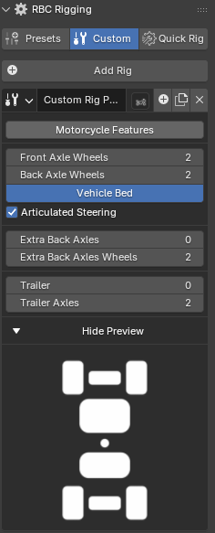  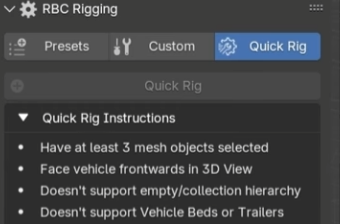

``RBC에서 제공하는 차량 이외의 자신 원하는 차량을 import 한 후. Custom 탭을 이용해 직접 해당 차량의 Rig를 생성 가능     
or Quick Rig 탭을 이용해 자동으로 Rig 생성(단. 조건 존재).``

## 2. 구동계 설정

### RBC Tuning: 휠 & 타이어 설정 가이드

이 패널은 바퀴의 움직임(기구학)과 타이어의 마찰 특성(동역학)을 제어하는 곳

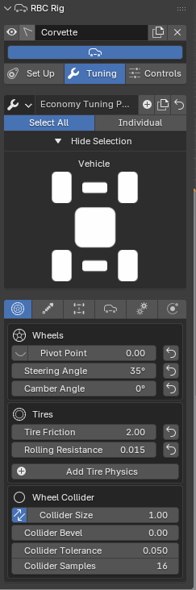

#### 1. Wheels (휠 기하학 및 조향)
* **Pivot Point (회전 중심점):** 바퀴가 회전하는 축의 위치를 미세 조정. 휠 메쉬의 원점이 정중앙이 아닐 때 사용.
* **Steering Angle (최대 조향각):** 핸들을 끝까지 꺾었을 때 앞바퀴가 돌아가는 최대 각도.
    * *제네시스 시뮬레이션 팁:* 일반 승용차는 보통 **30°~40°** 사이. 실제 차량의 회전 반경을 맞출 때 이 값을 조절.
* **Camber Angle (캠버 각):** 바퀴를 정면에서 봤을 때의 기울기입니다.
    * 레이싱 카처럼 바퀴를 안쪽으로 기울여(네거티브 캠버) 코너링 안정성을 높일 때 사용. 일반 주행 시뮬레이션에서는 **0°**가 기본.

#### 2. Tires (타이어 물성 - 핵심)

* **Tire Friction (타이어 마찰 계수):** 타이어가 노면을 움켜쥐는 힘(Grip)
* **Rolling Resistance (구름 저항):** 차가 굴러갈 때 저절로 속도가 줄어드는 정도. 타이어의 변형이나 공기압에 의한 에너지 손실을 모사.

#### 3. Wheel Collider (물리 충돌체 설정)
실제 눈에 보이는 바퀴(Mesh) 대신, 물리 엔진이 계산에 사용하는 **'보이지 않는 원통형 충돌체'** 설정입니다.

* **Collider Size:** 충돌체의 크기 비율. `1.00`이면 3D 모델 크기와 동일하게 설정. 바퀴가 땅에 파묻히거나 떠 있다면 이 값을 조절.
* **Collider Samples / Tolerance:** 충돌 감지의 정밀도. 차가 고속 주행 시 바닥을 뚫고 떨어지거나 덜덜 떨린다면 **Samples** 값을 올려서(예: 32) 계산 정확도를 높여야 함
---

### RBC Tuning: 서스펜션(Suspension) 설정 가이드

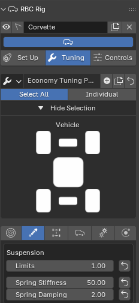

#### 1. Limits (서스펜션 가동 범위)
서스펜션이 위아래로 움직일 수 있는 최대 범위(Stroke)를 설정.

* **기능:** 바퀴가 차체 안으로 얼마나 들어갈 수 있는지, 혹은 공중으로 떴을 때 얼마나 아래로 처질 수 있는지를 결정.

#### 2. Spring Stiffness (스프링 강성 - $k$)
차체의 무게를 지탱하고 충격을 흡수하는 스프링의 '단단한 정도'. 물리 공식 $F = -kx$에서의 $k$ 값에 해당.

* **값이 높음 (Stiff):** 서스펜션이 딱딱해집니다.
    * 코너를 돌 때 차가 좌우로 기울어지는 현상(Rolling)이 줄어들어 민첩한 주행이 가능합니다.
    * *단점:* 요철을 지날 때 차가 튀어 오르며 승차감이 나빠집니다. (스포츠카 세팅)
* **값이 낮음 (Soft):** 서스펜션이 부드러워집니다.
    * 노면의 충격을 잘 흡수하여 승차감이 좋아집니다.
    * *단점:* 코너링 시 차가 휘청거리거나 급제동 시 앞부분이 쏠리는(Nose Dive) 현상이 심해집니다. (일반 세단/승합차 세팅)

#### 3. Spring Damping (댐핑/감쇠력 - $c$)
스프링의 출렁거림을 억제하는 **쇼크 업소버(Shock Absorber)**의 저항값. 스프링이 한 번 수축했다가 다시 펴질 때, 그 진동을 얼마나 빨리 멈추게 할지 결정.

---

### RBC Tuning: Drivetrain (구동 및 조향) 설정 가이드

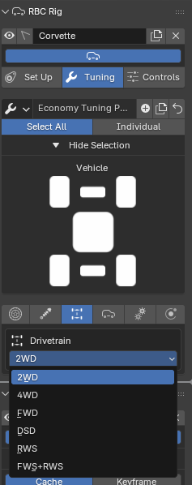

#### 1. Drive Modes (구동 방식 - 동력 전달)

엔진의 힘을 노면으로 전달하는 방식을 선택합니다.

* **FWD (Front Wheel Drive - 전륜 구동):** 
    
* **2WD (Two Wheel Drive - 후륜 구동):** 

* **4WD (Four Wheel Drive - 사륜 구동):** 
   
#### 2. Steering & Special Modes (특수 조향 및 구동)

일반적인 자동차(앞바퀴 조향)와 다른 특수한 움직임을 구현할 때 사용.

* **RWS (Rear Wheel Steering - 후륜 조향):** 뒷바퀴로 방향을 조절합니다.

* **FWS+RWS (All Wheel Steering - 사륜 조향):** 앞바퀴와 뒷바퀴가 동시에 움직입니다.
    
* **DSD (Differential Steering Drive - 스키드 스티어링):** 핸들 조향 각도가 아닌, 좌우 바퀴의 회전 

---

### RBC Tuning: Engine (엔진 & 변속기) 설정 가이드

이 패널은 차량의 심장인 엔진의 출력 특성과 기어 변속 로직을 제어.

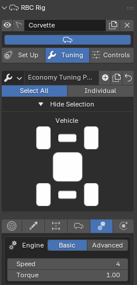

#### 1. Basic Mode (아케이드 설정)
물리적인 계산보다는 단순히 '빠르기'만 조절하고 싶을 때 사용하는 간편 모드. 

* **Speed:** 차량의 최고 속도 제한을 설정합니다.
* **Torque:** 가속력의 세기를 단순 수치로 설정합니다.

#### 2. Advanced Mode (리얼리스틱 설정 - 핵심)

실제 차량의 **토크 곡선(Torque Curve)**과 **기어비(Gear Ratio)**를 입력하여 물리적으로 정확한 거동을 구현.

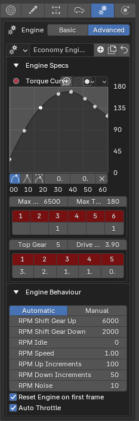

**A. Torque Curve (토크 곡선 그래프)**
엔진이 특정 RPM(분당 회전수)에서 뿜어내는 힘(Torque)의 변화를 그래프로 그림.
* **X축 (가로):** RPM (x100). 예를 들어 `30`은 3,000 RPM을 의미.
* **Y축 (세로):** 토크 값.

**B. Transmission & Gear Ratios (변속기 기어비)**
엔진의 회전수를 바퀴에 전달하는 비율.

* **Top Gear:** 기어의 총 단수.
* **Drive Ratio (종감속 기어비 - Final Drive):** 변속기를 거친 동력이 바퀴로 가기 전 마지막으로 감속되는 비율.
    * *값이 높음 (예: 4.10):* 가속력이 좋아지지만 최고 속도는 낮아짐. (트럭, 가속 중심).
    * *값이 낮음 (예: 3.00):* 가속은 더디지만 최고 속도가 높아지고 연비 주행에 유리.
* **Gear Ratios (각 단 기어비):** `1`단부터 `5`단까지 각각의 기어 비율.
    * **1단:** 출발용이므로 숫자가 가장 높음. (힘이 셈).
    * **고단:** 숫자가 1.0 이하(Overdrive)로 떨어지며 고속 항속 주행용.

**C. Engine Behaviour (변속 로직 - 오토매틱)**
자동 변속기가 언제 기어를 바꿀지 결정하는 '두뇌' 설정.

* **RPM Shift Gear Up (6000):** 엔진 회전수가 이 값에 도달하면 다음 단으로 변속(Shift Up).
    * *스포츠 모드:* 이 값을 높게 잡아 엔진을 끝까지 쥐어짜며 가속하게 함.
    * *에코 모드:* 이 값을 낮게(예: 2500) 잡아 빠르게 고단으로 넘어가게 함.
* **RPM Shift Gear Down (2000):** 회전수가 이 값보다 떨어지면 힘이 부족하다고 판단해 아랫단으로 변속(Shift Down).

---

### RBC Tuning: Physics (물리 보정 및 주행 보조) 설정 가이드

이 패널은 차량의 접지력을 인위적으로 보정하거나(Downforce), 주행 안정을 돕는 전자 장비(TCS)를 설정하여 **'운전의 편의성'**을 결정.

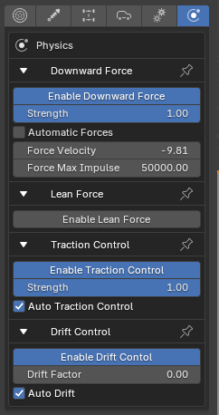

#### 1. Downward Force (다운포스 / 접지력 보정)
차량을 지면으로 꾹 눌러주는 가상의 힘을 적용.

* **Enable Downward Force:** 활성화 여부를 결정.
* **Strength:** 누르는 힘의 세기.
    * **기능:** 실제 자동차의 **에어로다이내믹(공기역학) 다운포스**를 흉내. 게임 물리 엔진 특성상 차가 가벼워 붕 뜨거나 전복되는 것을 막아줌.
  
#### 2. Lean Force (인공적인 쏠림)
코너를 돌 때 차체를 억지로 기울이는 기능.

* **Enable Lean Force:** 활성화 여부를 결정.

#### 3. Traction Control (TCS - 구동력 제어 장치)
급출발 시 타이어가 헛도는(Wheel Spin) 것을 방지.

* **Strength:** 개입 강도입니다. `1.0`이면 타이어 미끄러짐을 완전히 차단.
* **Auto Traction Control:** 상황에 따라 자동으로 개입.
  
#### 4. Drift Control (드리프트 어시스트)
차가 미끄러질 때 스핀하지 않고 각도를 유지하도록 도와주는 '아케이드성' 보조 기능.

* **Drift Factor:** 값이 높을수록 차가 옆으로 미끄러지는 상태를 유지하기 쉬워짐.

---

## 3. 주행 경로 설정

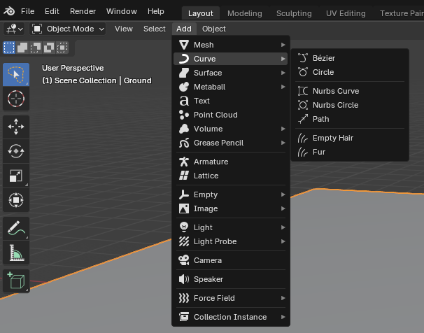

`` curve에 있는 bezier, circle, path 등의 옵션을 선택해 원하는 모양의 경로를 직접 그려 생성 ``

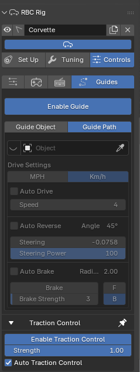

`` controls의 guides 선택 후 Enalbe Guide를 클릭 해 활성화 ``

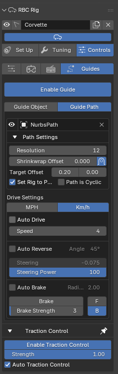

`` 위에서 만들어둔 경로를 선택 후 옵션 설정(자세한 내용은 아래 내용 참조)``

### RBC Controls: Guides (자율주행 및 경로 추적) 설정 가이드

이 패널은 차량이 블렌더의 커브(Curve) 객체를 인식하여 **스스로 핸들을 돌리고 가속/감속**하도록 만드는 **'가상 운전자(Virtual Driver)'** 시스템.   
->``경로 위에 타겟점을 두어 그 타겟점이 움직여 차량이 따라가게 함.``(**[[26-01-11] RL_Vehicle_Control](https://github.com/hhjae1/Genesis_AI-REPORT/blob/main/%5B26-01-11%5D%20RL_Vehicle_Control.md)** 여기서 설명했던 내용과 같음.)

#### 1. Guide Mode (주행 모드 선택)
* **Enable Guide:** 이 버튼을 눌러야 경로 추적 기능이 활성화.
* **Guide Path:** 미리 그려둔 선(Curve)을 따라가게 함. 
* **입력창 (NurbsPath):** 차량이 따라갈 경로(Curve) 오브젝트를 지정하는 곳.

#### 2. Path Settings (경로 추종 알고리즘)
차량이 선을 어떻게 따라갈지 결정하는 **조향(Steering) 알고리즘** 설정.

* **Target Offset (전방 주시 거리 / Look-ahead Distance):**
    * 차량이 현재 위치보다 **'얼마나 앞을 보고'** 핸들을 꺾을지 결정.(타겟점을 차량보다 얼마나 앞에 위치시킬 것인지)   
    ->  **[[26-01-11] RL_Vehicle_Control](https://github.com/hhjae1/Genesis_AI-REPORT/blob/main/%5B26-01-11%5D%20RL_Vehicle_Control.md)** 에서 다루었던 내용 
    
* **Set Rig to Path:** 체크하면 시뮬레이션 시작 시 차량을 경로의 출발점으로 순간 이동시킵니다.

#### 3. Drive Settings (속도 제어)
차량의 가속과 감속을 제어.

* **Km/h vs MPH:** 속도 단위를 선택. 
* **Auto Drive:** 체크하면 설정된 **Speed**에 도달하도록 자동으로 엑셀을 밟음. (크루즈 컨트롤).
* **Auto Reverse:** 막다른 길이나 좁은 코너에서 차가 끼었을 때, 자동으로 후진하여 탈출하는 기능.
* **Auto Brake (코너링 감속):**
    * **Radius:** 커브의 회전 반경이 이 값보다 작으면(급커브면) 브레이크를 밟음.
    * **Brake Strength:** 그때 밟을 브레이크의 강도.
    * *기능:* 실제 레이서처럼 직선에서는 빠르게 달리고, 코너 앞에서는 속도를 줄이는 똑똑한 주행을 구현.

https://github.com/user-attachments/assets/dd35077a-38db-419b-8042-90946347b02e

---

### RBC Environment: 주행 경로 구간별 마찰 계수 설정 (Variable Friction)

* **Environment Side (지면 설정):** 도로 바닥면(Mesh) 자체가 가지는 물리적 거칠기입니다. RBC는 바닥 객체의 Rigid Body 속성을 읽어옵니다.

#### 2. 구간별 차등 적용 방법 (Step-by-Step)
하나의 통짜 도로 메쉬(Mesh)에서는 위치마다 다른 마찰력을 줄 수 없음. 따라서 다음 절차를 따라 물리 환경을 구축해야 합니다.

1.  **도로 분리 (Split Object):**
    * 주행 경로를 '일반 구간', '미끄러운 구간(예: 빗물 웅덩이)', '급제동 구간' 등 목적에 맞춰 **여러 개의 오브젝트(Object)로 물리적으로 분리**하여 배치.
2.  **RBC Ground Collection 등록:**
    * 분리한 지면 객체들을 RBC가 인식할 수 있도록 **RBC Ground Collection**에 등록하여 관리.
3.  **개별 마찰력 부여 (Surface Response):**
    * 각 지면 객체의 **Rigid Body 설정(Physics Properties)** 탭으로 이동.
    * **Friction(마찰)** 값을 구간 특성에 맞게 다르게 입력합니다.
       

---

## 4. 데이터 추출 

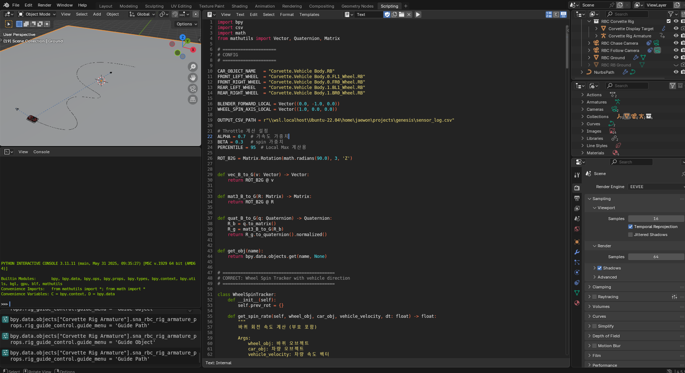

``Scripting에 들어가 데이터 추출 코드를 직접 작성한 후 실행하여 추출``

-> **[blender_data 추출 코드](https://github.com/hhjae1/Genesis_AI-REPORT/blob/main/res/blender_data_extraction.py)**

---

## 5. Genesis 학습 방법

위에서 추출한 데이터를 **[[26-01-11] RL_Vehicle_Control](https://github.com/hhjae1/Genesis_AI-REPORT/blob/main/%5B26-01-11%5D%20RL_Vehicle_Control.md)** 에서와 같이 ``mlp에 입력값으로 넣어 학습``