# Genesis 차량 자율주행 파이프라인

Blender(RBC/Bullet) → Genesis Sim2Sim · Golden Truth → BC → Residual RL
대상 기간 2025-11 ~ 2026-08

> **한 줄 요약.** Blender에서 **물리적으로 주행 가능한 경로**를 만들고, Genesis에서 그 경로를 재현하는
> **제어 입력(조향·스로틀)을 채굴**해 정답으로 삼음. 이를 MLP로 모방학습(BC)한 뒤, BC를 **고정**한 채
> 강화학습 잔차를 얹어 **외란·미학습 경로**까지 대응함.
>
> **최종 성능:** 미학습 31셀 **31/31 완주**, 경로오차 ≤ 0.32 m (RL 없이는 6/31).

---

## 0. 전체 파이프라인

| 단계 | 내용 | 산출물 | 핵심 결과 |
|---|---|---|---|
| ① 차량 | Ray-wheel URDF + Pacejka 타이어 | `car_raywheel.urdf` | mesh 접촉 대비 물리 정확·속도 우월 |
| ② 경로 | 도로규격 s,t 설계 → Blender bake | raw 경로 CSV | 주행 가능(feasible) 목표 궤적 |
| ③ 골든 | MPPI + Optuna로 제어 입력 채굴 | golden truth CSV | drift 0.148 m |
| ④ BC | 상태→제어 MLP 모방학습 | `model_chunk*` | 횡오차 ≤ 0.10 m |
| ⑤ RL | BC 고정 + PPO 잔차 + brake | `rlsch_v4` | 미학습 31셀 31/31 |

---

## 1. 차량 모델 — Ray-Wheel + Pacejka

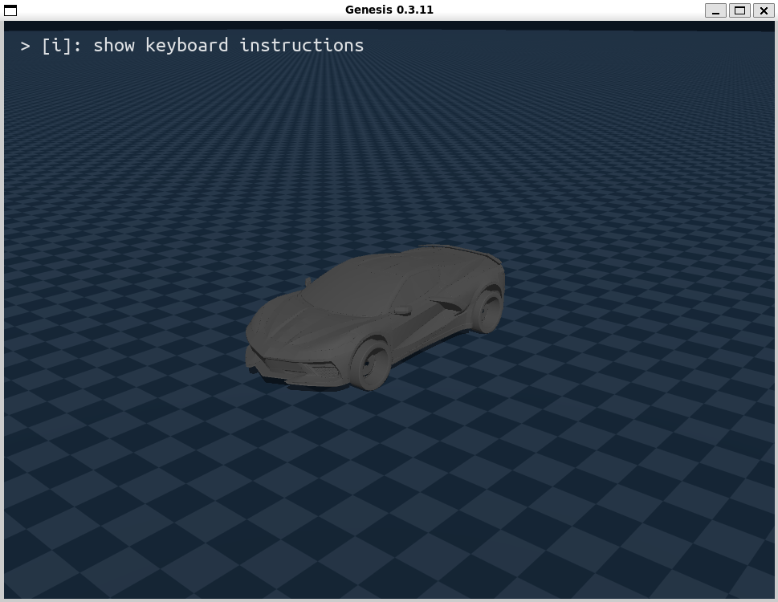

### 1.1 구조

- 4륜: 전륜 **조향 + 제동**, 후륜 **구동 + 제동**. 제동 배분 전륜 60 / 후륜 40 (실차 front-biased 반영)
- 자유도 16 = 차체 free 6 + 서스펜션 prismatic 4 + 전륜 조향 2 + 휠 회전 4
- **차체만 collision 유지, 바퀴 collision 제거** → 바퀴 접지는 ray-cast로 대체

### 1.2 서스펜션 조인트 — fixed로 바꿨다가 되돌린 이유

ray가 이미 외력을 차체에 넣으므로 조인트 자유도가 불필요하다고 보고 `fixed`로 바꿨으나,
평형 상태에서 **휠 메시가 지면 위 4.6 cm 부양**함.

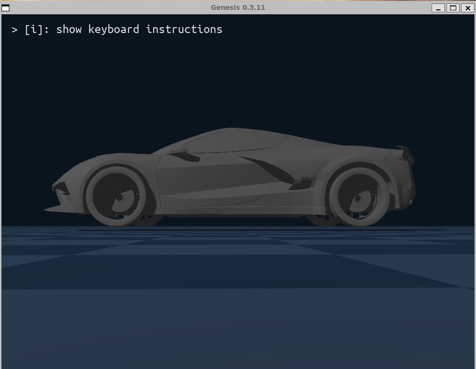

원인은 `fixed`가 **차체 로컬 좌표에 휠을 고정**한다는 데 있음. 차체의 평형 높이는 ray 서스펜션의
압축량으로 *동적으로* 정해지는데, `fixed`는 정적 좌표만 가지므로 이 변화를 따라갈 수 없음.
(물리는 정상이고 시각만 어긋난 상태였음.)

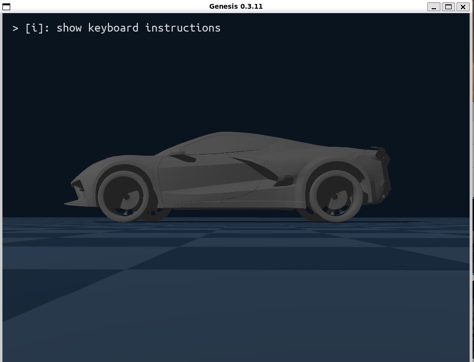

→ `prismatic`으로 되돌리되 **Genesis 스프링은 쓰지 않고**(damping/stiffness = 0) 매 스텝
`joint_pos = 휠반경 − ray거리`로 직접 세팅함. **물리는 ray, 시각 정렬만 조인트**가 담당.
CARLA·Unity Vehicle Physics·Unreal Chaos 등 산업 표준과 같은 방식임.

| 항목 | fixed | prismatic + 동적 정렬 |
|---|---|---|
| 평형 시 휠 바닥 | **+0.046 m (부양)** | **±0.003 m** |
| 지형 등반 시 추종 | × | ✓ 휠별 독립 추종 |

### 1.3 타이어 모델 — Coulomb vs Pacejka

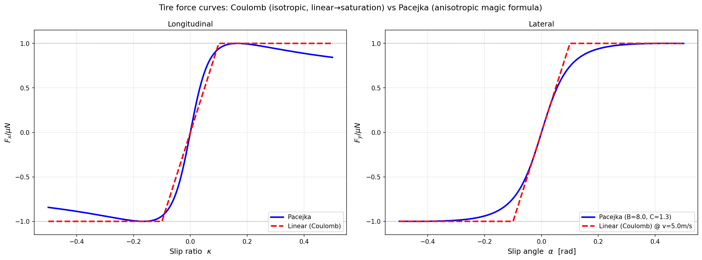

| 항목 | Coulomb (mesh 접촉) | Pacejka (ray-wheel) |
|---|---|---|
| 포화 거동 | 작은 슬립에서 곧장 최대 → 직선 클립 | peak 후 완만한 falloff (실차형) |
| 종/횡 이방성 | × 동일 취급 | ✓ 각각 다른 stiffness |
| 선회 중 가속 | × 횡 슬립 우세 시 종력 소실 | ✓ friction circle로 분배 |

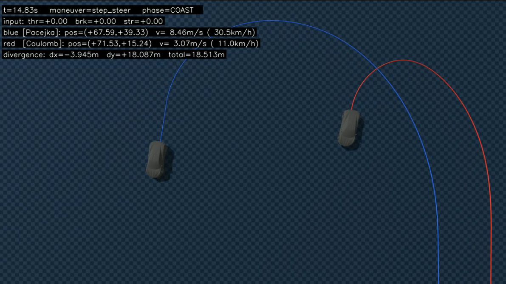

같은 입력(`steer +0.35 rad`)으로 10초 주행 시 두 모델의 궤적 차이가 **약 17.5 m**.
Coulomb(빨강)은 선회 즉시 횡 슬립이 우세해져 종방향 마찰력을 잃고 **급감속 + 작은 회전 반경**이 됨.
Pacejka(파랑)는 friction circle 분배로 종력을 일부 보존해 **속도와 큰 회전 호**를 유지함.

> **왜 ray-wheel인가.** 정확성(임의 타이어 모델 적용 가능)과 속도(충돌 탐색이 `O(4·log N)`,
> mesh 접촉은 삼각형 쌍 전수) 양쪽에서 우월함. 주요 차량 시뮬레이터가 모두 채택한 표준임.

---

## 2. 경로 데이터셋 — 한국 도로규격

「도로의 구조·시설 기준에 관한 규칙」의 설계속도별 최소곡선반경 표를, 임의 곡률 경로에 적용할 수 있도록
**가속도 3개의 한계값**으로 환산함.

| 한계 | 값 | 의미 |
|---|---|---|
| 횡가속도 | ≤ 0.20 g (2.0 m/s²) | 급선회 방지 |
| 종가속도 | 가속 ≤ 2.0 / 감속 ≤ 2.5 m/s² | 급출발·급정거 방지 |
| 완화곡선 jerk | ≤ 0.5 m/s³ | 직선→커브 전이를 부드럽게 (클로소이드) |

**생성 절차**

1. 규격을 만족하는 조향·속도(s,t) 프로파일을 설계
2. Blender RBC 차량에 넣어 Bullet 물리로 주행(bake)
3. **차가 실제로 간 궤적**을 목표 경로로 채택

설계한 곡선이 아니라 주행 결과를 쓰므로 **물리적으로 반드시 주행 가능**함.

seed 1~10 × 8 템플릿 = 80경로 → 규격 위반 4개 제외 → 76경로(완만 곡선).
이후 회전 기동 77경로 추가 → **총 153경로**, 설계속도 36~58 km/h.

---

## 3. Golden Truth 채굴 — MPPI + Optuna

### 3.1 MPPI

샘플링 기반 확률적 MPC. 매 프레임 다음을 수행함.

1. warm-start에 가우시안 노이즈를 더해 N=2048개 제어 시퀀스 생성 (horizon 10)
2. Genesis에서 각각 forward 시뮬레이션
3. 비용 평가
4. `w_i = exp(−cost_i / λ)` 가중평균
5. **첫 스텝만** 실제 환경에 적용하고 한 칸 전진

비용은 7항(위치·곡률·속도·방향·평활도·FF 앵커·가속) + 온도 λ = **하이퍼파라미터 8개**.
Genesis가 미분 불가능해도 동작하는 것이 장점임.

### 3.2 Grid Search → Optuna (TPE)

격자 탐색은 차원이 늘면 조합이 폭증함. Optuna는 초기 10 trial만 무작위로 뽑고, 이후 결과를
상위/하위로 나눠 각각의 파라미터 분포 `l(x)`, `g(x)`를 학습해 `l(x)/g(x)`가 큰 방향으로 샘플링함.

| 방식 | 결과 |
|---|---|
| Grid search (mesh 접촉 시절) | drift 0.52 m |
| **Optuna TPE (dual-scene ray-wheel)** | **drift 0.148 m** — 3.5배 개선 |

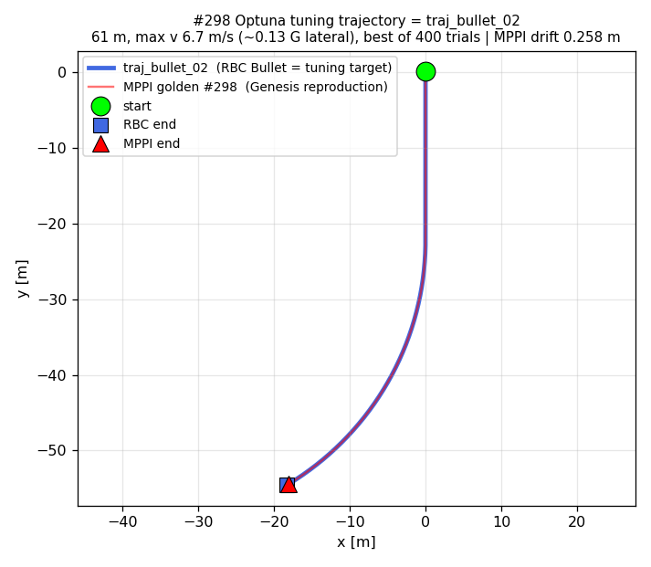

파랑(RBC Bullet, 튜닝 대상)과 빨강(MPPI golden, Genesis 재현)이 거의 완전히 겹침(drift 0.258 m).
이 최적 파라미터(`#298`)를 **다른 153경로에 그대로 적용**해 골든을 추출, 파라미터의 경로 일반화를 확인함.

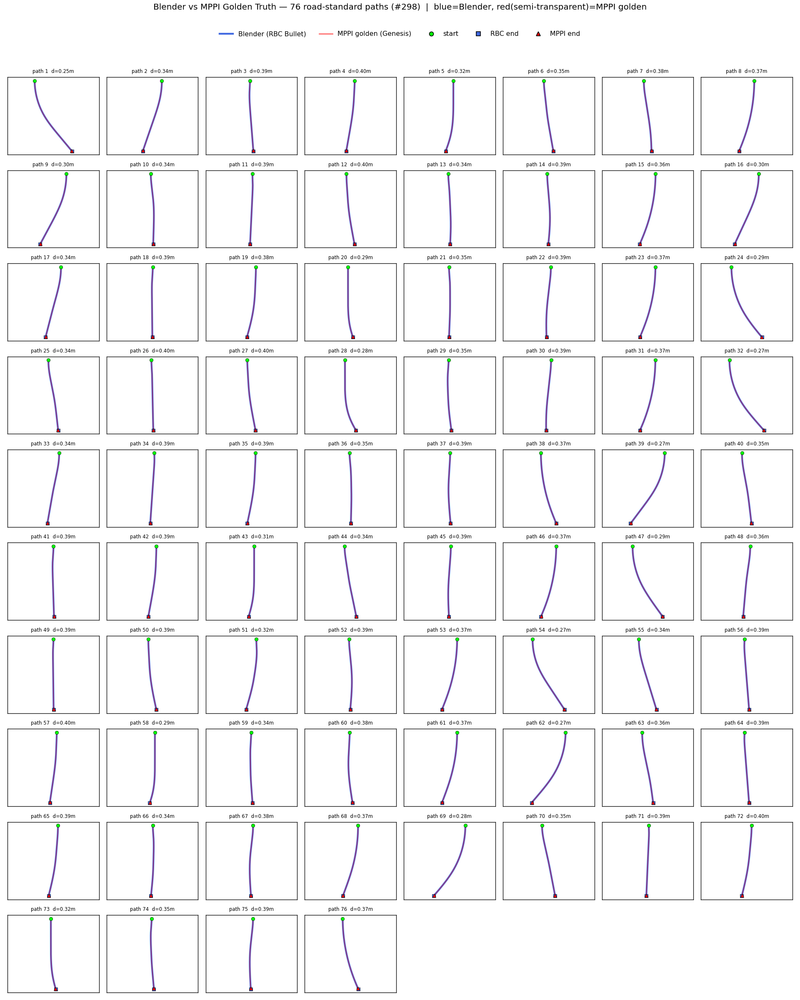

각 subplot이 한 경로임. 파랑 = Blender(RBC Bullet), 빨강 = MPPI golden(Genesis 재현) — 겹치면 보라색.

---

## 4. BC — 상태에서 제어로 (path2st)

### 4.1 입출력 설계

| 구분 | 차원 | 내용 |
|---|---|---|
| 출력 | 2 | (throttle, steer), Tanh |
| 입력 | 3 | 추종오차: Δv, Δheading, cross-track error |
| | 2 | 현재상태: v, κ |
| | 2 | 이전제어: prev_throttle, prev_steer |
| | 20 | 미리보기: 앞 10스텝 곡률 κ[+1..+10] + 속도 v[+1..+10] |

> **왜 위치·자세를 입력에 넣지 않는가.** 절대 위치/자세를 넣으면 정책이 "어디에 있는가"를 외워버려
> 새 경로에서 무너짐. 속도·오차·곡률 같은 **지역(local) 상대량**만 넣어야 경로가 바뀌어도
> 같은 규칙이 성립함.

### 4.2 학습 결과

| 항목 | 값 |
|---|---|
| 모델 | MLP 27 → [128, 128] → 2, 20,354 params |
| 데이터 | 153경로 → 궤적 단위 train 130 / holdout 23 |
| train / val MSE | 2.7e-5 / 3.0e-5 → **과적합 없음** |

### 4.3 폐루프 평가 — 설계 도형 5종

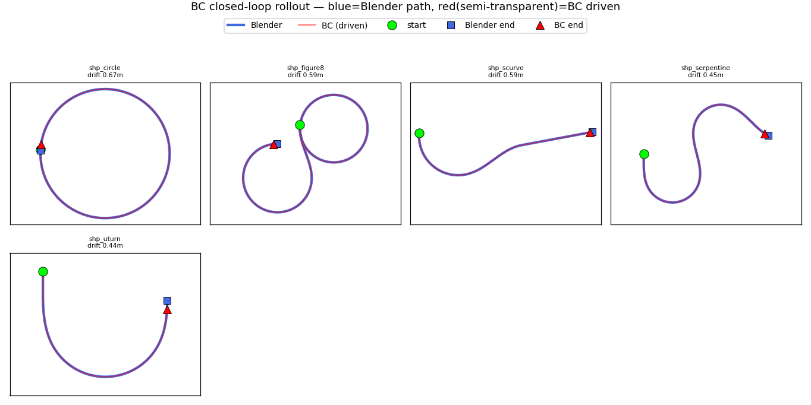

파랑(Blender) vs 빨강(BC)이 전 구간 겹침(겹치면 보라색).

| 도형 | 설계속도 | drift | 횡오차(cte) | 종방향 | 속도오차 |
|---|---|---|---|---|---|
| 원 (360°) | 27 km/h | 0.673 m | **0.099 m** | 0.673 m | 0.016 m/s |
| 8자 | 24 km/h | 0.586 | **0.058** | 0.586 | 0.009 |
| S커브 | 27 km/h | 0.571 | **0.072** | 0.571 | 0.021 |
| serpentine | 18 km/h | 0.436 | **0.044** | 0.435 | 0.013 |
| U턴 | 19 km/h | 0.212 | **0.071** | 0.208 | 0.046 |

> **BC의 구조적 한계가 여기서 드러남.** 횡오차는 10 cm 이하로 도로 모양을 완벽히 유지하지만,
> **drift가 거의 전부 종방향**임(원 0.673 m 중 0.673 m). 입력 27차원에 횡오차는 있으나
> **종방향 위치오차가 없어** 밀린 것을 스스로 되돌릴 피드백이 없음.
> → RL 잔차가 필요한 직접적 근거.

---

## 5. 구동계 민감도 — 왜 적응이 필요한가

학습된 4경로에서 구동계 파라미터만 바꿔(One-factor-at-a-time) 순수 영향을 측정함.
미학습 경로를 쓰면 "파라미터 탓인지, 처음 보는 경로라 못 따라가는 것인지" 분리가 불가능하기 때문임.

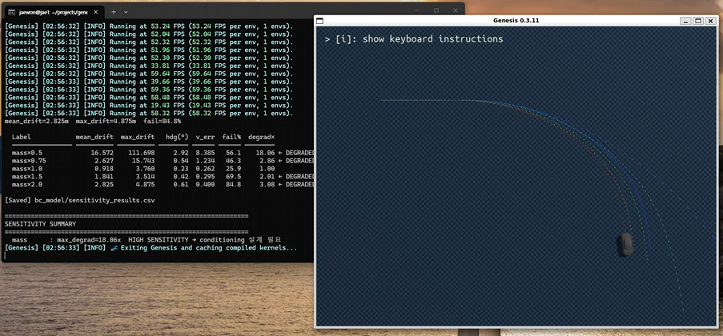

| 파라미터 | 결과 | 해석 |
|---|---|---|
| **질량** | ×0.5 → 10.3 m (8.7배), ×2.0 → 3.62 m (3.1배) | 유일한 민감 인자. 코너링 관성 변화라 속도 피드백으로 보상 불가 |
| 마찰 | 1.04~1.44 m로 평탄 | Genesis 접촉 마찰 = max(타이어, 지면) → 지면이 지배해 실험 무의미 |
| 토크 | 1.15~1.19 m로 평탄 | BC가 속도오차를 보고 스로틀을 올려 흡수(폐루프) |

질량 변화는 **BC 구조로는 보상 불가**함. 이것이 잔차 적응(Residual Adapter)의 설계 근거가 됨.

---

## 6. Residual RL — BC 고정 + PPO 잔차

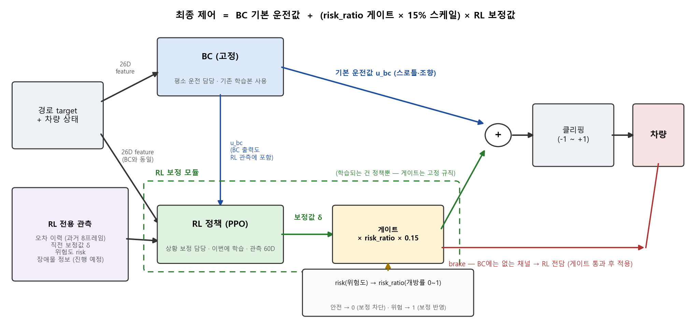

**최종 제어 = BC 기본값 + (위험할 때만, 조금만 섞이는) RL 보정.**

- **BC (고정)** — 평상시 담당. 기존 학습본 그대로 사용해 **BC 성능이 하한으로 보존**됨
- **RL (PPO)** — 보정 담당. BC가 못 따라가는 상황·외란을 잡음. **brake는 RL 전담**(BC 출력에 없는 채널)
- **위험도 게이트 (soft intervention)** — 안전하면 0(BC 그대로), 위험하면 1.
  게이트가 열려도 보정 크기는 **BC 출력 범위의 15%**로 제한

```
risk       = 1.0·|cte| + 2.0·|Δheading| + 0.3·|Δv| + 0.3·v·max|κ_lookahead|
risk_ratio = clip((risk − 0.5) / (1.5 − 0.5), 0, 1)
throttle   = clip(u_bc_thr + risk_ratio · 0.15 · δ_thr, −1, 1)
steer      = clip(u_bc_str + risk_ratio · 0.15 · δ_str, −1, 1)
brake      = risk_ratio · clip(b, 0, 1)
```

게이트 하한 0.5는 정상 주행의 위험도 수준(실측 캘리브레이션)임 — 초기값 0.15에서는 과잉 보정으로
BC를 망침. 스케일 0.15도 실측 경계값(0.2 = BC 파괴 / 0.05~0.1 = 무력)의 중간임.

**관측 60D** = BC feature 26 + BC 액션 2 + 오차 이력 24(과거 8프레임 × cte·Δheading·Δv) + 직전 잔차 2 + 위험도 1.
Critic은 여기에 특권 관측 4D(토크·마찰 스케일, 초기 외란 크기)를 더한 비대칭 actor-critic임.

### 6.1 외란 복구 결과

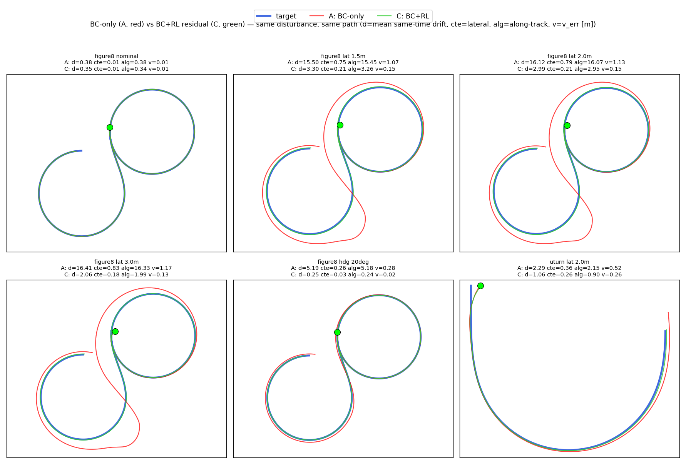

| 시나리오 | A: BC only | C: BC + RL | 개선 |
|---|---|---|---|
| figure8 무외란 | 0.38 m | 0.35 m | 동급 |
| figure8 횡 1.5 m | **15.50** | **3.30** | 4.7배 |
| figure8 횡 3.0 m | **16.41** | **2.06** | 8.0배 |
| figure8 헤딩 20° | **5.19** | **0.25** | 20.8배 |
| U턴 횡 2.0 m | 2.29 | **1.06** | 2.2배 |

무외란에서는 동급(BC를 망치지 않음), 외란이 커질수록 개선폭이 커짐 — 게이트 설계 의도대로 작동함.

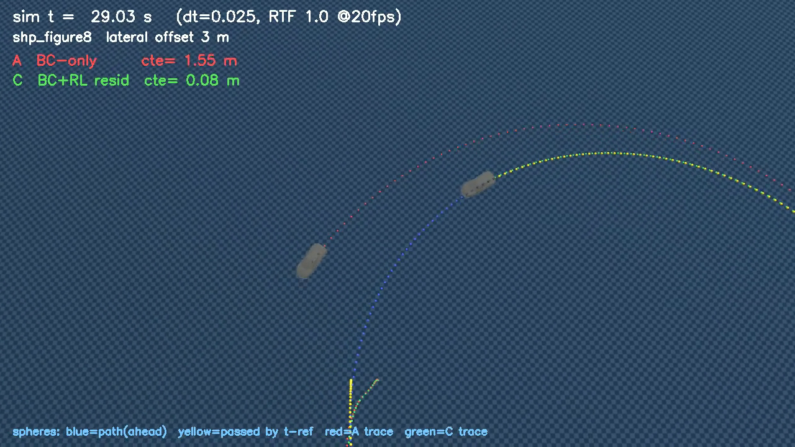

---

## 7. 고속 대응 — 제어 채널 분리 (BC → PID)

> **문제.** BC가 조향·스로틀을 **둘 다** 맡던 v3까지는 고속에서 성능이 나오지 않음.
> 원인은 모방학습의 구조적 한계(**인과 혼동**) — 골든 데이터에서 속도 변화가 거의 없어
> 정책이 "빠르면 스로틀을 뗀다"는 **가짜 상관**을 학습함.

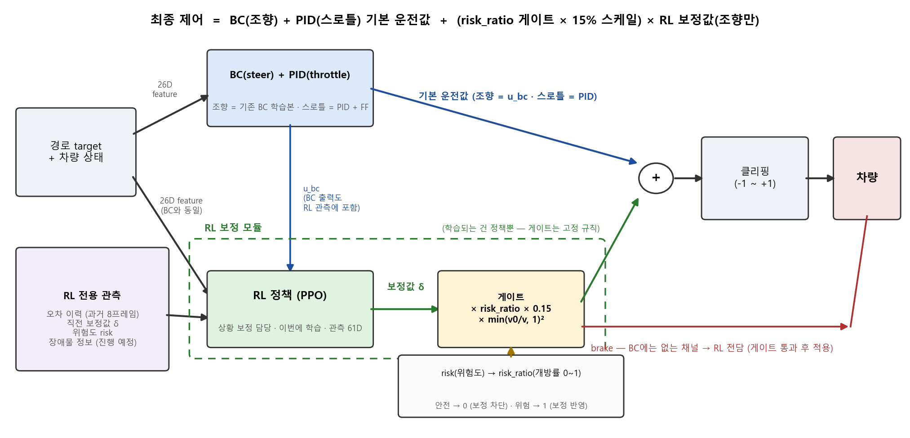

**해법: 채널을 성격에 따라 분리.**

| 채널 | 담당 | 이유 |
|---|---|---|
| 조향 | BC + RL 잔차 | 고속일수록 원심력·언더스티어가 커지는 **비선형** 문제 → 학습 |
| 스로틀 | **PID + FF** | 1차원 추종이라 고전 제어로 충분. RL 개입을 완전 차단했을 때 오히려 성능이 좋았음 |
| 제동 | RL 전담 | BC 출력에 없는 채널 |

**속도감응 게이트.** 잔차의 횡가속 기여가 `v²`에 비례하므로 게이트에 `min(v₀/v, 1)²`
(v₀ = 20 m/s = 72 km/h)를 곱해 고속에서만 영향력을 줄임. 실차의 속도감응형 조향과 같은 개념임.

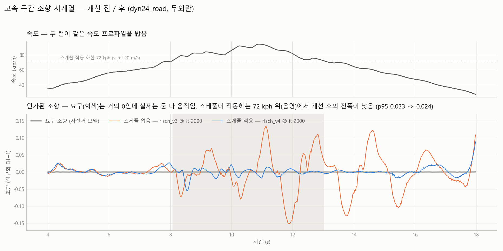

| 90 km/h 구간 횡가속 리플 | 보정 없음 (v3) | 보정 적용 (v4) |
|---|---|---|
| 같은 iteration(2000) 비교 | **5.09 m/s²** | **1.04 m/s² (−80%)** |

### 7.1 최종 평가 — 미학습 31셀

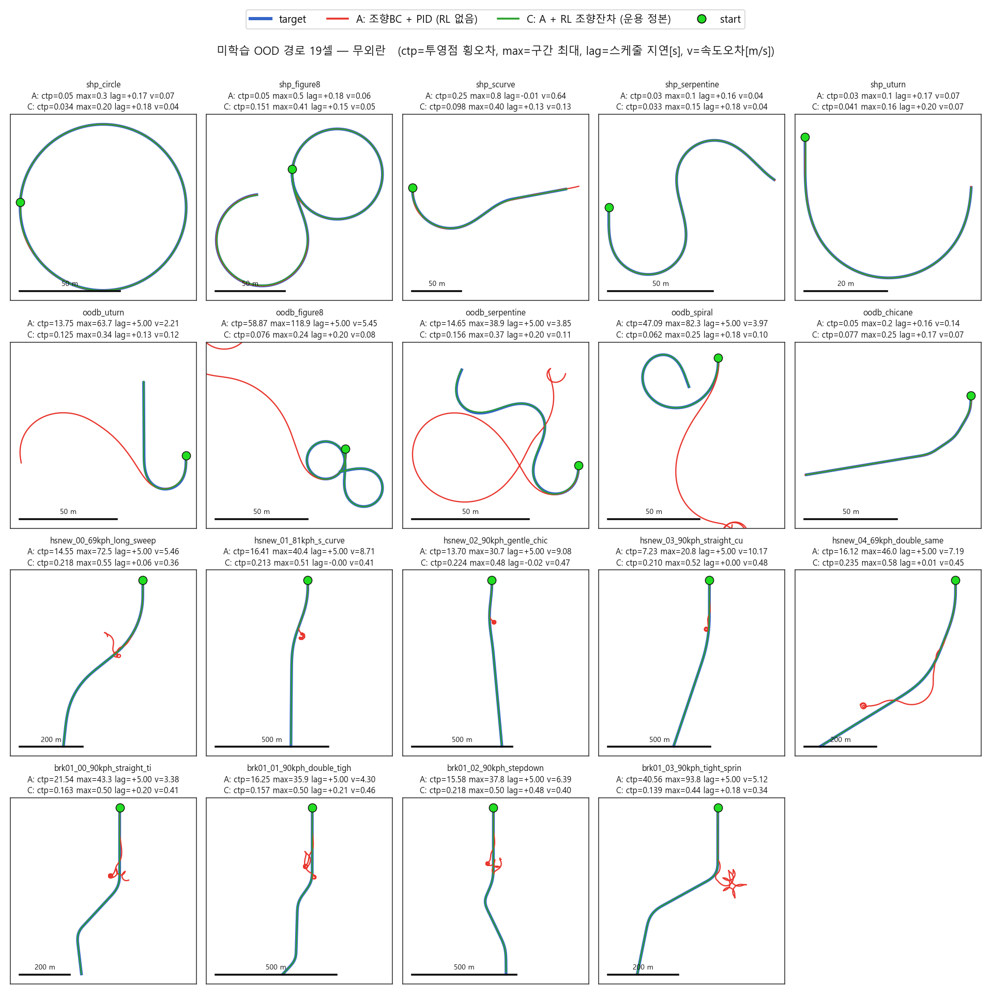

파랑 = 목표(골든 경로), 빨강 = A(RL 없음), 초록 = C(BC+RL). 축이 목표 기준이라 이탈한 A는 화면 밖으로 나감.

| 시나리오 | 셀 | A 완주 | C 완주 | A 경로오차 범위 | C 경로오차 범위 |
|---|---|---|---|---|---|
| 저속 5도형 (shp) | 9 | 5/9 | **9/9** | 0.03~27.4 m | **0.033~0.322** |
| 급곡률 5종 (oodb) | 10 | 1/10 | **10/10** | 0.05~95.2 | **0.062~0.286** |
| 고속 신규 5종 (hsnew) | 8 | 0/8 | **8/8** | 7.2~81.8 | **0.139~0.249** |
| 고속 급커브 4종 (brk01) | 4 | 0/4 | **4/4** | 15.6~40.6 | **0.139~0.218** |
| **합계** | **31** | **6/31** | **31/31** | 0.03~95.2 | **≤ 0.322 m** |

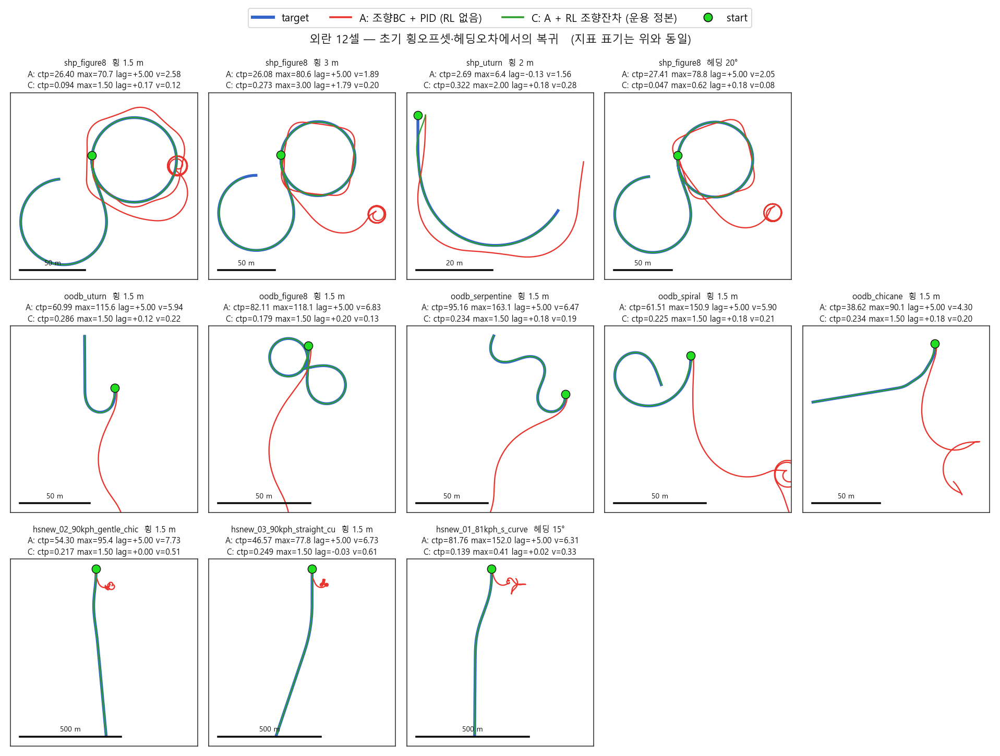

외란(초기 횡오프셋 1.5~3 m, 헤딩오차 15~20°) 12셀에서도 **A는 12/12 이탈, C는 12/12 완주**함.
학습 외란 상한(2 m)을 넘는 3 m에서도 복귀함. 시간 지연(lag)은 대부분 ±0.2초 안 —
밀린 상태에서 복귀하면서도 목표 속도를 동시에 지킴.

---

## 8. 단계별 핵심 성과

| 단계 | 핵심 결정 | 정량 결과 |
|---|---|---|
| 차량 | ray-wheel + Pacejka, 서스펜션은 시각 정렬용 prismatic | 휠 접지 오차 46 mm → **3 mm** |
| 경로 | 도로규격을 가속도 한계로 환산, bake 궤적을 목표로 채택 | 규격 준수 **153경로** |
| 골든 | Grid → Optuna TPE, dual-scene | drift 0.52 → **0.148 m** |
| BC | 지역 상대량만 입력 (위치·자세 배제) | 횡오차 **≤ 0.10 m**, 과적합 없음 |
| 진단 | 구동계 민감도 분해 | 질량만 민감 (최대 **8.7배** 악화) |
| RL | BC 고정 + 위험도 게이트 잔차, brake 전담 | 외란 복구 최대 **20.8배** |
| 고속 | 채널 분리 + 속도감응 게이트 | 31셀 **31/31**, 리플 **−80%** |


