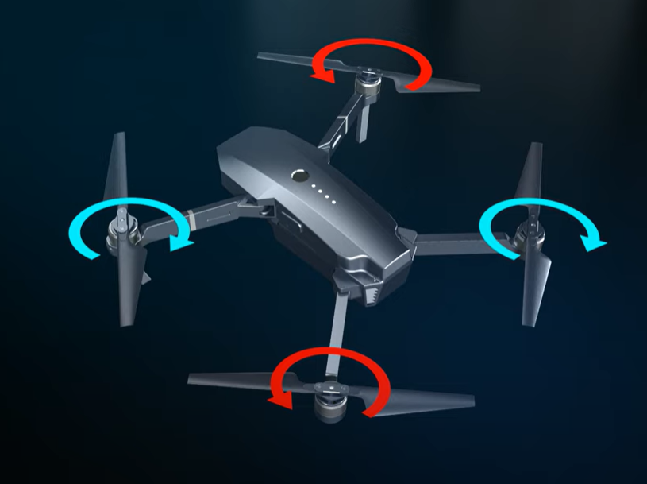

# 드론 작동 원리

## 1. 드론 제어 코드 흐름

### (1) Action 차원 정의

```python
# hover_train.py
def get_cfgs():
    env_cfg = {
        "num_actions": 4,   # Action 차원 = 4 (모터 M1~M4)
        ...
    }
    return env_cfg, obs_cfg, reward_cfg, command_cfg
```

---

### (2️) HoverEnv 클래스에서  초기화

```python
# hover_env.py
self.num_actions = env_cfg["num_actions"]    # = 4
self.actions = torch.zeros((self.num_envs, self.num_actions), device=gs.device, dtype=gs.tc_float)
```

hover_train.py 에서 정의된 "num_actions"를 불러옴  

---

### (3) Action 범위 제한 

```python
# hover_env.py
def step(self, actions):
    # Action 범위 제한 ([-1, 1])
    self.actions = torch.clip(actions, -self.env_cfg["clip_actions"], self.env_cfg["clip_actions"])
    exec_actions = self.actions
```

-> `clip_actions = 1.0` 이므로 Actor 출력은 `[-1, 1]`로 제한됨 
> Action 범위 제한 이유:   
>  드론 모터는 RPM 범위에 한계가 있어 비현실적인 RPM 값이 들어가지 않게 하기 위해 제한
>

---

### (4) Action → 모터 RPM 변환
Action 벡터는 **hover RPM**을 기준으로 스케일링되어 네 모터 RPM으로 변환됩니다.  

```python
# hover_env.py
self.drone.set_propellels_rpm((1 + exec_actions * 0.8) * 14468.429183500699)
```

- `14468.429...` = **hover RPM** (드론이 제자리에서 뜰 수 있는 RPM)  
- `(1 + exec_actions * 0.8)` = hover RPM에서 **±80% 가감**  

---

### (5) 최종 동작

`set_propellels_rpm()`으로 전달되어 모터 **M1~M4**에 각각 적용됩니다.  
네 모터 RPM 조합에 따라 드론은 **상승/하강, 전진/후진, 좌/우 이동, Yaw 회전**을 수행 

>set_propellels_rpm()는 genesis 엔진 내부 코드로 드론의 네 개 모터에 원하는 회전 속도(RPM)를 세팅하는 함수

## 2. 프로펠러 동작 원리


쿼드콥터 기본 배치:

```
    M1 (CW)       M2 (CCW)
        \           /
         \         /
          [ 드론 본체 ]
         /         \
        /           \
    M4 (CCW)      M3 (CW)
```


- M1, M3 = 시계 방향 (CW)  
- M2, M4 = 반시계 방향 (CCW)  
>기본적으로 토크가 상쇄되어 안정적 Hover 가능  -> 옆끼리 서로 반대 방향으로 회전하여 힘이 상쇄

---

### (1) 상승 / 하강 

- 상승: M1~M4 모두 ↑  
- 하강: M1~M4 모두 ↓  


---

### (2) 전진 / 후진
 
- 전진: M1, M2 ↓, M3, M4 ↑ → 드론이 앞으로 기울어 전진  
- 후진: M1, M2 ↑, M3, M4 ↓ → 드론이 뒤로 기울어 후진  


---

### (3) 좌/우 이동

- 왼쪽 이동: M1, M4 ↓, M2, M3 ↑  
- 오른쪽 이동: M1, M4 ↑, M2, M3  ↓  
  
> 각 각 좌우로 기울어 이동


---

### (4) Yaw 회전
 
- 시계 방향 회전: M1, M3 ↓, M2, M4 ↑  
- 반시계 방향 회전: M2, M4 ↓, M1, M3 ↑  

