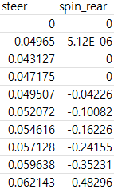
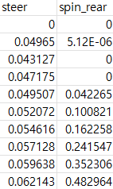
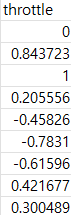

# Blender 차량 시뮬레이션 데이터 추출 및 Genesis 적용 방법 정리

``본 보고서는 Blender 데이터 추출 시의 문제점을 해결하고 spin_rear(뒷바퀴 회전 속도)와 throttle(가속 페달 입력)의 차이점을 정리하여 정확한 정의에 대한 정리를 하였고, 최종 데이터 추출을 함. 이후 진행할 genesis calibration에 대한 대략적인 과정 정리``


**주요 작업**:
- spin_rear 부호 오류 수정
- spin_rear와 throttle 차이점
- throttle 값 추정
- Genesis calibration (진행 예정)


## 1. Spin_rear 부호 오류 수정

### 문제 상황



- 초기 데이터 추출 시, `spin_rear` (뒷바퀴 회전 속도)에서 전진 데이터 임에도 불구하고 **음수 값이 발생**하는 문제가 있었다.

---

### 해결 방법

- 차량의 **속도 방향**을 기준으로 바퀴 회전 방향을 결정하도록 수정.

---

### 수정 결과


  
- 전진만 있는 경로 → 모두 양수로 수정됨


## 2. Spin_rear vs Throttle 차이점

### 근본적 차이

| 구분 | Spin_rear | Throttle |
|------|-----------|----------|
| **의미** | 바퀴 회전 속도 (출력) | 가속 페달 입력 (입력) |
| **단위** | rad/s (각속도) | -1 ~ 1 (정규화) |
| **결정** | 물리 엔진이 계산 | 사용자/제어 알고리즘 |
| **방향** | 양수=전진, 음수=후진 | 양수=전진토크, 음수=후진토크 |

---

### Spin_rear를 그대로 Throttle로 사용했을 때의 문제점

#### 문제 1: 물리적 의미 불일치

```
Spin_rear: 결과 (바퀴가 실제로 얼마나 회전하는가)
Throttle: 원인 (얼마나 힘을 가하는가)

예시:
  평지에서 throttle 0.5 → spin_rear 30 rad/s
  오르막에서 throttle 0.5 → spin_rear 15 rad/s
  
→ 같은 throttle이어도 상황에 따라 spin_rear 다름
```

**문제점**: Spin_rear를 그대로 Genesis에 입력하면, Genesis의 지형/마찰 조건에서 다른 결과 발생.

---

#### 문제 2: 스케일 불일치

```
Blender spin_rear: 0 ~ 38.60 rad/s (실제 물리 단위)
Genesis throttle: -1 ~ 1 (정규화된 제어 입력)

→ 직접 매핑 불가능
```
---

### Throttle의 필요성

Throttle은 **제어 의도**를 나타냄:
- `throttle > 0`: 가속하려는 의도
- `throttle = 0`: 타력 주행
- `throttle < 0`: 감속/후진하려는 의도

이를 통해 Genesis가 **자체 물리 엔진**으로 적절한 차량 동작을 계산할 수 있음.

---

## 3. Throttle 계산 방법

``Throttle을 직접 측정할 수 없으므로, 관측 가능한 데이터로부터 **역추정**.``


```
throttle = α × (acceleration / accel_max) + β × (spin_rear / spin_max)

여기서:
  α = 0.7  (가속도 가중치)
  β = 0.3  (spin 가중치)
  α + β = 1
```
-> throttle은 주로 가속에 의해 결정되기 때문에 가속도 가중치를 더 높게 잡음(만약 급가속이 많이 주행이라면 가속도에 대한 가중치를 크게 하여 영향을 높힘.)

**개념**: 
- Throttle은 가속도와 바퀴 회전에 모두 영향
- 두 가지를 결합하면 더 정확한 추정 가능

#### Local Max 방식

각 주행 데이터마다 **자체 최댓값**을 기준으로 정규화:

```python
# 가속도 계산
speed = np.sqrt(vx**2 + vy**2)
acceleration = np.gradient(speed, time)

# Local Max (95 percentile 사용)
accel_max = np.percentile(np.abs(acceleration), 95)
spin_max = np.percentile(np.abs(spin_rear), 95)

# 정규화
accel_norm = acceleration / accel_max
spin_norm = spin_rear / spin_max

# Throttle 계산
throttle = 0.7 * accel_norm + 0.3 * spin_norm
throttle = np.clip(throttle, -1, 1)
```

**95 Percentile을 사용한 이유**:
- 이상치(outlier)에 강건
- 극단값 제외하고 실제 주행 범위 반영
- 상위 5%는 clipping으로 처리

#### Throttle 계산 결과



-> 전진 방향에 대한 데이터에 대해 추출했음에도 불구하고 throttle 값에 음수가 끼어있음. why? (아래 설명)

---

## Throttle 물리적 의미

### 핵심: Throttle ≠ 바퀴 방향 직접 결정

```
 x : throttle < 0 → 바퀴가 무조건 역회전
 o : throttle < 0 → 후진 방향 토크만 가함
                     → 물리 엔진이 실제 회전 계산
```

``-> throttle 값이 음수라고 무조건 역회전 하는 것이 아님(아래 예시로 설명)``


### 시나리오별 예시

#### 시나리오 1: 정지 상태 + 음수 throttle

```
초기: spin_rear = 0 (정지)
입력: throttle = -0.5

물리 계산:
  후진 토크 > 저항
  → 바퀴 역회전 시작

결과: spin_rear < 0 (후진)
```

#### 시나리오 2: 전진 중 + 음수 throttle

```
초기: spin_rear = +30 rad/s (전진 중)
입력: throttle = -0.3

물리 계산:
  후진 토크 < 관성
  → 바퀴 감속 (여전히 전진 회전)
  → 브레이크 효과

결과: 
  즉시: spin_rear > 0 (감속하며 전진)
  나중: spin_rear → 0 (정지)
  더 나중: spin_rear < 0 (후진 시작)
```

#### 시나리오 3: 전진 중 + 강한 음수 throttle

```
초기: spin_rear = +10 rad/s (느린 전진)
입력: throttle = -1.0 (최대!)

물리 계산:
  강한 후진 토크 > 관성
  → 빠른 감속
  → 0 통과
  → 역회전

결과: spin_rear < 0 (후진 전환)
```

**핵심**: 물리 엔진이 자동으로 상황 판단
- 브레이크인지 후진인지 구분 불필요
- Throttle만 입력하면 물리 엔진이 알아서 계산

---

## 4. Genesis Calibration

### Calibration의 필요성

Local Max 방식으로 계산한 throttle은 **Blender 물리 엔진 기준**이므로, Genesis에서 동일한 결과를 보장하지 않음.

**이유**:

1. **물리 파라미터 차이**
   - 차량 질량
   - 엔진 토크
   - 타이어 마찰
   - 공기저항
   
2. **스케일 차이**
   - Blender에서 throttle 0.5 → 10 m/s
   - Genesis에서 throttle 0.5 → ??? m/s

### Calibration 프로세스

```
1. Blender throttle → Genesis 입력
   ↓
2. Genesis 실행 → 속도 프로필 출력
   ↓
3. 비교
   Blender 속도 vs Genesis 속도
   ↓
4. 조정
   - Genesis 차량 파라미터 튜닝
   - 또는 throttle 스케일 조정
   ↓
5. 반복 → 속도 일치까지
```

### Calibration 방법

#### 방법 1: Genesis 차량 파라미터 조정

```
조정 가능한 파라미터:
  - 엔진 토크
  - 차량 질량
  - 타이어 마찰 계수

장점: 물리적으로 정확
```

#### 방법 2: Throttle 스케일 조정

```python
# Genesis가 너무 느리면
throttle_adjusted = throttle * 1.3

# Genesis가 너무 빠르면
throttle_adjusted = throttle * 0.8

장점: 간단
단점: 물리적 의미 약화
```
