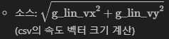

# Pure Pursuit 모델 모방 워크플로우 

## 1. 이전 시도의 한계 
###  기존 방식 (Online Learning with Velocity Inputs)
- **입력 파라미터 (6개)**: `[g_lin_vx, g_lin_vy, g_lin_vz, g_ang_vx, g_ang_vy, g_ang_vz]`
- **문제점**: 
  - 오직 차량의 **현재 속도와 움직임(Velocity/Angular Velocity)** 정보만 주어졌음.
  - **"어디로 가야 하는지"에 대한 목표점(Target) 정보가 전혀 없었기 때문에**, 아무리 학습해도 차가 올바른 경로를 찾아갈 수 없었음.

-> ``따라서 아래 같은 방법을 채택하여 진행하면 어떨까라는 생각을 하게 됨.``

## 2. Pure Pursuit 알고리즘이란? (Background)

순수 추종(Pure Pursuit)은 기하학 위주의 경로 추종 알고리즘. 복잡한 수식 없이 매우 직관적인 원리로 작동  
-> 마치 블렌더에서처럼 경로를 만들고 그 경로 위를 최대한 따라가게 하는 것과 유사

1. **Lookahead Point (목표점)**: 
   - 내 차 위치에서 경로를 따라 일정 거리(예: 3m) 앞의 점을 찍음
   - 이것이 "단기 목표"가 됨.
2. **조향 (Steering)**:
   - 그 목표점을 향해 **원(Arc)** 을 그리며 이동하도록 핸들을 꺾음.  
   - 목표점이 멀리 있으면 완만하게, 가까이 있으면 급하게 꺾게 됨.
   -> ``아래 사진의 파란색 선처럼 경로가 그려짐``  

- 초록색 점: 출발점
- 빨간색 점: 종착점
- 파란색 선: 추종 경로
- 노란색 점: 목표점
- 초록색 선: 차가 이동한 경로

---

## 3. MLP 입출력 설계 (Input/Output Design)

#### 1.  Input Parameters (MLP가 보는 것)
- **Speed**: 현재 차량의 속력
  
- **Target Local X** (전방 거리): 내 차 기준, 목표점이 앞뒤로 어디 있는가?
- **Target Local Y** (측면 거리): 내 차 기준, 목표점이 좌우로 어디 있는가?
  - **계산 방법**:
    1. 현재 위치 ($i$행): `g_pos_x`, `g_pos_y`
    2. 현재 방향 ($i$행): `g_qw, g_qx, ...` -> **Yaw 각도 변환**
    3. **목표점 찾기**: CSV의 미래 시점($j$행) 중 거리가 2.5m 떨어진 지점 $(x_j, y_j)$ 선택
    4. **좌표 변환**: 식을 통해 전역 좌표를 내 차 기준(Local)으로 변환

### Output Parameters (MLP 정답/Label) 
해당 위치에서 **Pure Pursuit 알고리즘을 돌려서 나온 계산값**을 정답으로 씀.
1. **Calculated Steer**: Pure Pursuit 수식이 "이 상황에선 이렇게 꺾어라"라고 한 값.
2. **Calculated Throttle**: 설정된 속도 제어 로직에 따른 값.

---

## 4. 실행 단계 (Workflow Steps)

### Step 1: 데이터 생성 (Offline Data Processing)
 `sensor_log.csv`(기존에 뽑은 블렌더 데이터)로 새로운 데이터 생성
1. **CSV 로드**: 전체 주행 경로(`g_pos_x`, `g_pos_y`, `yaw`)를 불러옵니다.
2. **목표점 탐색 (Lookahead Finding)**: 
   - 각 시점($i$)마다, 미래 경로($j$) 중 **2.5m** 떨어진 지점을 찾습니다.
3. **좌표 변환 (Transform)**: 
   - 절대 좌표(Global)에 있는 목표점을 내 차 기준(Local)으로 변환합니다.
   - **(Target - Current) × Rotation Matrix**
4. **라벨링 (Labeling)**: Pure Pursuit 수식으로 이 상황에 필요한 `Steer` 값을 계산합니다.
5. **저장**: `training_data.csv` 생성.

### Step 2: 모델 학습 (Train)
생성된 데이터를 MLP에 넣고 학습을 시킴.
- **Input**: `[Target Local X, Target Local Y, Speed]` (3개)
- **Output**: `[Steer, Throttle]` (2개)
- **함수**: MSE Loss (정답과 예측값의 차이 최소화)

**참고 - [Throttle/Brake 제어 로직]**
Genesis 물리 엔진은 **Throttle 값을 토크(Torque)로 해석**하여 차량의 움직임을 자동으로 처리함.
- 복잡한 로직(브레이크 상태 체크 등) 없이, 단순히 MLP가 출력한 **Throttle 값(-1.0 ~ 1.0)** 을 물리 엔진에 전달하면 됨.
- **음수(-) 값**: 후진 토크(Reverse Torque)로 작용 -> 전진 중이라면 **자동으로 브레이크(감속) 효과**를 내고, 정지 상태라면 **후진**하게 됨.
- 이는 `RigidSolver` 내부적으로 힘과 토크를 계산하여 관성 및 마찰을 처리하기 때문

