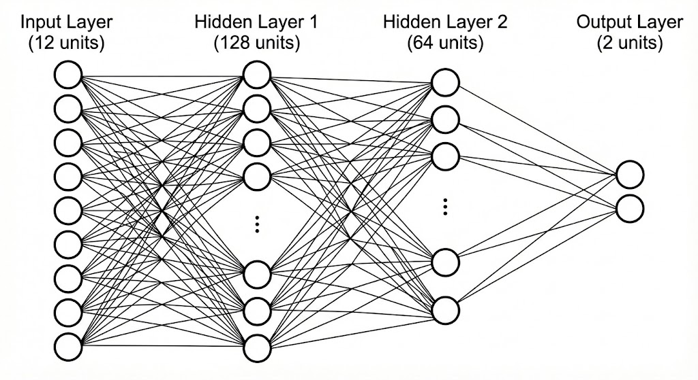
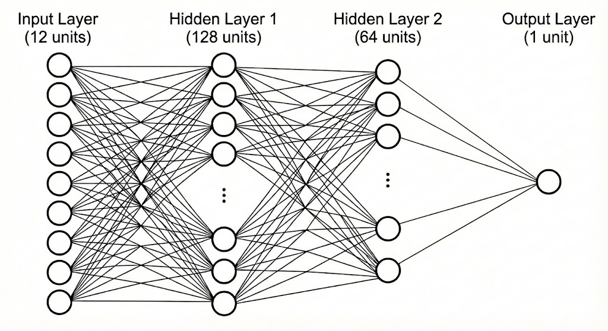

# RL 기반 차량 경로 추종 제어 시스템

## 프로젝트 개요

Genesis 물리 시뮬레이터를 사용하여 강화학습(RL) 기반의 차량 경로 추종 시스템을 구현함.  
Pure Pursuit 알고리즘과 유사한 타겟 추종 방식을 사용하되, 수학 공식 대신 **MLP 신경망이 조향과 스로틀을 학습**하도록 설계함.

---

## 지금까지 한 작업 요약

### 1. Genesis 드론 예제 구조 참고
Genesis의 드론 예제를 기반으로 코드를 구조화:
- **car_env.py**: VecEnv 스타일 환경 (CarTrackingEnv 클래스) -> `` 보상함수 계산 로직 ``
- **car_train_fixed.py**: 학습 스크립트 (OnPolicyRunner + PPO) -> ``MLP 구성 + 보상 가중치``
- **car_eval_fixed.py**: 평가 스크립트 (시각화 + CSV 저장)

### 2. 목표 타겟 시스템
Pure Pursuit 알고리즘과 유사한 방식으로 타겟을 설정:
- **sensor_log.csv에서 250개 경로 포인트 로드**
- **매 스텝마다 타겟 업데이트**:
  - `nearest_idx` = 차량에서 가장 가까운 경로 포인트
  - `target_idx` = `nearest_idx + lookahead_idx`  
  -> ``nearest_idx = 뽑은 데이터의 경로 포인트 중에서 차량과 가장 가까운 포인트의 번호``  
  -> ``target_idx = 가장 가까운 포인트에서 lookahead_idx(임의의 수)만큼 앞의 포인트 번호`` <- 따라 가야할 경로의 타켓점

- **빨간 공(sphere)으로 타겟 시각화**
- **차량은 이 타겟을 따라가도록 학습**

### 3. 보상 함수 설계
차량이 경로를 잘 따라가도록 유도하는 보상 함수:
- **tracking reward**: `exp(-distance_to_target)` - 타겟에 가까울수록 높은 보상
- **forward reward**: 전진 속도에 비례 - 정지하지 않고 계속 이동하도록
- **penalty**: 조향 페널티 - 과도한 조향 방지

### 4. 관찰(observation) 구성
MLP의 입력으로 다음 정보 제공:
- **타겟까지의 상대 위치** (차량 좌표계 기준 2차원)
- **차량 속도** (차량 좌표계 기준 2차원)
- **각속도** (yaw rate)
- **현재 throttle, steer 값** 


## 시스템 구조

Genesis의 드론 예제를 참고하여 다음과 같이 3개 파일로 구성:

### 1. `car_env.py` - 환경 (Environment)
- **역할**: VecEnv 스타일의 강화학습 환경
- **주요 기능**:
  - `sensor_log.csv`에서 250개 경로 포인트 로드
  - Pure Pursuit 스타일의 타겟 업데이트:
    ```
    nearest_idx = 차량에서 가장 가까운 경로 포인트
    target_idx = nearest_idx + lookahead_idx
    ```
  - 관찰(observation) 계산
  - 보상(reward) 계산
  - 종료 조건 체크

### 2. `car_train_fixed.py` - 학습 (Training)
- **역할**: PPO 알고리즘으로 정책 학습
- **라이브러리**: `rsl_rl`의 `OnPolicyRunner`
- **학습 설정**:
  - 병렬 환경 수: 64 envs
  - 최대 반복 횟수: 500 iterations
  - 저장 간격: 50 iterations

### 3. `car_eval_fixed.py` - 평가 (Evaluation)
- **역할**: 학습된 정책 평가 및 시각화
- **기능**:
  - 체크포인트 로드
  - 시뮬레이션 실행 (viewer 활성화)
  - 참조 경로 시각화 (녹색 선)
  - 타겟 시각화 (빨간 구)
  - CSV 데이터 저장 (`evaluation_results_car_rl_fixed.csv`)

---

## MLP 신경망 구조

### Actor-Critic 아키텍처

PPO 알고리즘은 Actor-Critic 구조를 사용하며, 두 개의 독립적인 MLP로 구성.

### Actor Network (정책 네트워크)

**역할**: 현재 관찰(observation)을 입력받아 행동(action)을 출력



```
입력층 (12차원)
    ↓
은닉층 1 (128 뉴런, ELU 활성화)
    ↓
은닉층 2 (64 뉴런, ELU 활성화)
    ↓
출력층 (2차원) - [throttle, steer]
```

**파라미터 개수**:
- 입력 → 은닉1: `12 × 128 + 128 = 1,664`
- 은닉1 → 은닉2: `128 × 64 + 64 = 8,256`
- 은닉2 → 출력: `64 × 2 + 2 = 130`
- **Actor 총 파라미터: 10,050개**

### Critic Network (가치 함수 네트워크)

**역할**: 현재 상태의 가치(Value)를 추정



```
입력층 (12차원)
    ↓
은닉층 1 (128 뉴런, ELU 활성화)
    ↓
은닉층 2 (64 뉴런, ELU 활성화)
    ↓
출력층 (1차원) - Value 추정치
```

**파라미터 개수**:
- 입력 → 은닉1: `12 × 128 + 128 = 1,664`
- 은닉1 → 은닉2: `128 × 64 + 64 = 8,256`
- 은닉2 → 출력: `64 × 1 + 1 = 65`
- **Critic 총 파라미터: 9,985개**

### 전체 모델 통계

- **총 파라미터 개수**: 20,035개
- **활성화 함수**: ELU (Exponential Linear Unit)
- **출력 범위**: [-1, 1] (clamping 적용)

---

## 입력 및 출력 구조

### 입력 (Observation) - 12차원

| 차원 | 내용 | 설명 |
|-----|------|------|
| 0-1 | 타겟 상대 위치 (x, y) | 차량 좌표계 기준 타겟까지의 거리 |
| 2-3 | 속도 (vx, vy) | 차량 좌표계 기준 선속도 |
| 4 | 각속도 (yaw rate) | Z축 회전 각속도 |
| 5 | **현재 throttle** | 이전 스텝의 스로틀 값 |
| 6 | **현재 steer** | 이전 스텝의 조향 값 |
| 7-11 | 패딩 | 0으로 채워짐 (확장 가능) |   
  
  -> ``패딩 부분은 필요에 따라 차원 확장을 가능하게 하기 위해 . 결과에 거의 영향을 주지 않음.``

### 출력 (Action) - 2차원

| 차원 | 내용 | 범위 | 설명 |
|-----|------|------|------|
| 0 | **throttle** | [-1, 1] | 스로틀 제어 (음수 = 후진, 양수 = 전진) |
| 1 | **steer** | [-1, 1] | 조향 제어 (음수 = 좌회전, 양수 = 우회전) |

실제 차량에 적용 시:
```python
actual_steer = action[1] * max_steer  # max_steer = 0.65 rad
actual_torque = action[0] * max_torque  # max_torque = 3000 N·m
```

---

## 보상 함수 (Reward Function)

PPO에서는 보상 함수가 손실 함수(loss)의 기반이 됩니다.
보상을 최대화하는 방향으로 정책이 학습됩니다.

### 총 보상 계산

```python
total_reward = tracking_reward × 5.0
             + forward_reward × 0.5
             + penalty × 0.01
```

### 1. Tracking Reward (경로 추종 보상)

**목적**: 차량이 타겟에 가까이 가도록 유도

```python
distance = ||타겟 상대 위치||  # L2 norm
tracking_reward = exp(-distance)
```

**특징**:
- 타겟에 가까울수록 1에 가까운 높은 보상
- 멀어질수록 0에 가까운 낮은 보상
- **가중치 5.0**: 경로 추종이 가장 중요한 목표

**예시**:
- distance = 0m → reward = 1.0 × 5.0 = **5.0**
- distance = 1m → reward = 0.368 × 5.0 = **1.84**
- distance = 5m → reward = 0.007 × 5.0 = **0.035**

### 2. Forward Reward (전진 보상)

**목적**: 차량이 정지하지 않고 앞으로 나아가도록 유도

```python
forward_reward = velocity_x  # 차량 좌표계 x축 속도
```

**특징**:
- 전진 속도에 비례
- **가중치 0.5**: tracking보다 덜 중요하지만 정체 방지

### 3. Penalty (조향 페널티)

**목적**: 과도한 조향을 방지하여 부드러운 주행 유도

```python
penalty = -|steer_action|
```

**특징**:
- 조향각의 절댓값에 비례하여 감점
- **가중치 0.01**: 매우 작은 페널티 (미세 조정용)

---

## 결과 및 분석

### 학습 진행 상황

현재 **500 iterations** 학습 완료:
- ✅ 차량이 타겟을 인식하고 추종 시도
- ❌ 방향 제어 불안정 (왼쪽으로 가야 하는데 오른쪽으로 조향하는 등)
- ❌ 186 스텝 만에 경로 이탈 (5m 초과) 후 리셋

### 현재 문제점
- **lookahead=20**: 타겟이 너무 멀리 도망가서 따라잡기 어려움
- **lookahead=5**: 타겟이 너무 가까워서 거의 안 움직임
- **500 iterations**: 학습 시간 부족으로 안정적인 제어 학습 실패  


## ``lookahead = 20``
<video controls src="../res/lookahead_20.mp4" title="Title"></video>

## ``lookahead = 5``
<video controls src="../res/lookahead_5.mp4" title="Title"></video>

### 문제 원인 상세 분석

#### 1. 학습 시간 부족 (500 iterations)
- **RL의 특성**: 강화학습은 일반적으로 **수천~수만 iteration** 필요
- **연속 제어의 어려움**: 이산 행동(discrete action)보다 연속 행동(continuous action) 학습이 훨씬 오래 걸림
- **현재 상태**: 정책이 아직 올바른 조향 방향을 학습하지 못함
  - 예: 타겟이 왼쪽에 있는데 오른쪽으로 조향
  - 전진 속도 제어가 불안정 (0.1 ~ 4 m/s 들쑥날쑥)

#### 2. Lookahead 파라미터 문제
- **lookahead=20 (초기 설정)**:
  - 타겟이 너무 빨리 도망감
  - path_error가 0.21 → 4.89m까지 계속 증가
  - 186 스텝 후 5m 초과로 에피소드 종료

- **lookahead=5 (수정 후)**:
  - 타겟이 거의 움직이지 않음
  - 차량도 거의 이동하지 않고 정체
  - 타겟 좌표가 (40.211, -15.002) 근처에 고정

- **결론**: 10~12 정도가 적절할 것으로 예상

#### 3. 보상 함수 튜닝 필요
- **현재 tracking 가중치 (5.0)**: 충분하지 않을 수 있음
- **forward 가중치 (0.5)**: 너무 작아서 정지 상태를 선호할 수 있음
- **개선 방향**: tracking 10.0, forward 1.0으로 증가 고려

### 개선 방안

#### 1. 학습 시간 대폭 증가
```python
"max_iterations": 2000  # 또는 3000, 5000
```
- 500 iterations는 명백히 부족
- 최소 2000 iterations 이상 권장
- 주행 성능이 안정화될 때까지 학습

#### 2. Lookahead 파라미터 최적화
```python
"lookahead_idx": 10  # 또는 12
```
- 5와 20의 중간값 사용
- 타겟이 적절히 앞서가면서도 따라잡을 수 있는 거리
- 실험을 통해 최적값 탐색 필요

#### 3. 보상 가중치 조정
```python
reward_cfg = {
    "reward_scales": {
        "tracking": 10.0,  # 5.0 → 10.0 (더 강한 경로 추종)
        "forward": 1.0,    # 0.5 → 1.0 (더 빠른 주행 유도)
        "penalty": 0.01,   # 유지
    }
}
```

#### 4. 학습률 조정 (선택사항)
```python
"learning_rate": 5e-4  # 3e-4 → 5e-4 (더 빠른 학습)
```
- 초기 학습 속도 향상
- 하지만 불안정해질 수 있으므로 주의

---

## 참고 자료

- **Genesis 물리 시뮬레이터**: [https://github.com/Genesis-Embodied-AI/Genesis](https://github.com/Genesis-Embodied-AI/Genesis)
- **rsl_rl (PPO 라이브러리)**: [https://github.com/leggedrobotics/rsl_rl](https://github.com/leggedrobotics/rsl_rl)
- **Pure Pursuit 알고리즘**: 고전적인 경로 추종 알고리즘
- **PPO (Proximal Policy Optimization)**: [Schulman et al., 2017](https://arxiv.org/abs/1707.06347)
