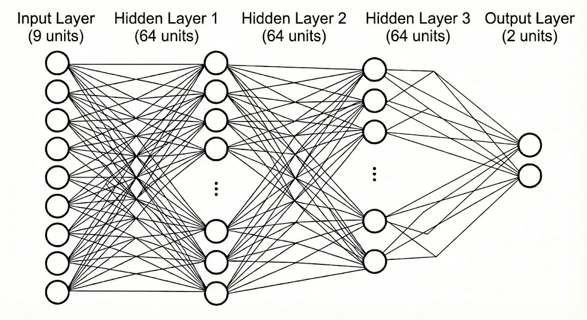
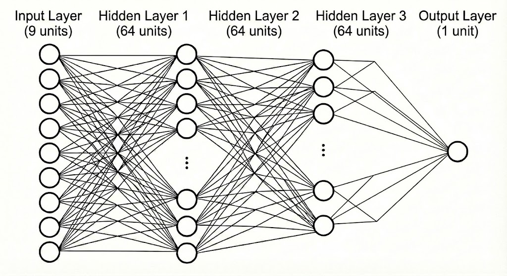
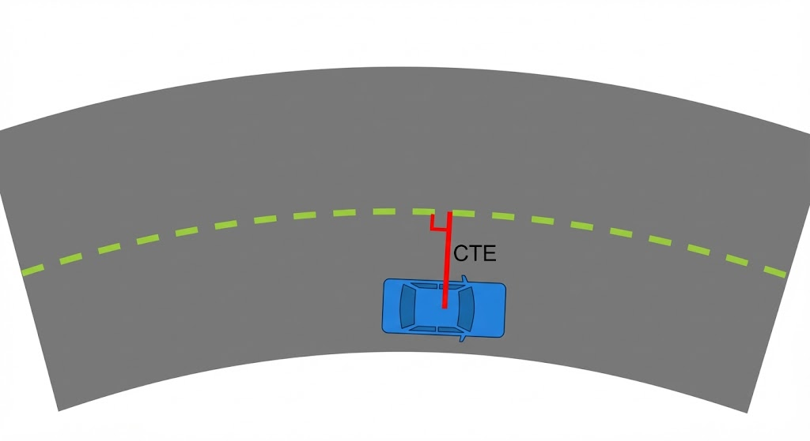
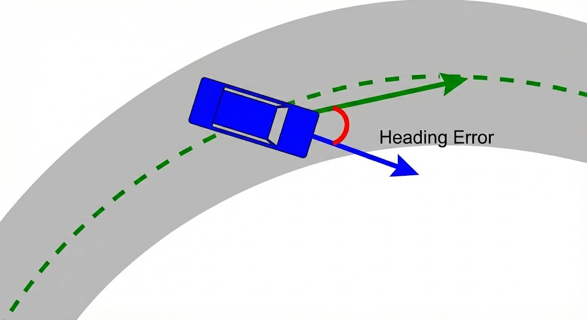

# RL 기반 차량 경로 추종 제어 시스템

## 1. MLP 신경망 구조 (Network Architecture)

본 모델은 **PPO (Proximal Policy Optimization)** 알고리즘을 사용하며, Actor와 Critic이 분리된 두 개의 독립적인 MLP로 구성된 **Actor-Critic** 아키텍처를 따름.

### 1.1 Actor Network (정책 네트워크)
* **역할:** 현재 관찰(Observation)을 입력받아 최적의 행동(Action)을 출력
* **활성화 함수:** ELU (Exponential Linear Unit)
* **구조 특징:** 9차원의 작은 입력 공간을 고려하여 **Narrow & Deep (좁고 깊은)** 형태 채택



| Layer | Nodes | Parameters Calculation | Count |
| :--- | :--- | :--- | :--- |
| **Input** | 9 | - | - |
| **Hidden 1** | 64 | $9 \times 64 + 64$ | 640 |
| **Hidden 2** | 64 | $64 \times 64 + 64$ | 4,160 |
| **Hidden 3** | 64 | $64 \times 64 + 64$ | 4,160 |
| **Output** | 2 | $64 \times 2 + 2$ | 130 |
| **Total** | | **Actor Parameters** | **9,090** |



### 1.2 Critic Network (가치 함수 네트워크)
* **역할:** 현재 상태(State)의 가치(Value)를 추정하여 학습 방향 제시
* **구조:** Actor와 동일한 Hidden Layer 구조 공유

| Layer | Nodes | Parameters Calculation | Count |
| :--- | :--- | :--- | :--- |
| **Input** | 9 | - | - |
| **Hidden 1..3** | 64 | (Same as Actor) | 8,960 |
| **Output** | 1 | $64 \times 1 + 1$ | 65 |
| **Total** | | **Critic Parameters** | **9,025** |

### 1.3 모델 전체 요약
* **총 파라미터 수:** **18,115개**
* **출력 범위:** `[-1, 1]` (Clamping 적용)
* **설계 근거:** 128개 이상의 뉴런은 Over-parameterization 우려. 깊이(3층)를 유지하되 너비(64)를 줄여 표현력 유지 및 연산 효율성 확보.

---

## 2. 입력 및 출력 구조 (I/O Specification)

### 2.1 입력 (Observation Space) - 9차원
각 입력 차원은 학습 안정성을 위해 정규화(Normalization) 과정을 거침.

| Index | Feature | Norm | Description |
| :---: | :--- | :--- | :--- |
| **0-1** | **Target Rel Pos** `(x, y)` | $\times 0.1$ | 차량 좌표계 기준 타겟까지의 거리 |
| **2-3** | **Velocity** `(vx, vy)` | $\times 0.1$ | 차량 좌표계 기준 선속도 |
| **4** | **Yaw Rate** | $\times 0.5$ | Z축 회전 각속도 |
| **5** | **Prev Throttle** | Raw | 이전 스텝의 스로틀 값 `[-1, 1]` |
| **6** | **Prev Steer** | Raw | 이전 스텝의 조향 값 `[-1, 1]` |
| **7** | **CTE** (Cross-Track Error) | $\times 0.5$ | 경로 중심선에서 차량까지의 수직 거리 | 
| **8** | **Heading Error** | $\times 0.5$ | 목표 방향과 현재 차량 방향의 차이 (Rad) |

> **핵심 요소:**
> * **CTE & Heading Error:** 경로 추종 정밀도를 높이기 위한 핵심 관측값
> * **Previous Action:** 제어의 연속성(Temporal Information) 학습

|  |  |
| :---: | :---: |
| *(그림 1: 차량 중심에서 경로<br>중심선까지의 수직 거리인 CTE)* | *(그림 2: 경로(Target)와 차량(Current)<br>사이의 각도 차이인 Heading Error)* |

### 2.2 출력 (Action Space) - 2차원
네트워크는 `[-1, 1]` 사이의 값을 출력하며, 물리 엔진에 적용 시 실제 단위로 변환.

| Index | Action | Range | Description |
| :---: | :--- | :--- | :--- |
| **0** | **Throttle** | `[-1, 1]` | 양수: 전진 가속 / 음수: 후진 및 브레이크 |
| **1** | **Steer** | `[-1, 1]` | 양수: 우회전 / 음수: 좌회전 |
---

## 3. 보상 함수 (Reward Function)

학습의 핵심 전략은 **"전진 우선 + 부드러운 경로 추종"**입니다. 복잡한 제약을 줄이고 진행도(Progress)에 집중하도록 설계되었습니다.

### 총 보상 계산

```python
total_reward = progress_reward * 2.0
             + speed_reward * 1.0
             + cte_penalty * 0.3
             + time_penalty * 1.0
```

### 1. Progress Reward (경로 진행 보상)

**목적**: 단순 직선 거리가 아닌, 경로 누적 거리(Arc-length) 기반의 진행을 최우선으로 유도

```python
progress_reward = (current_arc_length - previous_arc_length) / dt
```

**특징**:
- 가중치 2.0: 가장 높은 중요도 부여

- 전진 시 큰 보상, 정체 시 0, 후진 시 음수 보상

- 트랙을 따라 실질적으로 얼마나 나아갔는지를 평가

### 2. Speed Reward (속도 유지 보상)

**목적**: 목표 속도인 5.0 m/s를 유지하도록 유도

```python
speed_reward = exp(-|current_velocity - 5.0|)
```

**특징**:

- 가중치 1.0: 적절한 주행 속도 유지

- 차량이 너무 느리거나, 제어 불가능하게 빨라지는 것을 방지

### 3. CTE Penalty (경로 이탈 페널티)

**목적**: 경로 중심에서 벗어나는 것을 방지

```python
cte_penalty = -|cross_track_error| ** 2  # 제곱 페널티
```

**특징**:

- 가중치 0.3: 비교적 낮은 가중치 설정

- 설계 의도: 약간의 경로 이탈을 허용하더라도 멈추지 않고 전진하는 것을 유도 (초반 좌회전 구간 등에서 멈추는 문제 해결)

### 4. Time Penalty (시간 페널티)

**목적**: 불필요한 정체나 우회를 방지하고 빠른 에피소드 완주 유도

```python
time_penalty = -1.0  # 매 스텝마다 부과
```

**특징**:

- 가중치 1.0: 최단 시간 주행 장려

- 스텝이 길어질수록 누적 페널티가 커지므로 빠르게 목표에 도달하도록 압박

## 4. 결과 및 분석

https://github.com/user-attachments/assets/79201243-f97e-4189-91cc-a570f96b42e7

