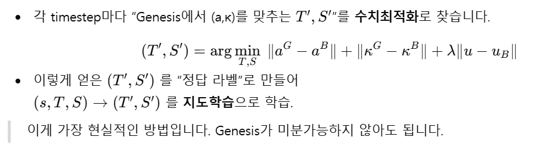

# UKMAC_Optimization_Problem

## 1. UKMAC Pipeline

#### 1. 추출한 Blender data 에서 a, k를 추출. 

#### 2.  a, k 를 만족시키는 T, S 를 로컬 최적화화 찾고 T, S 를 가지고 직접적인 지도학습. 즉, loss 가 T, S 로부터 정의되도록 함.(Blender의 a, k는 위에서 추출한 것을 사용,  Genesis a, κ는 매번 새로 계산 - 최적화 시도할 때마다 genesis 시뮬레이션 실행)

#### 3. 이후 보정 단계에서 강화 학습.

## 2. 현재 문제점

#### 1. 최적화 과정에서 문제 발생(최적화 시도할 때마다 genesis 시뮬레이션 실행을 어떻게 할지)

### 최적화 전략 비교: Full Continuous vs. Segmented Continuous

``지금 현재 1 프레임 당 최대 20번의 시뮬레이션을 돌리게 한 결과(max_iters=20) ``

| 비교 항목 | ① 초기 시도: 전체 연속 (Full Continuous) | ② 해결책: 세그먼트 (Segmented Continuous) |
| :--- | :--- | :--- |
| **실행 방식** | **Start to End (Non-stop)** Frame 0만 초기화하고 450프레임 쭉 주행 | **Divide and Conquer (구간 반복)** 20프레임마다 위치를 초기화(Reset)하되, 구간 내에서는 연속 주행 |
| **장점** | **물리적 완전 연속성** 가장 이상적인 형태의 주행 데이터 | **오차 누적 방지 (Drift Reset)** 주행이 파국으로 치닫기 전에 기준점을 잡아줌 |
| **최적화 성공률** (Success Rate) | **11.7%** - 수치는 상대적으로 높지만, 이미 경로를 이탈한 상태에서의 성공이라 무의미함 | **1.5%** - 엄격한 물리 기준(Tolerance) 탓에 수치는 낮지만, 실제 주행을 바로잡는 **'데이터'** 확보 |
| **실패 원인** | **누적 오차 (Accumulated Error)** 초반의 작은 오차가 눈덩이처럼 불어나, 후반부엔 물리적으로 **'복구 불가능한 상태'**가 됨 | **최적화 성공률을 높여야 함** 성공률 수치는 낮으나 데이터 품질은 확보됨 (Loss가 낮은 유효 데이터) |
| **학습 효과** | **후반부 데이터 폐기 수준** 이미 경로를 1km 이탈한 상태에서는 어떤 제어값도 의미가 없음 (Garbage In) | **"복구 가능한 실수" 학습 (Good Data)** 5cm~1m 정도의 **'적당한 오차'** 상황을 계속 만들어, AI가 이를 바로잡는(Recovery) 능력을 배움 |
| **결과 (목표 위치와의 평균 오차 거리)** | **1,243m** | **85m** |

`` 결과가 segment 방식이 더 좋아보일 수 있으나 제자리 가만히 있었어도 평균 오차 거리가 27m로 절대 좋은 수치가 아님. `` 

-> **일단 핵심은 최적화 성공률을 높이기 위해 최적화를 할 때 허용 오차(Tolerance)를 완화하거나, 최대 반복 횟수(Max Iterations) 증가시켜야 할 것으로 보임(지금 450프레임 기준 max_iters=20일 때 최적화 시간이 20분정도 소요)** 

-> **or 최적화 방식 변경(현재 Nelder-Mead 방식)**