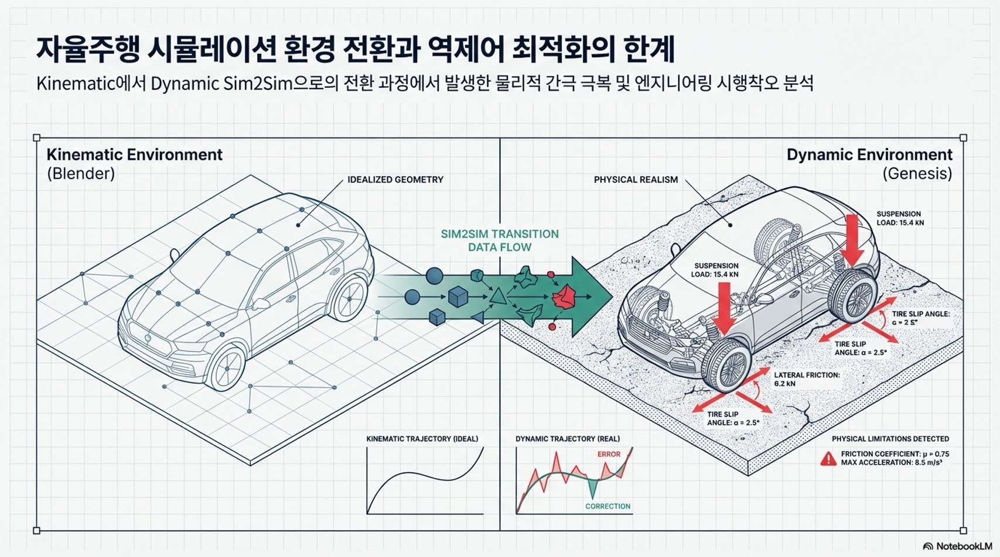
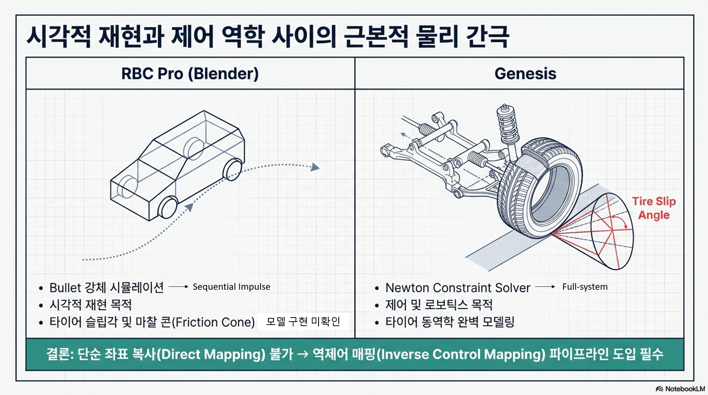
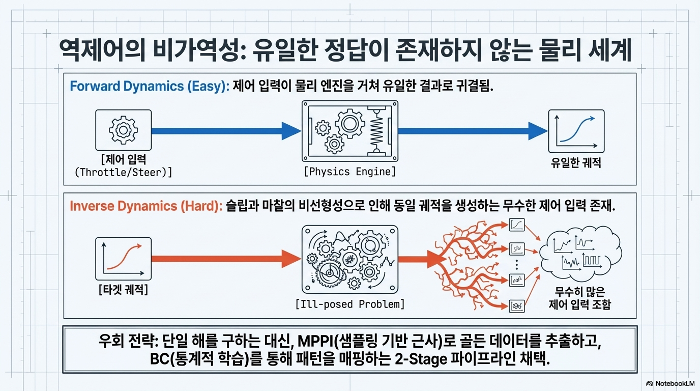
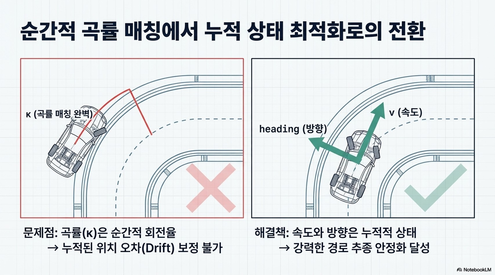
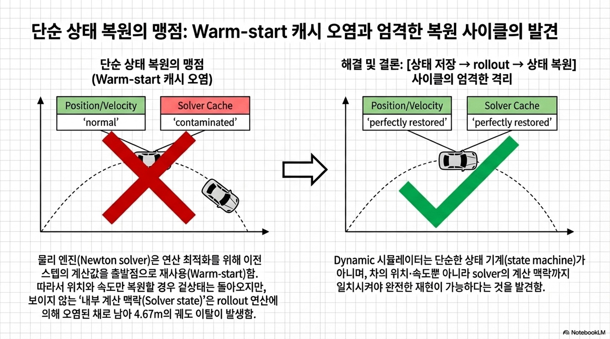
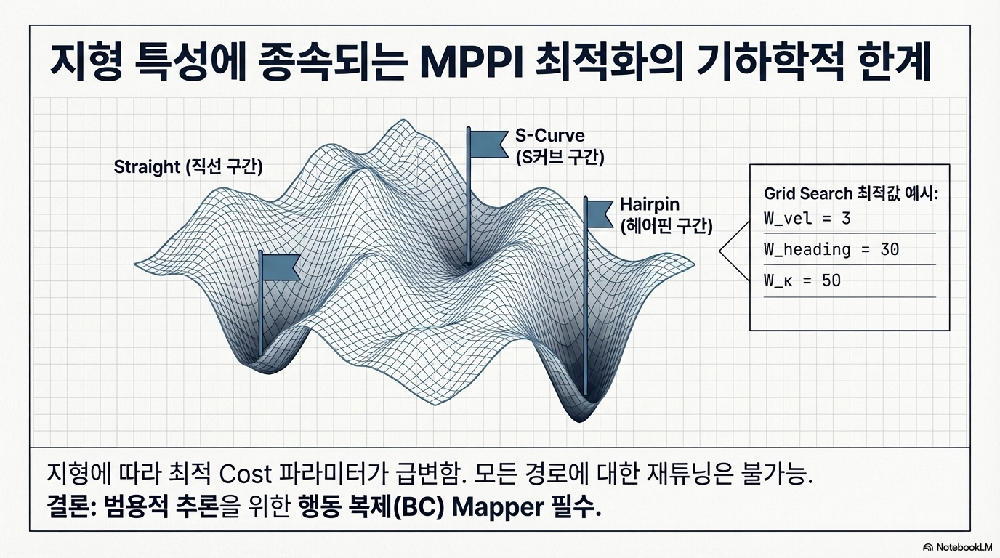
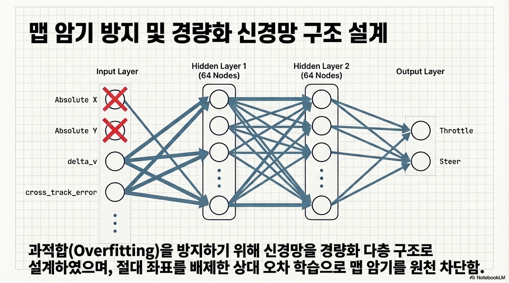
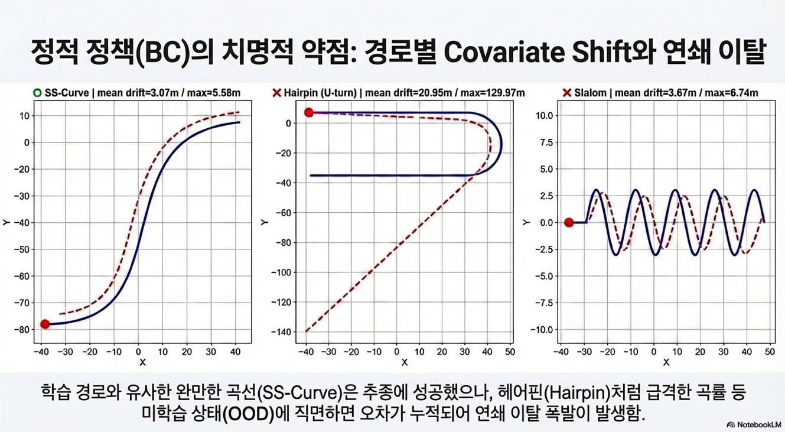
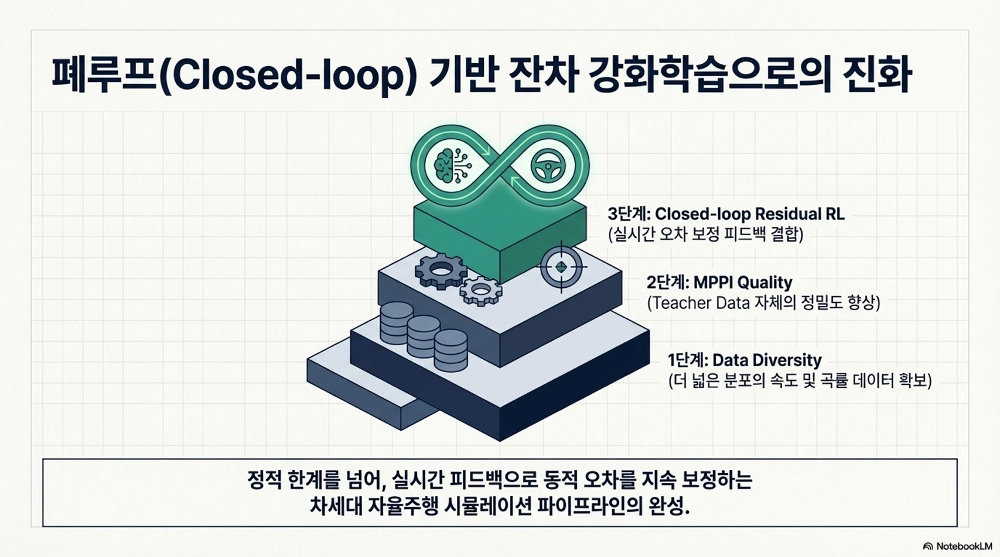
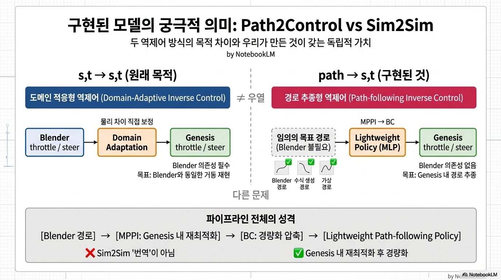

# Kinematic → Dynamic Sim2Sim 시행착오 및 구현 모델의 궁극적 의미

## 1. 두 시뮬레이터의 물리 모델 정밀도 차이

RBC Pro는 Bullet Physics 기반 강체 시뮬레이션으로 물리 법칙 자체는 존재하지만, 타이어 슬립 모델 및 마찰 상세 스펙이 공개 자료상 미확인인 시각적 재현에 최적화된 환경. 반면, Genesis는 Full-system Newton constraint solver 로 기본 마찰 모델링 및 전역 제약 최적화를 포함한 제어·로보틱스용 정밀 물리 시뮬레이터.

**RBC Pro (Blender):**
* Bullet Physics 기반 강체 시뮬레이션 / Sequential Impulse [1][2]
* 제약 조건을 순차적으로 근사 처리 [1][2]
* 수치 정확도 최적화 (속도 > 정확도)
* 타이어 슬립/슬립각 모델 구현 미확인 (공개 공식 자료상) 
* 마찰 모델 상세 스펙 미확인 — guide 기능이 경로 구속(Path Constraint)으로 작동할 가능성 있음 (물리 마찰 관여 여부 불명확)
* 영상·애니메이션 시각적 재현 목적 [1][2]

**출처:**  
  [1] AKA Studios. *RBC | A Physics-Based Vehicle Rigging Addon*. Superhive product page.  
  [2] AKA Studios. *RBC | A Physics-Based Vehicle Rigging Addon – Documentation*. Superhive documentation page.  
  [3] AKA Studios. *RBC Pro Manual* (official documentation page 링크 참조; 접근 시 404 반환).

**Genesis:**
* Full-system Newton constraint solver  [1][2]
* 제약 조건을 전역 최적화 방식으로 처리 (SAP: Semi-Analytic Primal)  [3]
* 수치 정확도 최적화 (정확도 > 속도)
* 타이어-지면 기본 마찰 모델링
* 타이어 슬립/슬립각 모델 구현 미확인 (Code Wiki 기준)
* 방향성 마찰 콘 구현 미확인 (Code Wiki 기준)
* 제어·로보틱스 정확도 목적  [4]

**출처:**  
  [1] Genesis. `genesis/options/solvers.py` — RigidOptions, `gs.constraint_solver.Newton`  
  [2] Genesis Code Wiki. *Physics Solvers and Coupling Mechanisms*.  
  [3] Genesis. `genesis/engine/couplers/sap_coupler.py` — `sap_solve` method (line 1007)  
  [4] Genesis Code Wiki. *Robotics for Locomotion and Manipulation with Reinforcement Learning*.  

이 물리 모델 정밀도 차이로 인해 Blender 경로를 Genesis에서 직접 재현하는 것이 불가능하며, 역제어 매핑 파이프라인 전체가 필요했던 출발점.

---

## 2. 역제어 문제의 비가역성

**본질적 문제:** 우리가 풀려는 것은 역제어(Inverse Control).

* **Forward (쉬움):** 제어 입력 (throttle, steer) $\rightarrow$ [물리 시뮬] $\rightarrow$ 궤적
* **Inverse (어려움):** 원하는 궤적 $\rightarrow$ [???] $\rightarrow$ 제어 입력

Kinematic 모델에서는 물리 변수 없이 기하학적 관계만으로 제어를 근사할 수 있지만, Dynamic 환경에서는 같은 궤적을 만들 수 있는 제어 입력이 무수히 많고 물리 상태(슬립, 마찰, 하중)에 따라 달라지는 **Ill-posed Problem(불적합 문제)** 의 특성을 가짐. MPPI는 이 역함수를 샘플링으로 근사하는 방식이었고, BC는 그 근사 결과를 통계적으로 학습하는 2단계 근사.

---

## 3. a, κ 매칭으로 동일 경로 재현이 가능하다는 가정의 실패

**초기 가정:** Blender에서 추출한 가속도($a$), 곡률($\kappa$)를 Genesis에서 동일하게 재현하면 같은 경로를 따라갈 것.

Blender $\kappa$와 Genesis $\kappa$ 모두 $\omega/v$로 동일하게 계산됨. 공식은 같지만 문제는 다른 곳에 있었음.

* **$\kappa$는 순간적 회전율 (instantaneous)**
  * $\kappa\_err = 0$이어도 현재 위치·방향이 이미 틀려있으면 무의미
  * 위치 오차를 직접 반영하지 못함
* **v, heading은 누적적 상태 (integrative)**
  * 속도와 방향이 맞으면 자연스럽게 경로 위에 위치
  * 경로 이탈을 더 직접적으로 감지

MPPI가 최적화하는 것은 `throttle`과 `steer`이며, $\kappa, v, heading$은 각 rollout 결과를 평가하는 기준. $\kappa\_err$만 강하게 줬을 때 "회전율은 맞는데 경로는 틀린" 상황이 발생했고, `v_err + heading_err`를 핵심으로 두었을 때 경로 추종이 안정화됐음.

---

## 4. Genesis 내부 상태 문제 (Newton Solver Warm-start)

**예상:** 물리 시뮬레이터는 위치 + 속도 상태만 동일하면 재현 가능.

MPPI는 매 스텝마다 아래 과정을 반복.
1. 현재 차량 상태 저장 (위치, 속도)
2. 201개 환경에서 각각 다른 제어를 넣어 20스텝 앞으로 시뮬레이션
3. 각 결과의 cost 계산
4. 저장했던 상태로 복원
5. 가장 좋은 제어 입력 1개 적용

문제는 **4번 "복원"** 에서 발생했음. Genesis의 Newton solver는 바퀴가 차체에서 떨어지지 않거나 지면을 뚫지 않는 등 물리적 제약 조건을 만족시키기 위한 내부 힘을 매 스텝마다 계산. 이 때 계산 속도를 높이기 위해 "지난 스텝의 계산값이 이번 스텝과 비슷할 것"이라 가정하고 그 값을 출발점으로 삼는 **warm-start** 방식을 사용.

위치와 속도만 복원하면 차의 겉상태는 돌아오지만 이 내부 계산값은 rollout 이후 상태로 남아, 같은 제어를 넣어도 다른 결과가 나옴.

* **위치 + 속도만 복원 시:**
  * solver 내부 계산값 불일치
  * $\rightarrow$ 4.67m drift 발생 (100프레임 기준)
* **해결:**
  * Rollout 연산이 메인 시뮬레이션의 내부 캐시를 오염시키지 않도록 `[Save → Rollout(20 steps) → Restore]`를 독립된 하나의 사이클로 엄격히 묶음.
  * 단순히 위치/속도만 맞추는 것이 아니라, 시뮬레이터의 내부 계산 맥락(Solver state)까지 원상 복구된 상태에서 최적 제어를 적용.
  * $\rightarrow$ **0.9mm 이하의 완전 재현 달성**

Dynamic 시뮬레이터는 단순한 상태 기계(state machine)가 아니며, 차의 위치·속도뿐 아니라 solver의 계산 맥락까지 일치시켜야 완전한 재현이 가능하다는 것을 발견.

---

## 5. Cost 함수 파라미터 탐색: Grid Search

`v_err + heading_err` 중심의 cost 구조를 확정한 이후에도, 각 항의 가중치를 어떻게 설정하느냐에 따라 결과가 크게 달라졌음. 파라미터 하나하나를 수동으로 튜닝하는 것이 불가능했기 때문에 Grid Search로 조합을 탐색함.

* **탐색 파라미터:** `W_vel`, `W_heading`, `W_kappa`, `W_rate`, `W_accel`, `λ (temperature)`
* **최적값 (첫 번째 경로 기준):** `W_vel=3`, `W_heading=30`, `W_kappa=50`, `λ=0.01`, `W_rate=1`, `W_accel=1`
  * $\rightarrow$ mean drift 0.015m (200프레임 기준)

그러나 이 파라미터를 나머지 5개 경로에 그대로 적용했을 때 경로마다 최적값이 달랐음. 곡률이 크거나 속도 변화가 급격한 경로에서는 `W_kappa`나 `W_vel`의 최적값이 달라졌고, 하나의 파라미터 세트로 모든 경로를 동시에 잘 커버하는 범용 파라미터가 존재하지 않는다는 한계를 확인.

이는 MPPI cost 함수가 경로의 기하학적 특성에 종속적임을 의미하며, 경로가 바뀔 때마다 재튜닝이 필요하다는 점에서 BC를 통한 일반화의 필요성을 더욱 강하게 뒷받침함. 즉 MPPI는 단일 경로에 대한 최적 제어를 잘 찾아내지만, 새로운 경로에 대해 매번 grid search를 반복하는 것은 현실적이지 않기 때문에 BC가 그 역할을 대신하는 구조가 필요했음.

---

## 6. MLP 구조 선택의 시행착오

BC 학습에서 모델 구조를 결정할 때 두 가지 기준이 있었음.

**첫째, 데이터 규모 대비 모델 크기**
* 학습 샘플 수: ~1,700개
* 최종 파라미터 수: ~6,082개 (`27 → 64 → 64 → 2`)
* 파라미터를 늘릴 경우 (예: `128 × 128` 등):
  * $\rightarrow$ 학습 경로 6개를 암기
  * $\rightarrow$ 새로운 경로에서 일반화 실패 (Overfitting)

**둘째, 넓게(Wider) vs 깊게(Deeper)**
* **넓게 (64노드 → 128노드):**
  * 한 층에서 더 많은 패턴 병렬 처리
  * 소규모 데이터에서 파라미터 낭비 및 Overfitting 위험 증가
* **깊게 (2층 → 3층):**
  * 계층적 추상화: 오차 $\rightarrow$ 경향 $\rightarrow$ 제어값
  * 파라미터 대비 표현력 효율 증가

제어 매핑(State $\rightarrow$ Action)은 복잡한 시각 처리가 아닌 비교적 단순한 비선형 매핑이라 2층 64노드로 충분한 표현력이 확보됐음. 또한 절대 좌표(x, y)를 입력에서 배제하고 상대 오차(`delta_v`, `cross_track_error` 등)만 사용하여 특정 경로 좌표를 암기하는 **맵 암기(Map Memorization)** 문제를 방지했음.

--

## 7. BC의 본질적 한계: 정적 정책 vs 동적 최적화

BC의 목적은 MPPI 없이 새로운 경로를 즉시 주행할 수 있는 **Inverse Control(lightweight)** 정책을 만드는 것. MPPI는 Genesis 시뮬레이터가 반드시 필요하지만, BC는 학습 후 시뮬레이터 없이도 새 경로에 바로 제어를 추론할 수 있음.

다만 정적 정책의 근본 한계로 **Covariate Shift**가 발생.

* **학습 시:** MPPI가 잘 따라가는 상태에서의 데이터
* **추론 시:** 조금이라도 이탈하면 학습에 없던 상태
  * $\rightarrow$ 오차가 오차를 낳는 연쇄 이탈

**실험 결과:**
* `SS-Curve`: mean drift 3.07m, max 5.58m (형태 추종, 완만한 곡선) $\rightarrow$ **부분 성공**
* `Slalom`: mean drift 3.67m, max 6.74m (진폭 감소, 위상 불일치) $\rightarrow$ **부분 실패**
* `Hairpin`: mean drift 20.95m, max 129.97m (U턴 구간 이탈 폭발) $\rightarrow$ **완전 실패**

SS-Curve는 학습 경로와 유사한 완만한 곡선 분포를 가져 부분적으로 추종에 성공함. 반면 Hairpin처럼 학습 데이터에 없던 급격한 $\kappa$ 분포가 등장하면 이탈이 폭발적으로 증가함. 이는 학습 데이터의 $\kappa$/속도 분포가 넓을수록 일반화 성능이 향상됨을 시사하며, 이를 해결하기 위한 접근 순서는 다음과 같음. 

1. **데이터 다양성 확보:** 더 다양한 $\kappa$/속도 분포를 학습 데이터에 포함.
2. **MPPI 품질 개선:** MPPI 최적화의 정확도를 높여 Golden Data 자체의 품질 개선 선행.
3. **Residual RL 도입:** 그럼에도 Covariate Shift로 인한 이탈 복구가 충분하지 않을 경우, Residual RL을 통해 실시간으로 오차를 교정하는 **Closed-loop(폐루프) 제어 시스템** 완성.

---

## 8. 우리가 구현한 모델의 궁극적인 의미: Path2Control vs Sim2Sim

프로젝트의 원래 목적은 **Sim-to-Sim 제어 변환**, 즉 Blender에서 생성된 throttle/steer를 Genesis에서 동등한 효과를 내는 throttle/steer로 변환하는 것이었음. 이를 **s,t → s,t** 로 표현할 수 있음.

그러나 우리가 실제로 구현한 것은 **path → s,t**, 즉 목표 경로(위치, 속도, 방향)가 주어졌을 때 Genesis 차량이 그것을 추종하는 throttle/steer를 추론하는 구조임.

| | s,t → s,t (원래 목적) | path → s,t (구현된 것) |
|---|---|---|
| **입력** | Blender throttle/steer | 목표 경로 (위치, 속도, 방향) |
| **출력** | Genesis throttle/steer | Genesis throttle/steer |
| **Blender 의존성** | 필수 | 불필요 |
| **본질** | 두 시뮬레이터 간 제어 번역 | Genesis용 경로 추종 정책 |

이 둘은 추구하는 목적이 다른 것이지 우열의 문제가 아님. 둘 다 역제어(Inverse Control)이지만, **무엇을 원하는 결과로 정의하느냐**가 다름. s,t → s,t는 "Blender와 동일한 거동"을 목표로 두 시뮬레이터 간 물리 차이를 직접 보정하는 **도메인 적응형 역제어(Domain-Adaptive Inverse Control)**이고, path → s,t는 "명시된 경로 추종"을 목표로 물리 차이를 우회하여 Genesis 단독 문제로 환원하는 **경로 추종형 역제어(Path-following Inverse Control)**임.

**핵심 구분:**
우리가 구현한 path → s,t에서 입력 경로는 Blender 데이터일 필요가 없음. 수식으로 생성한 가상의 경로, 또는 어떤 방식으로 만들어진 참조 궤적이든 동일하게 입력으로 사용 가능. 즉, **모델 자체는 Blender와 무관한 Genesis 전용 경량 경로 추종기**이며, Blender 데이터는 학습 데이터를 생성하기 위한 하나의 수단이었을 뿐임.

**path → s,t가 갖는 독립적 의미:**

MPPI는 Genesis 시뮬레이터를 반드시 실행하면서 샘플링을 통해 최적 제어를 탐색하기 때문에 계산 비용이 높고 실시간 적용이 어려움. BC는 MPPI가 탐색한 결과를 모방 학습하여 시뮬레이터 없이도 임의의 경로에 대해 즉시 제어를 추론할 수 있는 **경량 정책(Lightweight Policy)** 으로 압축함.

> MPPI로 수집한 Genesis 주행 데이터를 기반으로, 임의의 목표 경로가 주어졌을 때 Genesis 차량이 그것을 추종하는 throttle/steer를 실시간으로 추론하는 경량 역제어 정책.

다만 Sim2Sim의 본질적 문제, 즉 두 시뮬레이터 간의 물리 모델 차이로 인한 제어 불일치를 직접 해소하지는 않음. 그 문제는 MPPI 단계에서 Genesis 내에서 직접 최적 제어를 탐색함으로써 우회한 것이며, BC는 그 결과를 경량화한 것임. 따라서 이 파이프라인 전체(MPPI + BC)는 Sim2Sim 문제를 **"번역"이 아닌 "Genesis 내 재최적화 후 경량화"** 로 접근한 구조로 이해할 수 있음.