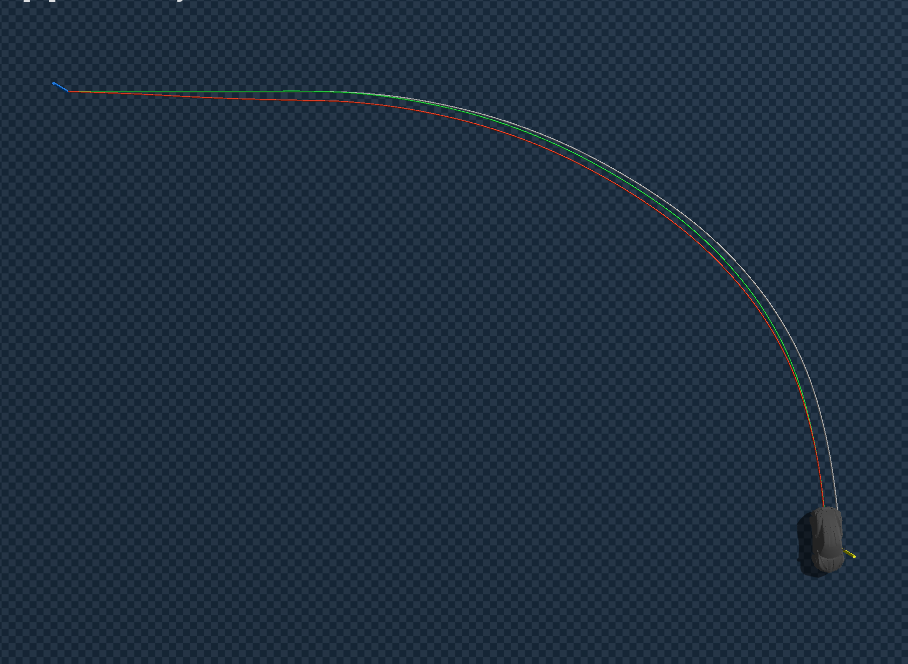
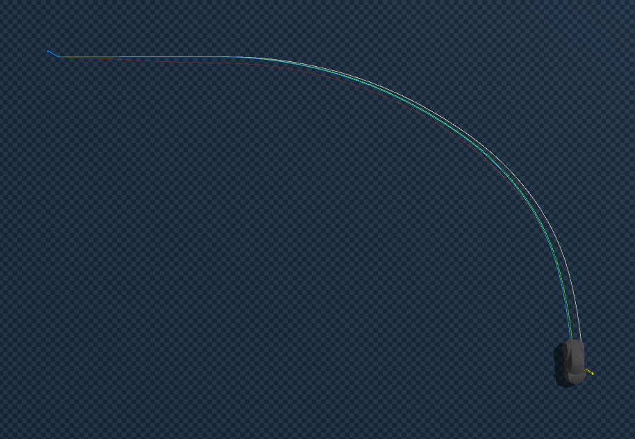

# BC Frozen + Residual RL 실험 정리

본 실험에서 사용한 BC 모델은 기존에 생성한 5개의 최적화 경로 데이터를 기반으로 학습된 모델이며, friction 계산 방식은 `MAX` 기준

해당 BC 모델은 학습 경로에서는 안정적으로 동작하지만, 다양한 미학습 경로에 대해 완전한 일반화를 보장하지는 않았음.(데이터가 많아지면 해결될 것으로 보임.) 따라서 이번 residual RL 실험에서는 새로운 OOD 경로를 대상으로 하기보다, BC가 학습한 최적화 경로에 대응되는 Blender 원본 경로를 기준으로 실험을 진행

이는 본 실험의 핵심이 “미학습 경로 일반화”가 아니라, 이미 학습된 nominal BC controller가 존재하는 상황에서 구동계 문제가 발생했을 때 RL residual이 추가적인 보정 및 복구 능력을 제공할 수 있는지를 확인하는 것이기 때문 

## 1. 실험 목적

일단 먼저 기존 원본 데이터를 완벽하게 따라가는 것이 먼저라 생각하여 아래를 진행

기존 BC 모델은 golden data로 학습되어 있고, 학습 경로에서는 이미 경로를 잘 따라감. 따라서 강화학습의 목적은 BC를 대체하는 것이 아니라, **BC를 nominal controller로 고정한 상태에서 RL이 작은 residual action을 추가로 학습**

구조적으로는 BC가 기본 throttle/steer를 출력하고, PPO가 그 위에 더해지는 보정값만 출력하도록 설계했다. BC 모델은 27D feature를 입력으로 받고 `[throttle, steer]` 2D action을 출력하며, PPO actor와 직접 weight를 공유할 수 없기 때문에 **frozen BC + residual RL** 구조를 선택

```python
bc_action = BC(27D_feature)

rl_residual = PPO(9D_observation)

final_action = clamp(
    bc_action + residual_scale * rl_residual,
    -1, 1
)
```

이때 BC는 완전히 frozen 상태로 두고, PPO만 학습


## 2. 환경 조건 정리

``residual env와 기존 bc_env 의 물리 조건을 동일하게 가져감.``  


다만 RL 환경에서는 ''target(정확히 맞추고자 하는 원본 경로의 point)'' 시간 기준 `frame_idx`보다 현재 차량 위치 기준으로 target을 업데이트하는  `nearest_idx`가 더 적합하다고 판단. `frame_idx` 방식은 차량이 reference보다 빠르거나 느릴 때 target이 뒤처지는 문제가 있었고, 실제로 CTE가 악화되었다. 

따라서 최종 residual PPO 환경은 **물리 조건은 bc_env와 맞추되, target/reference는 `nearest_idx` 기반으로 함.


## 3. Reward function

```
reward =
    + speed reward
    + CTE penalty
    + heading penalty
    + action smoothness penalty
    + residual L2 penalty
```

구체적으로는 다음과 같은 의미다.

- **speed**: 현재 속도와 `v_smooth` target speed 차이에 대한 보상/패널티
- **CTE**: 경로 중심선에서 벗어난 cross-track error 패널티
- **heading**: 차량 yaw와 path heading의 차이에 대한 패널티
- **action_smoothness**: 최종 적용 action(`final_action`)의 급격한 변화 패널티
- **residual_l2**: PPO가 출력한 residual action 자체를 작게 유지하기 위한 패널티

초기 reward 구성은 speed, cte, heading, action_smoothness였고, residual이 너무 커지는 문제가 생긴 뒤,  
 **Stage 2에서 `residual_l2`를 추가**

---

## 4. Stage 1 결과: residual이 BC를 오히려 망침



처음 residual PPO는 다음 설정으로 진행

```python
residual_scale = 0.2
init_noise_std = 1.0
```

결과가 악화됨

**BC-only:**
- Mean CTE = 0.2557m
- Max CTE = 0.9549m
- Mean heading error = 0.423°
- Mean speed = 4.808m/s

**BC + Residual PPO:**
- Mean CTE = 0.5746m
- Max CTE = 1.0666m
- Mean heading error = 1.488°
- Mean speed = 5.304m/s
- Residual mean magnitude = 0.5522
- Residual saturation rate = 13.0%

즉, PPO residual이 BC를 보정한 것이 아니라, BC가 이미 잘 내고 있던 action을 크게 흔들어서 경로 추종 성능을 악화시킴 
특히 progress reward를 더 받기 위해 속도를 높이는 방향으로 학습되었고, 그 결과 커브에서 안쪽으로 파고들며 CTE가 커짐


## 5. Stage 2 결과: 안정화는 되었지만 BC-only보다 좋지 않음



이후 residual을 작게 만들기 위해 다음과 같이 수정

```
residual_scale:    0.2 → 0.1
init_noise_std:    1.0 → 0.2
residual_l2 penalty 추가
```

결과는 Stage 2보다 개선

**Stage 2 PPO:**
- Mean CTE = 0.3250m
- Max CTE = 1.1645m
- Mean heading error = 0.345°
- Mean speed = 4.916m/s
- Residual magnitude = 0.137
- Saturation = 0.0%

하지만 BC-only와 비교하면 여전히 악화

| | Mean CTE |
|---|---|
| BC-only | **0.2557m** |
| Stage 22 | 0.3250m |

즉, Stage 2는 BC를 크게 망치지는 않도록 안정화한 것이지, **BC보다 더 좋은 nominal tracking을 만든 것은 아님**


## 6. 결론: nominal path에서 residual RL로 BC-only를 더 맞추는 것은 의미가 거의 없음

이번 실험에서 확인한 핵심은 다음

> 외란이 없는 nominal 경로에서는 BC-only가 이미 충분히 잘 동작  
> 따라서 residual RL이 추가로 개선할 여지가 작음

BC-only가 이미 mean CTE 약 0.26m 수준으로 안정적으로 경로를 따라가고 있기 때문에, nominal 상황에서 residual의 이상적인 값은 대부분 0에 가까움.

```
ideal residual ≈ 0
```

이 상태에서 PPO를 학습시키면, PPO는 보상을 더 얻기 위해 불필요하게 BC action을 수정하려고 함. 특히 progress reward가 존재하기 때문에 더 빠르게 가는 방향으로 residual을 만들 수 있고, 그 결과 오히려 경로 이탈이 증가

따라서 이 실험의 결론은 다음과 같음

> **BC-only가 이미 잘 동작하는 nominal 경로에서**
> **residual RL을 사용해 원본 reference에 더 정확히 맞추는 것은 효과가 제한적.**
>
> **오히려 residual이 BC action을 흔들어 tracking 성능을 악화시킬 수 있음.**