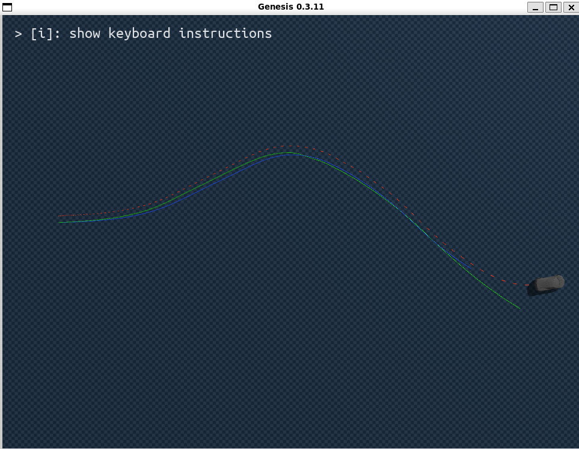
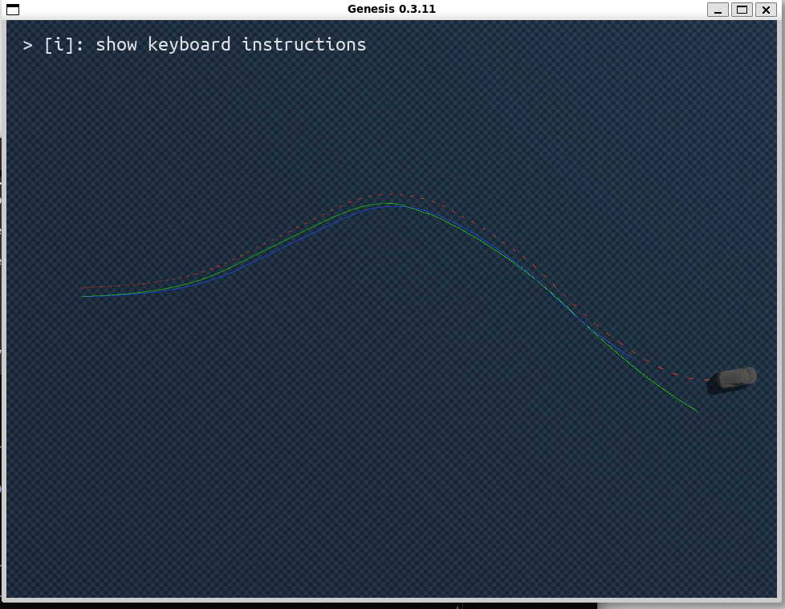

# BC Frozen + RL Residual Brake Controller 기반 초기 외란 복구 실험 보고서

## 1. 실험 설계

기존에 설계한 max fricition 기반으로 학습한 path2st 모델을 사용하고, 그 위에 RL을 입혀 학습한 path2st 모델이 잘 추종하는 경로에 변수(ex:아래에서 실험한 차량의 시작 초기 위치를 옆으로 이동시키는 것 등)를 주었을 때 원래의 경로로 복귀하여 주행을 잘 시행하는 지를 봄. 

또한, 기존 path2st 모델은 output으로 s,t를 반환하지만, RL를 거친 후에는 s,t,b를 출력하도록 설계함. 즉, RL로 residual, 경로에 변수를 주었을 때 단순히 s,t로 보정을 하는 것이 아닌 brake까지 사용하여 잘 복구할 수 있도록 설계한 것임.

---

## 2. Soft Intervention 구조

“hard하게 개입하지 말고 soft하게 개입”한다는 내용은 현재 구현에서 **보상함수 항이 아니라 action-level gating 구조**로 반영함.

즉 PPO residual을 항상 같은 강도로 적용하지 않고, 현재 차량 상태가 위험할수록 더 크게 반영함.

```text
위험도 낮음
→ intervention_ratio 작음
→ 거의 BC action 그대로 사용

위험도 높음
→ intervention_ratio 큼
→ PPO residual과 brake를 더 강하게 반영
```

위험도는 `risk_score`로 계산함.

```text
risk_score =
    w_cte     × |cross_track_error|
  + w_heading × |heading_error|
  + w_speed   × |speed_error|
  + w_curve   × current_speed × max(|lookahead_curvature|)
```

각 항의 의미는 다음과 같음.

| 항목 | 의미 |
|---|---|
| `cross_track_error` | 차량이 path 중심선에서 얼마나 벗어났는지 |
| `heading_error` | 차량 방향이 path tangent와 얼마나 다른지 |
| `speed_error` | 현재 속도와 target speed의 차이 |
| `current_speed × lookahead_curvature` | 빠른 속도로 곡률이 큰 구간에 진입하는 위험도 |

이 `risk_score`를 이용해 `intervention_ratio`를 계산하고, 이 값이 PPO residual action에 곱해짐.

```text
BC action + intervention_ratio × PPO residual
```

따라서 soft intervention의 의미는 다음과 같음.

```text
RL을 항상 강하게 개입시키는 것이 아니라,
현재 경로 이탈 위험도에 따라 PPO residual을 부드럽게 반영함.
```

---

## 3. PPO 학습 설계

### 3-1. Reward 설계

PPO residual controller는 path recovery를 목표로 학습함. 보상함수는 여러 항을 과도하게 추가했을 때, *Reward hacking* 현상이 빈번하게 발생할 수 있어 5개의 항으로 구성.

현재 reward의 주요 구성은 다음과 같음.

```text
reward =
  - speed_weight              × speed_error_penalty
  - cte_weight                × CTE_penalty
  - heading_weight            × heading_error_penalty
  - action_smoothness_weight  × action_change_penalty
  - brake_smoothness_weight   × brake_change_penalty
```

현재 주요 weight는 다음과 같음.

```text
speed_weight              = 0.5
cte_weight                = 3.0
heading_weight            = 0.75
action_smoothness_weight  = 0.05
brake_smoothness_weight   = 0.01
brake_usage_weight        = 0.0
```

여기서 `brake_usage_weight = 0.0`이라는 것은 brake 사용량 자체에 대한 직접적인 reward나 penalty가 없다는 뜻임. 즉, 현재 reward는 brake를 직접적으로 “밟으라”고 보상하지 않음.

다만 `brake_smoothness_weight`는 존재함. 이 항은 brake를 많이 쓰게 만드는 항이 아니라, brake command가 급격히 변하는 것을 억제하기 위한 항임.

따라서 현재 구조에서 brake는 직접 보상으로 학습되는 것이 아니라, brake를 사용했을 때 speed error, CTE, heading error가 줄어들면 전체 penalty가 감소하는 방식으로 간접적으로 학습됨.

예를 들어 차량이 target speed보다 너무 빠른 상황에서 brake를 밟아 속도 오차가 줄어들면, `speed_error_penalty`가 감소함. 또는 급커브 구간에서 감속을 통해 CTE 증가가 줄어들면, `CTE_penalty`가 감소함. 이런 경우 PPO는 brake 사용이 전체 reward를 개선한다는 방향으로 학습할 수 있음.

다만 현재 reward에는 brake를 직접적으로 활성화시키는 항은 없기 때문에, 이후에도 과속이 발생하는데 brake가 잘 사용되지 않는다면 다음과 같은 추가 설계를 검토할 수 있음.

```text
- actual speed > target speed일 때 overspeed penalty 강화
- 급커브 구간에서 과속 시 penalty 강화
- brake exploration 또는 brake activation 조건 조정
```

현재 단계에서는 brake 사용량 자체보다, 먼저 lateral recovery가 가능한지를 확인하는 것을 우선함.

---

### 4-2. PPO batch size, mini-batch, iteration 설정

PPO 학습 설정은 다음과 같음.

```text
num_envs            = 32
num_steps_per_env   = 64
rollout_batch_size  = 32 × 64 = 2048
num_mini_batches    = 8
actual mini_batch   = 2048 / 8 = 256
num_learning_epochs = 5
max_iters           = 300
```

즉 한 iteration마다 32개의 병렬 environment에서 각각 64 step씩 rollout하여 총 2048개의 transition을 수집함.

이를 8개의 mini-batch로 나누므로 실제 mini-batch size는 다음과 같음.

```text
actual mini_batch_size = 2048 / 8 = 256
```

한 iteration에서 gradient update는 다음 횟수만큼 수행됨.

```text
num_mini_batches × num_learning_epochs
= 8 × 5
= 40
```

전체 학습 step 수는 다음과 같음.

```text
total timesteps
= 32 × 64 × 300
= 614,400
```

따라서 본 실험은 약 61만 step 규모의 PPO 학습으로 진행됨.

---

## 5. Brake 추가 및 차량 제어 구조

### 5-1. Brake action 추가

기존 PPO residual action은 `[delta_throttle_raw, delta_steer_raw]`였음.

```text
기존:
RL residual action = [delta_throttle_raw, delta_steer_raw]
```

교수님 미팅 이후, 감속 제어를 명시적으로 포함하기 위해 brake action을 추가했음.

```text
수정:
RL residual action = [delta_throttle_raw, delta_steer_raw, brake_raw]
```

brake command는 0과 1 사이의 값으로 사용함.

```text
brake ∈ [0, 1]
```

여기서 0은 brake를 사용하지 않는 상태이고, 1은 최대 brake command를 의미함. 이 brake command는 이후 brake torque로 변환되어 차량의 바퀴에 적용됨.

---

### 5-2. Brake torque 적용 방식

차량 구조는 후륜구동을 유지함.

```text
drive torque:
- rear left wheel
- rear right wheel

brake torque:
- front left wheel
- front right wheel
- rear left wheel
- rear right wheel
```

즉 drive torque는 후륜에만 적용하고, brake torque는 네 바퀴에 모두 적용함.

이는 실제 차량에서 brake가 네 바퀴에 작동한다는 구조를 반영한 것임. 또한 제동 시 차량 하중이 전륜 쪽으로 이동하는 점을 고려하여, brake torque는 front-biased 방식으로 분배했음.

```text
front brake bias = 60%
rear brake bias  = 40%
```

각 wheel 기준으로는 다음과 같음.

```text
FL = 30%
FR = 30%
RL = 20%
RR = 20%
```

따라서 wheel torque 구조는 다음과 같음.

```text
FL = brake torque only
FR = brake torque only
RL = drive torque + brake torque
RR = drive torque + brake torque
```

중요한 구조적 조건은 다음임.

```text
front drive torque = 0
```

전륜은 조향과 제동에 사용하고, 구동 토크는 후륜에만 적용함.

---

### 5-3. Throttle-Brake Constraint

교수님 미팅 내용과 실제 운전자의 제어 방식을 반영하여, brake와 throttle이 동시에 큰 값으로 들어가지 않도록 hard constraint를 추가했음.

본 실험에서는 다음 제어 가정을 둠.

```text
브레이크와 엑셀을 동시에 밟지 않는 controller를 가정함.
```

따라서 brake가 의미 있게 들어오면 throttle drive torque를 0으로 차단함.

```text
brake_threshold = 0.05

if brake > brake_threshold:
    effective_throttle = 0.0
else:
    effective_throttle = throttle_pre_brake
```

vectorized training env에서는 다음과 같이 구현함.

```text
effective_throttle = torch.where(
    brake > brake_threshold,
    torch.zeros_like(throttle_pre_brake),
    throttle_pre_brake
)
```

여기서 `throttle = 0`은 차량 정지가 아니라 **drive torque 차단**을 의미함. 차량은 관성으로 계속 움직이고, 실제 감속은 brake torque에 의해 발생함.

또한 brake는 steering에 영향을 주지 않음.

즉 최종 제어는 다음처럼 정리됨.

```text
effective_throttle:
- brake > 0.05이면 0
- 아니면 throttle_pre_brake

final_steer:
- BC steer + PPO steer residual
- brake와 독립

brake:
- 4-wheel brake torque로 적용
```

---

## 6. 전체 실험 파이프라인

본 실험은 외란을 한 번에 모두 적용하지 않고, 원인을 분리하기 위해 단계적으로 확장함.

```text
Stage 1: fixed start + lateral perturbation
현재 진행 중
- 차량 초기 위치를 path 기준 lateral 방향으로 이동
- lateral_offset ~ Uniform(-1.0m, +1.0m)
- viewer 대표 case: s_curve, lateral_offset = +1.0m
- 목적: path 옆으로 밀린 상태에서 reference path로 복귀 가능한지 확인

        ↓

Stage 2: fixed start + heading perturbation
Stage 1 성공 후 진행
- 차량 초기 heading을 path tangent에서 회전
- heading_offset ~ Uniform(-8deg, +8deg)
- 목적: 방향이 틀어진 상태에서 path 방향으로 재정렬 가능한지 확인

        ↓

Stage 3: fixed start + lateral + heading perturbation
Stage 1, 2 성공 후 진행
- lateral_offset ~ Uniform(-1.0m, +1.0m)
- heading_offset ~ Uniform(-8deg, +8deg)
- 목적: 위치와 방향이 동시에 틀어진 초기 pose error에서 복구 가능한지 확인

        ↓

Stage 4: contact friction variation
초기 pose recovery 이후 진행
- friction_scale ~ Uniform(0.6, 1.0)
- effective contact friction = 2.5 × friction_scale
- 목적: contact friction 변화가 있을 때도 path tracking을 유지할 수 있는지 확인
```

현재는 **Stage 1 lateral perturbation**을 진행 중임.

---

## 7. Stage 1 결과: BC-only vs BC+RL 진단 비교

Stage 1은 fixed start 상태에서 차량을 reference path 기준 lateral 방향으로 이동시킨 뒤, PPO residual controller가 BC-only보다 더 적극적으로 원래 경로로 복귀시키는지를 확인하기 위한 실험임.

이 단계에서 기대한 결과는 다음과 같았음.

```text
BC-only:
초기 lateral offset을 가진 상태에서 reference path와 비슷한 형태로 주행할 수는 있지만,
경로 중심선으로 빠르게 복귀하지는 못할 것으로 예상

BC + PPO residual:
초기 lateral offset 이후 PPO residual이 steer/throttle/brake 보정을 수행하여,
BC-only보다 더 빠르게 reference path 중심으로 복귀할 것으로 예상
```

즉 Stage 1의 핵심 목표는 단순히 차량이 path와 비슷한 모양으로 주행하는 것이 아니라, **RL residual을 적용했을 때 초기 lateral error가 더 빠르게 줄어들고, reference path로 명확하게 복귀하는지 확인하는 것**이었음.

---

### 7-1. Viewer 시각 결과

```text
파랑: Blender reference path
초록: MPPI golden trajectory
빨강:
BC-only rollout
BC frozen + PPO residual + brake rollout
```

| BC-only rollout | BC frozen + PPO residual + brake rollout |
|---|---|
|  |  |
| PPO residual을 사용하지 않고 BC controller만 적용한 결과 | Frozen BC 위에 PPO residual과 brake action을 추가한 결과 |

Viewer 결과만 보면 BC-only와 BC+RL rollout이 거의 비슷한 경로 형태를 보였음. 따라서 시각적 결과만으로는 PPO residual이 lateral recovery에 뚜렷하게 기여했다고 보기 어려움.

---

### 7-2. BC-only vs BC+RL 정량 비교

동일한 초기 조건에서 BC-only와 BC+RL hard v2를 비교했음.

| 항목 | BC-only | BC+RL hard v2 | 해석 |
|---|---:|---:|---|
| initial CTE | 1.000 | 1.000 | 동일 조건 |
| mean CTE | 1.097 | 1.126 | BC-only가 더 좋음 |
| max CTE | 1.469 | 1.497 | BC-only가 더 좋음 |
| final CTE | 0.119 | 0.132 | BC-only가 더 좋음 |
| recovery_time | None | None | 둘 다 recovery 기준 미충족 |
| completion | False | False | 둘 다 path completion 실패 |
| cte_abort | False | False | 둘 다 큰 이탈은 없음 |
| timeout | True | True | 둘 다 timeout |
| speed_err mean | 1.64 | 1.82 | BC+RL이 더 과속 |
| speed_err max | 8.05 | 9.23 | BC+RL이 더 과속 |
| brake_mean | 0 | 0 | 둘 다 brake 사용 없음 |
| T_drive_F max abs | 0 | 0 | front drive torque invariant 유지 |

정량 결과를 보면 BC-only와 BC+RL의 차이는 매우 작았음. 특히 mean CTE, max CTE, final CTE 모두 차이가 0.03m 이하로, PPO residual이 lateral recovery를 의미 있게 개선했다고 보기 어려움. 오히려 BC+RL hard v2는 mean CTE, max CTE, final CTE에서 모두 BC-only보다 약간 더 나쁜 결과를 보였음. 또한 speed error도 BC+RL에서 더 크게 나타나, RL residual이 path recovery를 돕기보다 speed overshoot를 악화시킨 것으로 해석됨.

---

### 7-3. 원인 분석

이번 Stage 1 실패 원인은 다음과 같이 해석할 수 있음.

첫째, lateral offset 1m 조건이 BC-only에게 충분히 어려운 외란이 아니었을 가능성이 있음. BC-only도 reference path와 비슷한 형태로 주행하면서 후반부에는 final CTE 0.119m까지 자연스럽게 수렴했음. 따라서 PPO가 추가로 학습할 명확한 corrective signal이 약했을 수 있음.

둘째, PPO residual이 속도 제어를 개선하지 못했음. BC+RL은 BC-only보다 speed error mean과 max가 모두 더 컸음. 이는 RL residual이 path recovery를 위해 더 적극적으로 throttle/steer를 조정했지만, 결과적으로 과속을 키워 lateral recovery에는 도움이 되지 않았다는 뜻임.

셋째, brake action을 추가했음에도 deterministic evaluation에서는 brake가 사용되지 않았음. 따라서 과속 상황에서 brake를 통해 감속하는 behavior가 학습되지 않았고, 결과적으로 speed overshoot 문제가 그대로 남았음.

---

### 7-6. 다음 단계 대안

현재 Stage 1 결과만으로는 PPO residual이 lateral recovery를 개선한다고 주장하기 어려움. 따라서 다음 단계는 두 가지 방향 중 하나로 정리할 수 있음.

#### 대안 A. Stage 1을 더 어렵게 재설계하여 재실험

Stage 1 자체를 유지하되, BC-only가 자연스럽게 복귀하기 어려운 조건을 만들고 speed overshoot 문제도 함께 다룸.

```text
1. lateral disturbance 강화
- lateral_offset 범위를 U(-2.0m, +2.0m) 등으로 확대
- BC-only가 자연스럽게 복귀하기 어려운 조건 생성

2. speed overshoot 대응
- actual speed > target speed인 경우를 더 강하게 penalty
- brake를 간접적으로라도 사용할 필요가 생기도록 reward 수정 검토
```

이 대안은 Stage 1의 목표였던 “lateral error에서 RL residual이 즉각적으로 path로 복귀시키는지”를 더 명확하게 검증할 수 있다는 장점이 있음. 다만 reward와 disturbance 설정을 다시 바꿔야 하므로 추가 학습 비용이 발생함.

#### 대안 B. Stage 1을 생략하고 Stage 4(지면의 friction을 바꾸는)로 이동

이 대안의 관점은 다음과 같음.

```text
Stage 1에서는 BC-only도 이미 자연스럽게 수렴했기 때문에,
PPO residual이 학습할 명확한 corrective signal이 부족했음.
따라서 BC가 더 명확히 한계를 보이는 다음 stage에서 PPO residual 효과를 다시 확인함.
```

이 대안은 현재 연구의 목적이 “BC가 이미 잘하는 상황을 더 좋게 만드는 것”이 아니라, “BC가 어려워하는 조건에서 RL residual이 보정 역할을 하는지 확인하는 것”이라는 점에서 더 실용적임.

---

## 8. 현재 정리

본 실험에서는 reference path에서 생성한 golden/teacher control을 이용해 학습된 BC controller를 frozen nominal controller로 사용함. PPO는 BC를 대체하지 않고, BC가 출력한 throttle/steer 위에 residual correction을 추가함.

교수님 미팅 내용에 따라 PPO action space에는 brake를 추가했음. brake는 0과 1 사이의 command로 사용하며, 4-wheel front-biased 방식으로 적용함. drive torque는 후륜에만 적용하고, 전륜 drive torque는 항상 0으로 유지함.

또한 brake와 throttle이 동시에 크게 들어가지 않도록, brake가 의미 있게 들어오면 throttle drive torque를 0으로 차단하는 hard constraint를 적용했음. 이때 throttle 0은 차량 정지가 아니라 drive torque 차단이며, 차량은 관성으로 계속 움직이고 실제 감속은 brake torque에 의해 발생함.

soft intervention은 reward 항이 아니라, risk score를 기반으로 PPO residual action을 final control에 얼마나 반영할지 결정하는 action gating 구조임. 현재 상태가 안정적이면 BC action을 거의 그대로 사용하고, path 이탈 위험이 커질수록 PPO residual과 brake 개입이 커지도록 설계했음.

그러나 Stage 1 lateral recovery 진단 결과, 동일한 초기 lateral offset 조건에서 BC-only와 BC+RL hard v2의 차이는 거의 없었고, 오히려 BC+RL이 mean/max/final CTE 및 speed error 측면에서 약간 더 악화되었음. 따라서 Stage 1에서 기대했던 “PPO residual을 통한 즉각적인 path recovery”는 확인되지 않았음.

결론적으로, 현재 Stage 1은 **FAIL**로 정리함. 다만 이 실패는 구조 구현의 실패라기보다는, lateral 1m offset 조건이 BC-only에게 충분히 어려운 외란이 아니었고, PPO residual이 학습할 명확한 corrective signal이 부족했던 것으로 해석됨. 이후에는 Stage 1을 더 어렵게 재설계하여 재실험하거나, Stage 1을 실패 사례로 정리하고 바로 Stage 4로 이동하는 두 가지 대안 중 하나를 선택함.
