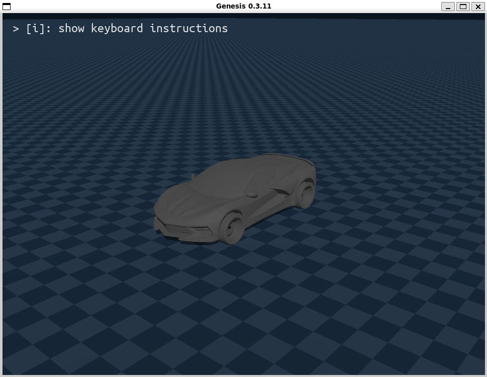
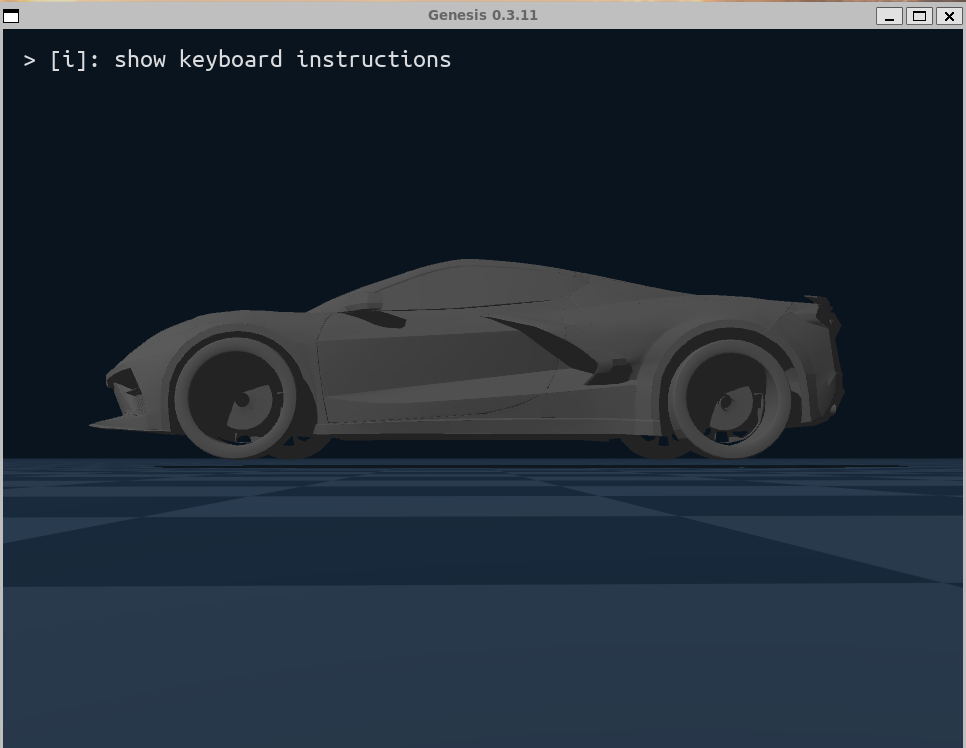
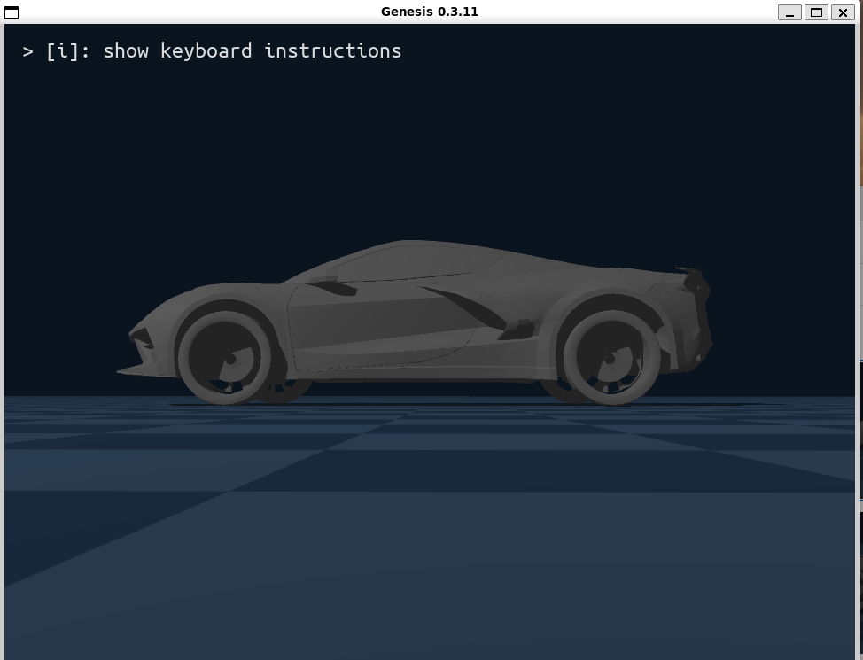
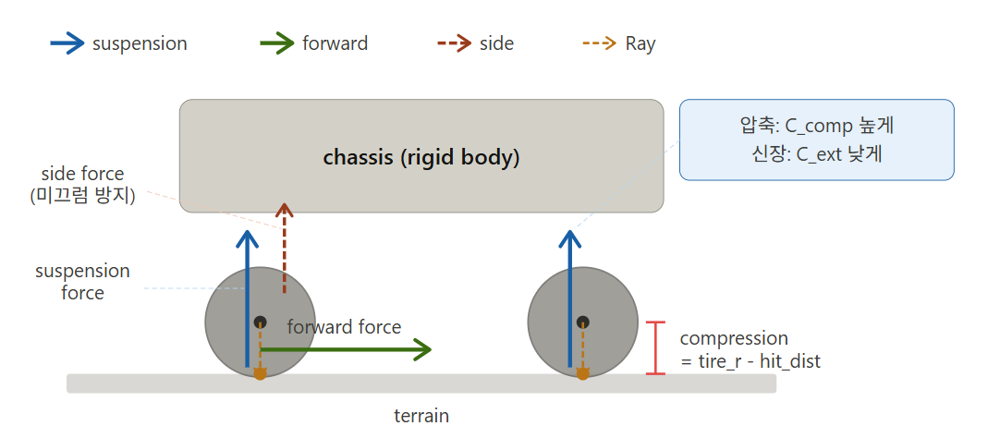
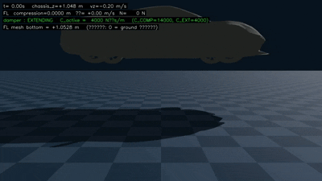
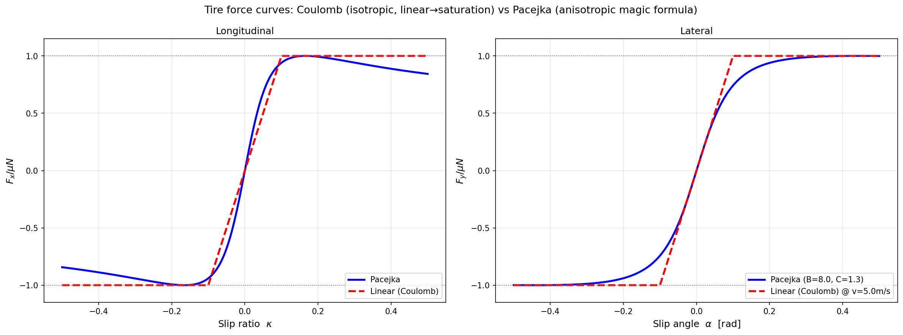
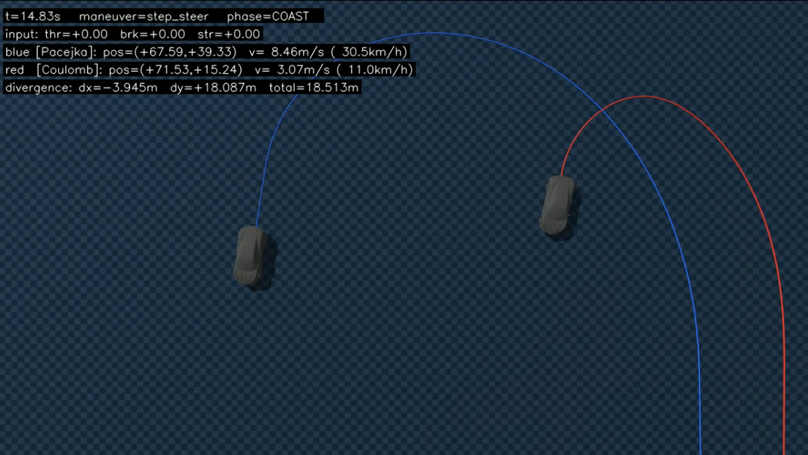

# car_raywheel — ray-based 차량 URDF 설계

## 1. 기본 구조



- 4 wheels:
  - 전륜 (FL, FR): steer + brake (drive 없음)
  - 후륜 (RL, RR): drive + brake  
->   brake 는 4 wheel 모두 적용 (FL=30%, FR=30%, RL=20%, RR=20%),   
->    실차의 front-biased 제동 (전륜 60%, 후륜 40%) 구조를 반영. EBD/ABS 등 동적 보정은 모델링하지 않음.

- DoF 합계 = 16:
  - chassis root (FREE): 6
  - wheel prismatic suspension: 4 (FL, FR, RL, RR)
  - 전륜 steer (revolute): 2 (FL, FR)
   - wheel rotation (continuous): 4
---

## 2. 개요

기존 `blender_car_suspension_pro.urdf` 를 **ray-based 모델용**으로 재구성.

- **차체(chassis)만 collision 유지**, 바퀴(wheel)는 collision 제거
- **원본 URDF 의 prismatic suspension joint 는 그대로 유지** (**fixed joint로 변경 후 visual 부분에서 문제가 발생하여 다시 원래로 변경하여 visual 정렬용 trick으로 prismatic 사용, 자세한 내용은 아래 첨부.**)

```-> 즉, 다시 말해 실제 genesis solver에서 collision에 대한 계산은 chassis에 대해서만 진행하고 wheel의 collision은 끄고 ray 방식의 외부 계산으로 대체하여 반영.(joint에 관한 내용은 아래에서)``` 

---


## 3. fixed → prismatic 시행착오

### 3.1 초기 시도 — 원본 prismatic 을 fixed 로 변경

원본 URDF 의 prismatic suspension joint 를 `<joint type="fixed">` 로 바꿈.

- **이유**: ray 가 이미 chassis 에 직접 외력(F, T)을 적용하고 있으므로, joint 자체의 z 자유도(suspension)는 굳이 필요 없을 거라 판단.
- Genesis solver 의 spring/damper 도 우리가 사용 안 할 거라면, 자유도 자체를 없애 모델을 단순화하려는 의도.
- 결과적으로 wheel 이 chassis 에 강체로 붙어버림 (z 자유도 = 0).

### 3.2 문제 — wheel mesh 가 ground 와 ~5 cm 떠 있음



차량 평형 상태에서 wheel mesh 가 시각적으로 ground 위에 떠 있음.

원인 분석:

| 항목 | 값 |
|---|---|
| wheel link world z (= chassis z + 0.34, fixed 고정) | 0.381 m |
| wheel mesh radius (실측 OBJ bbox) | 0.335 m |
| **wheel mesh bottom world z** | 0.381 − 0.335 = **+0.046 m** |

→ wheel 이 공중에 4.6 cm 부양. 시각적으로 차량 자세가 비현실적.(물리는 정확(부양 상태가 아님), 단순 visual만)

근본 원인: **fixed joint 는 chassis local frame 에 wheel link 를 고정**시키는데, chassis 의 평형 위치는 ray-based suspension 의 compression 에 의해 결정됨.   
fixed joint 는 ``정적`` chassis_local 좌표만 가지므로 이 ``동적 변화``에 대응 불가

```-> 즉, 다시 말해 ray 가 알려준 ground 위치와 wheel mesh 의 visual 위치가 일치해야 하는데 fixed joint라 일치하지 않음.```

### 3.3 해결 — 원본 prismatic 으로 되돌림 (단, dynamics=0)



suspension joint 를 원본 형태인 **prismatic** 으로 되돌림. 단, Genesis 자체 spring 은 여전히 사용하지 않음:


- `dynamics damping/friction/stiffness = 0` → Genesis solver 의 spring/damper 사용 안 함
- joint 는 **순수 visual 정렬 자유도**로만 활용

매 step `physics.step()` 안에서 joint position 을 직접 설정:

```python
joint_pos = WHEEL_MESH_RADIUS - hit_distance
self.car.set_dofs_position(
    joint_pos, suspension_dofs,
    zero_velocity=False,    # chassis velocity reset 부작용 차단
)
```

이 방식의 의미:

- **물리는 여전히 ray-based**: Genesis 자체 prismatic spring 사용 안 함. 우리 가상 suspension 의 normal force N, longitudinal/lateral tire force 만 외력으로 chassis 에 적용.
- **시각만 prismatic 으로 동적 정렬**: wheel mesh 가 ground 표면 (heightfield 포함)을 정확히 추종.
- ``이 패턴은 CARLA, Unity Vehicle Physics, Unreal Chaos Vehicles 등 산업 표준 vehicle simulator 의 공통 방식.``

### 3.4 결과

| 항목 | fixed | prismatic + dynamic positioning |
|---|---|---|
| 평형 시 wheel mesh bottom | +0.046 m (떠 있음) | **±0.003 m** (ground 에 정확히 닿음) |
| heightfield 등반/하강 시 wheel 추종 | × (chassis 와 함께만 움직여 wheel 이 지면 뚫거나 떠 있음) | ✓ (per-wheel 독립 ground 추종) |
| Genesis solver 부담 | 적음 (joint 자유도 적음) | 동일 (joint 자유도 있지만 dynamics 0) |
| 시각적 사실성 | ✗ | ✓ |

---

## 4. Custom Raycaster Pattern (sensing layer)

### 4.1 `gs.sensors.Raycaster`

- Genesis 가 기본 제공하는 ray-cast 센서.   
- 어떤 entity 에 부착하면 그 entity 의 위치·자세 기준으로 ray 를 쏴서 닿은 곳까지의 **거리·위치 정보**를 알려줌. 우리는 자동차에 부착.


### 4.2 `RaycastPattern`

Raycaster 가 쏠 ray 가 **어디서 어떤 방향으로** 쏘아질지를 정의하는 객체. Genesis 가 기본 제공하는 패턴:

- **GridPattern** — ray 를 격자 형태로 (LiDAR 같은 정면 sweep)
  ```
  ● ● ● ●
  ● ● ● ●
  ● ● ● ●
  ```

- **SphericalPattern** — 사방으로 퍼지는 ray (drone obstacle 감지 등)
  ```
        ↑
     ↖  |  ↗
   ←─── ● ───→
     ↙  |  ↘
        ↓
  ```

``-> 기본 제공 패턴 중엔 차량 4 wheel 위치에서 아래로만 쏘는 게 없음 → -z 방향으로 쏘는 ray를 custom 정의.``  
``-> ray 4 개로 4 wheel 의 ground 정보를 한 번에 받음. 이 distances 로 가상 suspension force 와 tire force 가 외부 계산됨.``



### 4.3 Compression & Suspension 반력 N (비대칭 damper)

#### Compression

ray hit_distance 로부터 spring 압축량 계산:

```
compression = max(REST_D − hit_distance, 0)
REST_D = TIRE_R + L_SUSP = 0.358 + 0.10 = 0.458 m
```

- **REST_D**: wheel 이 ground 에 막 닿은 (무하중) 시점에서 ray 가 측정해야 할 거리.
- **compression > 0**: 지면이 wheel 을 위로 누르는 만큼 spring 이 눌린 상태.
- **compression = 0**: wheel 공중 (`max()` 로 음수 차단 — distance > REST_D 면 wheel 자유 매달림).

평형 시 값: 차량 무게 (mg ≈ 21582 N) 가 4 wheel 균등 분배 → 각 wheel 의 spring 이 약 **7.7 cm 압축된 상태로 정지** (`mg / (4 · K_SUSP) = 21582 / 280000 ≈ 0.077 m`).

#### 비대칭 damper — Suspension 반력 N

compression 으로부터 chassis 에 인가될 수직 반력 N 계산:

```
N = K_SUSP · compression + C_damp · ċ          (N ≥ 0)

C_damp = C_COMP (= 14000 N·s/m)   if ċ > 0     (압축 진행 중)
       = C_EXT  (=  4000 N·s/m)   if ċ < 0     (신장 진행 중)
```

- **K_SUSP**: spring 항. 
- **compression**: 눌린 양에 비례하는 복원력.
- **C_damp**: damper 항. 
- **ċ**: compression 의 시간 미분 (= 압축 속도).
- **C_COMP > C_EXT (14000 vs 4000) — 비대칭**:
  - **압축 시 (ċ > 0)**: 노면 충격을 강하게 흡수 → 진동 빠르게 잡음
  - **신장 시 (ċ < 0)**: 약하게 저항 → wheel 이 ground 로 다시 내려갈 시간 확보
  - 대칭이면 통통 튀거나 (under-damped) 둔하게 가라앉음 (over-damped).  
  - 비대칭 = 실차 shock absorber 의 표준 거동.




``→ 비대칭 damper 덕에 차량이 ground 에 닿은 뒤 1~2 회 작은 bounce 만으로 평형 (chassis_z ≈ 0.04 m, compression ≈ 7.7 cm) 에 빠르게 안착.``
``→ N 은 chassis 에 외력으로 인가되어 차량을 ground 위에 띄우는 수직 force.``

---

## 5. ray 로 바꾼 이유 — Coulomb (mesh-mesh) vs Pacejka (ray) 비교

- **Coulomb** = 기존 mesh-mesh contact 방식. Genesis (그리고 MuJoCo, Bullet, PhysX 등 대부분의 rigid body engine) 가 contact solver 내부에 hard-code 한 마찰 모델.
- **Pacejka** = ray-based 차량 시뮬에서 채택하는 magic formula. 실제 타이어의 비선형 grip 곡선을 모델링.

### 5.1 두 모델의 force 곡선 비교



``-> 위 그래프를 보면 Coulomb은 linear하게 이어져 있어, Pacejka에 비해 차량의 동작이 부자연스러울 것으로 예상 가능.``

  #### Coulomb 의 한계
  1. **Sharp saturation**: 작은 slip 만 지나면 마찰력이 곧장 최대값에 도달. 실차처럼 *한 번 솟구쳤다 살짝 내려오는* 거동 표현 못 함
  2. **Isotropic**: 실차 타이어는 가속·제동 방향(종방향) 마찰력이 회전 방향(횡방향) 마찰력보다 큰데, Coulomb 은 둘을 동일하게 봄.
  3. **회전 시 가속 불가**: 횡방향 slip 이 우세하면 마찰력이 거의 횡방향만으로 향함 → 가속·제동 마찰력이 거의 0.

  #### Pacejka 의 장점
  1. **Smooth peak + falloff**: 실차 타이어 거동에 가까운 곡선.
  2. **Anisotropic**: 가속·제동 방향과 회전 방향 각각 다른 stiffness 로 모델링 가능.
  3. **Friction circle**: 종력과 횡력을 따로 계산 후 합쳐서 한도 안에 분배 → 회전 중에도 가속/제동 일부 가능.

``-> 그래프를 보면 Coulomb 은 한계(-1, 1)까지 가속하다가 그냥 직선으로 평평하게 (sharp clip). Pacejka 는 한 번 솟구쳤다가 살짝 내려옴. ``    
``-> 즉, Pacejka가 Coulomb보다 더 실제에 가까운 움직임을 모사.``

### 5.2 두 모델 비교

- 같은 차량·같은 입력 (`steer = +0.35` rad, throttle 0, brake 0) 에 두 tire model 만 swap 해서 동시에 주행.   



https://github.com/user-attachments/assets/e82ef9ea-7134-4796-947c-ede040bd008f

핵심 거동 차이:
- **Coulomb (빨강)**: 회전 시작 즉시 횡 slip 우세 → friction vector 가 거의 횡방향 → 종방향 마찰력 소실 → **급감속 + 작은 회전 반경**.
- **Pacejka (파랑)**: friction circle 분배로 종방향 force 일부 보존 → **속도와 큰 회전 호 유지**, 자연스러운 cornering.

10초 주행 후 두 차량 사이 누적 trajectory 차이가 **약 17.5 m**. 같은 입력에 대해 운동학적으로 전혀 다른 결과.

``-> 즉, Coulomb은 같은 steer 입력에도 회전을 할 때 급감속하고 회전 반경이 작아짐. (실제 차량 주행과 달리 부자연스러움)``  

`` -> mesh-mesh collision은 coulomb으로 제한되어 있어 tire는 ray가 더 물리적으로 정확. (일반 강체 충돌 (박스, 로봇, 부품) 에는 적합하지만, 타이어에는 부적합.) 속도 측면에서도 ray가 우월 ``

### 5.3 ray-wheel 의 두 가지 우월성

#### 정확성

| | mesh contact | ray-wheel |
|---|---|---|
| 마찰 모델 | Coulomb 등방 hard-coded | Pacejka 등 임의 tire model 적용 가능 |
| peak / falloff | × | ✓ |
| 종/횡 분리 | × | ✓ |
| friction circle | × (벡터 정규화로 단순) | ✓ |

#### 속도

| | mesh contact | ray-wheel |
|---|---|---|
| 충돌 탐색 | BVH traversal × wheel-mesh 모든 triangle pair | BVH ray hit 1 회 × 4 wheel |
| 복잡도 | 대략 O(N) (N = ground mesh triangle 수) | O(log N) per ray, 즉 O(4·log N) total |
| heightfield 위 시나리오 | 대량의 contact pair 생성 | ray 4 개로 끝 |

`` → 자동차 sim에서는 정확성과 속도 등과 같은 다양한 측면에서 ray-wheel 이 표준 (CARLA, Unity Vehicle Physics, Unreal Chaos Vehicles, BeamNG 등 모든 주요 simulator 가 채택).`` 


### 5. Todo

- ray-wheel 기반으로 다시 mppi 최적화(golden truth)를 하고 BC를 학습
- 학습한 BC를 이용해 BC(frozen) + RL 로 경로에 대한 residual 학습 및 환경이 바뀌었을 경우(지면의 friction, 차량의 구동계 등)를 대처하는 모델을 구현.