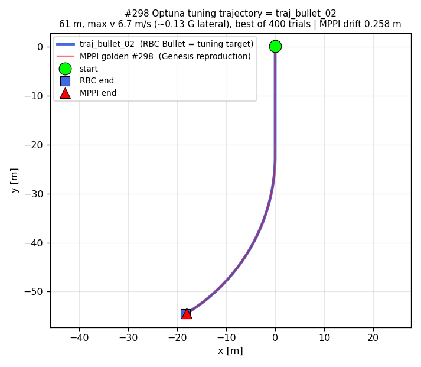
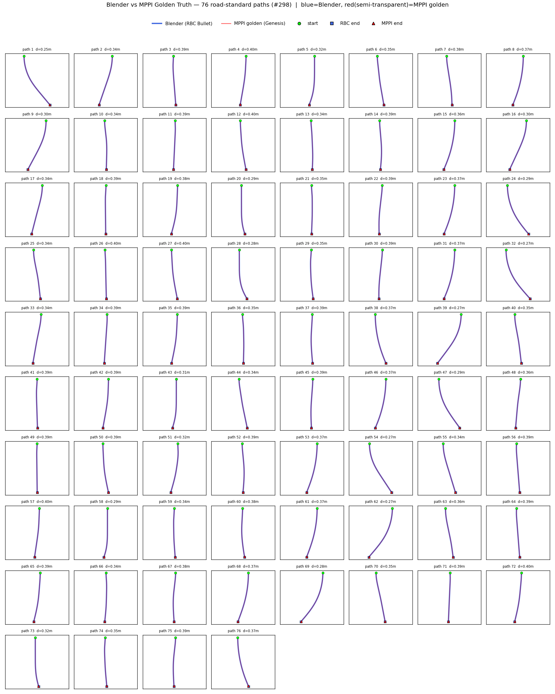
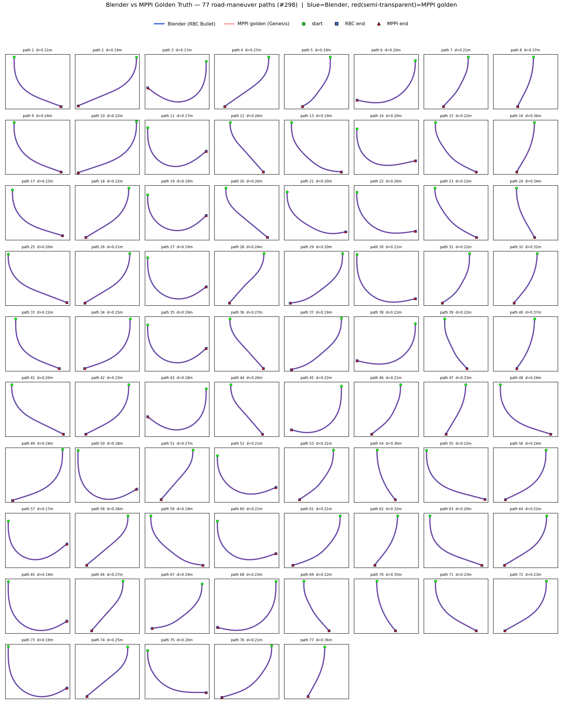
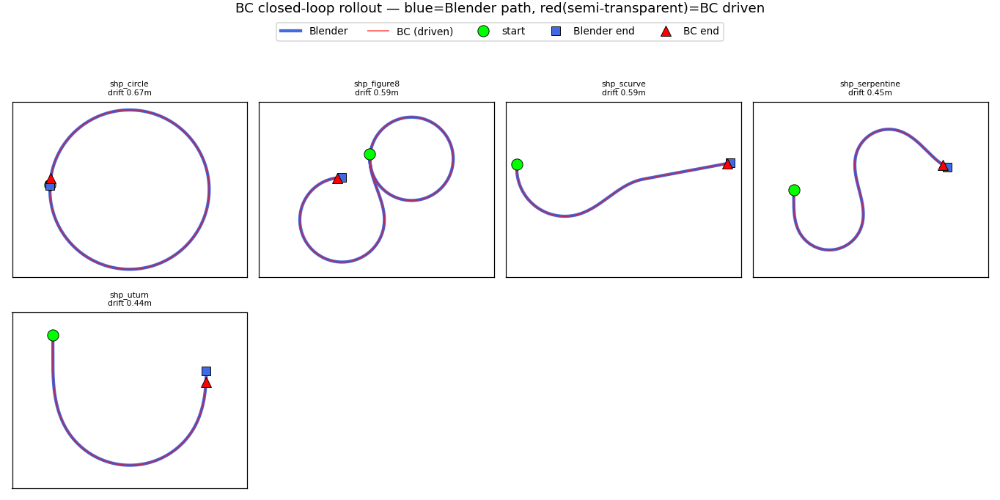

# 도로규격 경로 데이터셋 & Golden Truth 추종 분석

## 1. 개요 - 한국 도로규격에 맞는 경로 생성 간단 설명

### 1.1 한국 도로규격 

한국 도로규격(「도로의 구조·시설 기준에 관한 규칙」)은 원래 "설계속도별 최소 곡선반지름·완화곡선 길이" 표로 되어 있음.   
하지만 평지·임의곡률 경로를 만들기 때문에, 그 표의 물리적 근거를 가속도 3개의 한계값으로 바꿔 모든 경로에 적용:

| 한계 | 값 | 뜻 |
|---|---|---|
| 횡가속도 | ≤ 0.20 g (2.0 m/s²) | 코너에서 옆으로 쏠리는 힘 제한 → 너무 급하게 안 꺾음 |
| 종가속도 | 가속 ≤2.0 / 감속 ≤2.5 m/s² | 앞뒤 가감속 제한 → 급출발·급정거 안 함 |
| 완화곡선 jerk(가속도 변화율) | ≤ 0.5 m/s³ | 직선→커브 진입 시 핸들을 서서히 → 꺾임이 부드러움(클로소이드) |


### 1.2 경로 생성 방식 

| 단계 | 내용 |
|---|---|
| **① s,t 설계** | 도로 형태(직선·커브·회전 등)에 맞춰 조향 + 속도 프로파일을 만듦. 이때 위 도로규격(횡 ≤0.2g, 종 ≤2.0/2.5, 완화곡선 jerk ≤0.5)을 속도·조향에 반영  |
| **② Blender 주행(bake)** | 해당 s,t를 RBC 차량 제어로 넣고 Bullet 물리로 실제 주행 |
| **③ 궤적 읽기** | 차가 주행한 궤적(위치·속도·heading·곡률) = 물리적으로 가능한(feasible) target 경로 |

-> 조향·속도(s,t)를 설계 → Blender에서 RBC 차량을 그 s,t로 주행(Bullet 물리) → 차가 실제 간 궤적이 곧 경로.

### 1.3 Golden Truth 추출

이전 [MPPI + Optuna](#) 단계에서 확보한 특정 한 경로(이 경로도 한국 도로규격을 준수)에 대한 best 파라미터(**#298**)를 사용해,   
**한국 도로규격을 준수하는 다양한 경로 153개**에 대해 golden truth(Genesis 제어 S,T)를 추출하고 해당 best 파라미터가 다른 경로에 대해서도 잘 적용이 되는지 확인 후 적용.  
그 후 랜덤 추출한 다양한 경로의 golden truth로 BC(path2st)를 학습하여 generalize가 되었는지 확인.


```
#298 params: w_kappa=119.5, w_vel=12.74, w_heading=114.8, w_rate=2.97,
             w_ff=0.345, w_pos=259.5, mppi_lambda=63.2, noise_sigma_drive=0.138
```




`traj_bullet_02` — 파랑(RBC Bullet, 튜닝 대상) vs 빨강(MPPI golden #298, Genesis 재현)이 거의 완전히 겹침(drift 0.258 m).   
●=시작, ■=RBC 끝, ▲=MPPI 끝.

---

## 2. Blender vs Genesis(Golden Truth) 경로 비교

각 subplot = 한 경로. **파랑 = Blender(RBC Bullet) 경로**, **빨강(반투명) = MPPI golden(Genesis 재현) 경로**   
— 겹치면 보라색. ●=시작, ■=RBC 끝, ▲=MPPI 끝. 제목의 `d` = 해당 경로 mean drift.




- **데이터셋**: seed 1~10 × 8 형태 템플릿 = 80경로 생성 → 도로규격 위반 4개 제외 → **76경로**
- **설계속도** 36~58 km/h, 모든 경로가 종방향·횡방향 가속 + 완화곡선(클로소이드)까지 도로규격 준수
- **golden truth 추출**: MPPI dual-scene, #298 params, n_samples=1024 (경로당 ~239 frame)
- **2번**은 완만 곡선 76경로. 이후 곡률 다양성 확대를 위해 **회전 기동 77경로 추가** → **아래 3번**, 총 **153경로**

| 지표 | 평균 | 표준편차 | 최소 | 최대 |
|---|---|---|---|---|
| mean drift (m) | **0.354** | 0.041 | 0.246 | 0.397 |
| max drift (m) | 0.589 | 0.097 | 0.370 | 0.704 |
| **cross-track / 횡 (m)** | **0.007** | 0.001 | 0.003 | 0.009 |
| **along-track / 종 (m)** | **0.352** | 0.041 | 0.243 | 0.395 |
| velocity error (m/s) | 0.038 | 0.005 | 0.023 | 0.044 |
| heading error (deg) | 0.275 | 0.172 | 0.094 | 0.868 |

-> **76 / 76 경로 모두 sub-meter** (mean drift < 1 m). 편차도 작아(std 0.04 m) 경로 종류·속도대역과 무관하게 일관적.


-> 76경로 모두 두 경로가 **육안으로 구분이 안 될 만큼 겹침**. 즉 특정 한 경로에 대한 best 파라미터가 위 76개의 경로에 대해서 Genesis 차량이 RBC Bullet 경로의 *모양*을 거의 완벽히 재현.  
-> 하지만 위 76개 경로 모두 단조로운 직진 경로에 가까움. 그래서 아래 회전하는 77개의 경로를 한국 도로규격에 맞게 랜덤 생성.

---


## 3. 회전 경로 확장 

위 76경로는 곡률 다양성이 부족했다고 판단(전부 "직진하며 살짝 휘는" 완만 곡선, 총 회전각 ~20~40°).   
그래서 77개의 한국 도로규격에 맞는 회전 경로를 추가함.




각 subplot = 한 회전 기동 경로. **파랑 = Blender(RBC Bullet)**, **빨강(반투명) = MPPI golden(Genesis)**   
— 겹치면 보라색. ●=시작, ■=RBC 끝, ▲=MPPI 끝. 

- **설계속도**: **26~58 km/h** (평균 41, 파일명 kph = 직선·완만 구간 기준 V_d). 실제 주행 peak 17~52 km/h — 반경 R이 작은 tight 회전부는 `v=√(0.2g·R)`로 자동 감속(U턴·헤어핀 ~15~25 km/h, 완만 스윕 ~40~52 km/h)

| 지표 | 평균 | 표준편차 | 최소 | 최대 |
|---|---|---|---|---|
| mean drift (m) | **0.233** | 0.052 | 0.170 | 0.374 |
| cross-track / 횡 (m) | **0.009** | 0.002 | 0.006 | 0.014 |
| along-track / 종 (m) | 0.231 | 0.052 | 0.169 | 0.372 |
| velocity error (m/s) | 0.020 | 0.005 | 0.014 | 0.029 |
| heading error (deg) | 1.40 | 0.74 | 0.27 | 3.12 |


→ 위 2번과 동일하게 특정 한 경로에 대한 best parameter로 **경로 모양 완벽 재현**.

---

## 4. BC(path2st) 정책 학습

153경로 golden truth(상태→제어 s,t)를 MLP 정책으로 모방학습하여 path2st를 generalize하는 것이 목표

### 4.1 입출력 (path2st)

- **Output**: (throttle, steer), Tanh. 매 프레임 1개.
- **Input (27차원, 매 프레임 지역 feature)**:
  - 추종오차(3): Δv, Δheading, cross-track error
  - 현재상태(2): v, kappa / 이전제어(2): prev_throttle, prev_steer
  - 미리보기(20): 앞 10스텝 경로 곡률 κ[+1..+10] + 속도 v[+1..+10]


### 4.2 학습 설정

- 모델: MLP **27 → [128,128] → 2** (Tanh), 20,354 params
- 데이터: 153경로 → **궤적 단위** train 130 / validation(holdout) 23 분할 (train 32,810 / val 5,771 샘플)
- X 정규화(StandardScaler), MSE loss, Adam, early stopping(val 기준)

### 4.3 결과 

| 항목 | 값 |
|---|---|
| **train MSE** | **2.7e-5** |
| **val MSE** (holdout) | **3.0e-5** (RMSE ≈ 0.0055, 제어 [-1,1] 기준) |

→ **train ≈ val (2.7e-5 ≈ 3.0e-5)** 이라 **과적합 없음** 

---

## 5. BC Test Set 평가

임의의 경로(원·8자·serpentine·U턴·S커브)를 **설계**해 BC가 잘 주행하는지 확인.  
**1.2에서 설명한 경로 생성 그대로, 조향·속도(s,t)를 직접 설계해 Blender에서 차를 주행시킨 후 그 차가 간 경로로 설계함**(dynamic feasible).

BC 결과 :




위: 직접 설계한 5개 도형을 BC가 주행 — **파랑(Blender) vs 빨강(BC, 반투명)이 전 구간 겹침**(겹치면 보라색). ●=시작, ■=Blender 끝, ▲=BC 끝. 

| 설계 도형 | 설계속도 | drift(same-frame) | cte(횡, 도로이탈) | along-track(종) | v_err(속도오차) |
|---|---|---|---|---|---|
| 원 (360°) | 27 km/h | 0.673 m | **0.099 m** | 0.673 m | 0.016 m/s |
| 8자 | 24 km/h | 0.586 m | **0.058 m** | 0.586 m | 0.009 m/s |
| S커브 | 27 km/h | 0.571 m | **0.072 m** | 0.571 m | 0.021 m/s |
| serpentine | 18 km/h | 0.436 m | **0.044 m** | 0.435 m | 0.013 m/s |
| U턴 | 19 km/h | 0.212 m | **0.071 m** | 0.208 m | 0.046 m/s |

- **cte(횡) ≤ 10 cm** → 도로 선(모양)은 완벽히 유지. 원(한 바퀴)·8자까지 정확히 주행.
- **v_err ≤ 0.05 m/s** (≈ 0.1 km/h) → 순간 속도도 잘 맞춤.
- 하지만 **drift ≈ along-track** (예: 원 0.673 m = 거의 전부 종방향) -> 미세한 속도차가 위치로 적분되며 **진행방향 타이밍이 조금씩 밀림**.
- 원인: BC 입력 27차원에 횡오차(cross-track)는 있으나 **종방향 위치오차(along-track)가 없어** 지연을 스스로 보정할 피드백이 없음(bc의 구조적 문제). -> **RL residual**에서 보정하거나 **BC**를 재설계해야 함.

-> **횡방향(도로유지)·순간속도는 golden 수준으로 정확하지만**, 종방향 위치는 sub-meter 지연(발산 아님).

---

## 6. TODO

- **다음 단계: RL residual** (`rl/`, BC frozen + PPO residual) — 누적오차·외란 복구 학습.


