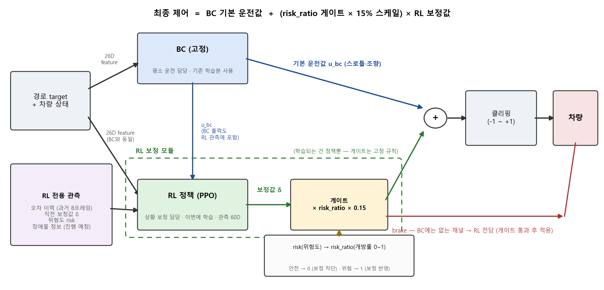
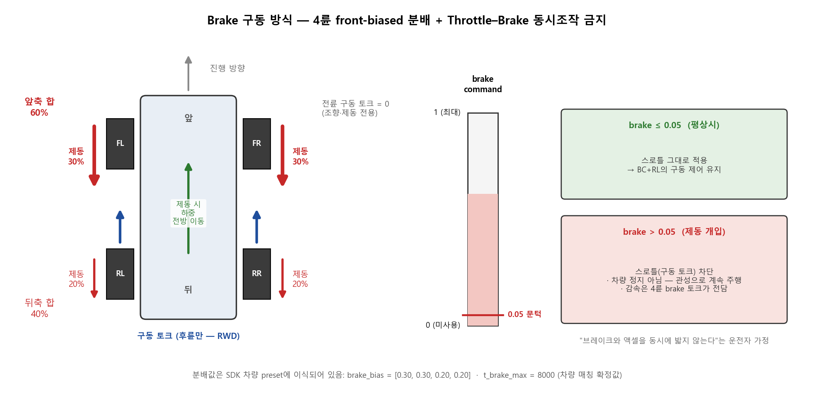
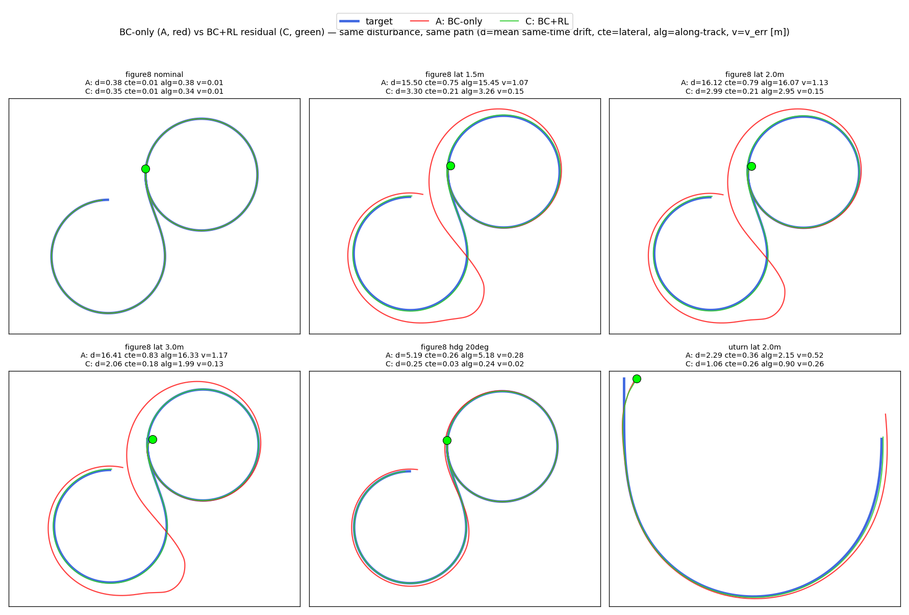
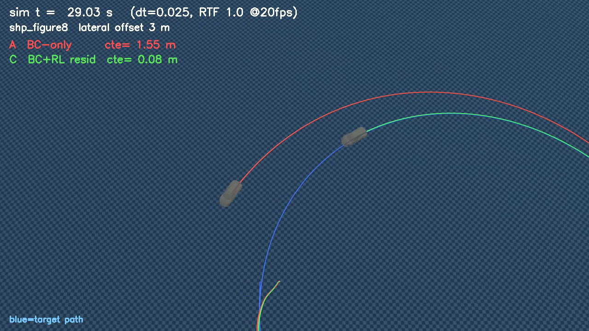
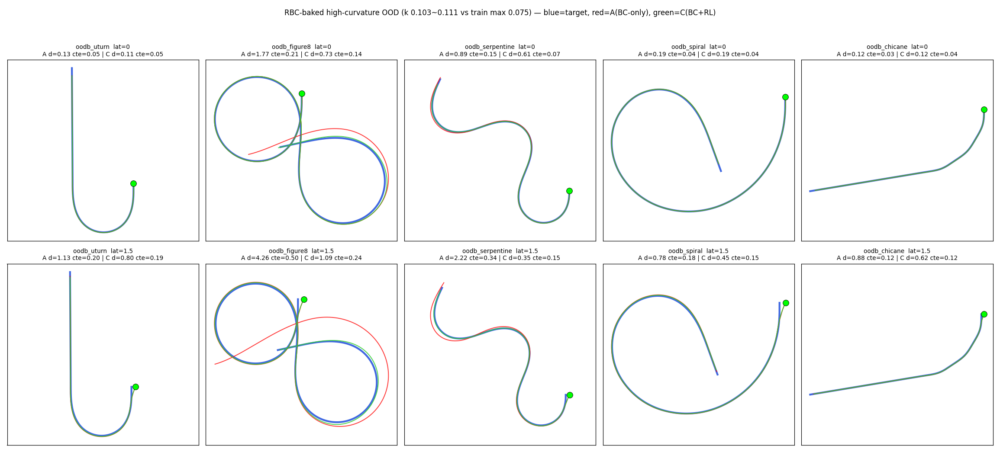

# BC Frozen + Residual RL v2 — RL 재설계

## 1. 전체 구조

한 줄 요약: **최종 제어 = BC가 낸 기본 운전값 + (위험할 때만, 조금만 섞이는) RL 보정값.**



- **BC (고정)**: 평소 운전 담당. **기존 학습본 BC를 그대로 사용**. → BC 성능이 하한으로 보존됨.
- **RL 정책 (PPO)**: 상황 보정 담당. -> 기존 BC가 잘 따라가지 못하거나 외란 상황이 발생한 것을 보정해줌. 
- **위험도 게이트 (soft intervention)**: 보정값을 그대로 더하지 않고 두 가지를 거침 -> residual이 기존에 잘 수행하는 BC를 망치는 것을 방지하기 위함.
  1. **risk_ratio (게이트 개방률)**: 위험도 risk를 0~1의 개방률로 환산한 값. 안전하면 0(보정 완전 차단 = BC 그대로), 위험하면 1(보정 전부 반영).
  2. **0.15 스케일**: 게이트가 활짝 열려도 보정의 최대 크기는 BC 출력 범위의 15%로 제한 — RL은 어디까지나 **"보정"**
- **brake**: BC 출력에는 없는 채널이라 RL이 전담. 같은 게이트를 거쳐 적용됨.

<details><summary>수식 (구현 세부)</summary>

```
u_bc       = BC_frozen(26D feature)                 # 정본 path2st (청크 + overlap m=25)
δ, b       = PPO(60D observation)                   # [δ_throttle, δ_steer, brake_raw]
risk       = 1.0·|cte| + 2.0·|Δheading| + 0.3·|Δv| + 0.3·v·max|κ_lookahead|
risk_ratio = clip((risk − RISK_LO) / (RISK_HI − RISK_LO), 0, 1)   

RISK_LO = 0.5   # 하한 — nominal 주행의 위험도 수준 (실측 캘리브레이션 값) -> 초기값 0.15으로 했을 때 과잉 보정으로 기존 BC를 망침
RISK_HI = 1.5   # 상한 — 명백한 위기 수준 (단순 설계값)

# 스케일 0.15 — 구세대 실측 경계의 중간값 (0.2=BC 파괴 / 0.05~0.1=포화·무력).    

throttle = clip(u_bc_thr + risk_ratio·0.15·δ_thr, −1, 1)
steer    = clip(u_bc_str + risk_ratio·0.15·δ_str, −1, 1)
brake    = risk_ratio·clip(b, 0, 1)
```
</details>

---

## 2. State (관측) 정의

**Actor:  입력 60 → Linear 256 → ELU → Linear 128 → ELU → Linear 3** 

* 파라미터 수: 약 48900개

**Actor 관측 60D:**

| 입력 | 차원 | 내용 | 근거 |
|---|---|---|---|
| BC feature | 26 | BC 입력 그대로 (Δv, Δheading, cte, v, κ, 미래 κ×10, 미래 v×10, dv_rate) | BC와 같은 상황 정보를 봐야 보정 판단이 가능 |
| BC nominal 액션 | 2 | u_bc (throttle, steer) | 잔차는 u_bc에 더해져 평가되므로 "무엇을 보정하는지"를 알아야 함 — 잔차 학습(Residual Policy Learning) 문헌의 표준 관행 (Trumpp 2023 등) |
| 오차 이력 | 24 | 과거 8프레임(1/24s 간격) × (cte, Δheading, Δv) | 현재 오차만으론 이탈 중인지 복구 중인지 구분 불가 -> 오차의 추세를 봐야 과잉/과소 보정을 피함 |
| 직전 잔차 | 2 | δ_{t−1} = ( δ_throttle(t−1),  δ_steer(t−1) ) | smoothing 효과 |
| 위험도 | 1 | risk score | soft intervention |

**Critic: 입력 64 → Linear 256 → ELU → Linear 128 → ELU → Linear 1** 

* 파라미터 수: 약 49700개

**Critic 관측 = 60D + 특권 관측 4D** (torque_scale, mu_scale(마찰), 초기 lateral/heading 외란 크기):   
- asymmetric actor-critic(대규모 병렬 RL 표준 - 사족보행 로봇 RL(rsl_rl 계열, 참고문헌의 Rudin 2021))   
-> critic만 env별 조건 랜덤화(torque, 마찰, 외란)의 실제값을 보고 value 분산을 줄여 학습의 안정화를 도움.

---

## 3. Action / Brake 구동 방식

action = `[δ_throttle, δ_steer, brake]` 3D. -> BC 출력(s,t)에는 brake 개념이 없으므로 감속 제어는 RL이 담당.



- brake command ∈ [0, 1]. 0 = 미사용, 1 = 최대. 
- 차량은 후륜구동 유지 — drive torque는 후륜만
- 실차의 제동 하중 이동을 반영한 **4륜 front-biased 분배(front 60% / rear 40% = 휠별 FL/FR 30%/30% + RL/RR 20%/20%)** — **SDK의 차량 preset에 적용되어 있어 그대로 사용**
- **Throttle–Brake hard constraint** (동시에 밟지 않도록) :

```
if brake > 0.05:
    effective_throttle = 0        # drive torque 차단 (차량 정지 아님 — 관성 유지, 감속은 brake torque)
else:
    effective_throttle = throttle
```

- 현재는 brake를 직접 보상하는 항은 두지 않음(간접 학습 원칙 — reward hacking 방지).   
-> 즉, 다시 말해 brake 사용에 보상을 주면 계속 brake만 밟으려고 할 수 있음.   
- 학습 결과 brake 평균 사용률 1.6%로 **위험 시에만 사용하는 행동이 학습됨**

---

## 4. 보상함수

현재 reward 주요 구성:

```text
reward =
  + 추적 점수 (0~1점)                              ← 오차가 작을수록 1점에 가까움
  - action_smoothness_weight × 제어 급변 페널티     (‖Δu‖² — 급정거·급가속 억제)
  - residual_weight          × 잔차 크기 페널티     (‖δ‖² — 불필요한 보정 억제)

이탈(|cte| > 3m) 시: 에피소드 종료 + 추가 감점 10

추적 점수 = exp( −(cte_weight × cte error + heading_weight × heading error + speed_weight × speed error) )
```

- **감점식이 아니라 "점수식"인 이유**: 오차를 계속 빼는 감점식이면, 큰 외란을 받은 에피소드는 회복하는 동안 감점 누적이 이탈 감점(−10)보다 훨씬 커짐.   
-> 감점식은 학습을 일부러 이탈하는 방향으로 하여 제대로 학습이 되지 않음.(추적 점수를 0~1로 묶으면 최악이어도 0점이라, 살아서 회복하는 쪽이 항상 이득)
- 오차가 아주 클 때도 학습 신호가 죽지 않도록 exp를 두 스케일로 평균((exp(−err) + exp(−err/8))/2)   
-> 예를 들어 exp(−err) 하나만 쓰면 err가 8 -> 6 으로 줄여도 둘 다 거의 0에 수렴해 보상이 거의 없게 됨. 
- cte·속도 오차는 2를 넘는 구간부터(그 전까지는 제곱으로) 선형(Huber형)으로 완만하게 함   
-> 외란 직후 페널티 폭주로 value 학습이 붕괴하는 것 방지(실측: value loss 2294 → 1~3).

---

## 5. 학습 설정 및 규모

| 항목 | 값 |
|---|---|
| 알고리즘 | PPO (rsl_rl 2.2.4), actor/critic [256, 128] ELU, init_noise_std 0.2 |
| PPO 하이퍼파라미터 | lr 3e-4(adaptive, desired_kl 0.01), γ 0.99, GAE λ 0.95, clip 0.2, epochs 5, minibatch 4 |
| 환경 | 1024 env GPU 배치, dt = 0.025 (SDK 기본) |
| 훈련 경로 | **153개 (rnd 76 + mnv 77)** — BC 학습셋과 동일. **도형 5종(shp)·flatbk/flatlongbk/route 32개·oodb 5개는 전부 미학습(홀드아웃)** |
| 외란/조건 (per-env 랜덤) | lateral U(±2.0m), heading U(±15°), 초기속도 ×U(1.0, 1.4), torque ×U(0.6, 1.1), 랜덤 시작점 |
| **Iteration** | **4,000회** (iter당 1024 env × 24 step 롤아웃) |
| **총 학습량** | **98,304,000 env-step** |
| **소요 시간** | **2,514초 = 41분 54초** (~39,000 env-step/s) |
| 체크포인트 | **iter 4000 최종본**사용|

---

## 6. 결과

### 6.1 A(BC-only) vs C(BC+RL) — 동일 외란·동일 경로 쌍 비교

| 시나리오 | | drift (m) | max | cte(횡) | along(종) | v_err (m/s) |
|---|---|---|---|---|---|---|
| figure8 nominal | A | 0.38 | 0.49 | 0.008 | 0.38 | 0.01 |
| | C | 0.35 | 0.43 | 0.009 | 0.34 | 0.01 |
| figure8 lat 1.5m | A | 15.50 | 39.8 | 0.75 | 15.45 | 1.07 |
| | C | **3.30** | 5.11 | **0.22** | 3.27 | 0.15 |
| figure8 lat 3.0m | A | 16.41 | 42.1 | 0.83 | 16.33 | 1.17 |
| | C | **2.06** | 4.10 | **0.18** | 1.99 | 0.13 |
| figure8 hdg 20° | A | 5.19 | 10.9 | 0.26 | 5.18 | 0.28 |
| | C | **0.25** | 0.42 | **0.03** | 0.25 | 0.02 |
| uturn lat 2.0m | A | 2.29 | 6.38 | 0.36 | 2.15 | 0.52 |
| | C | **1.06** | 2.77 | **0.26** | 0.91 | 0.26 |




### 6.2 주행 대표 영상 (lat 3)

https://github.com/user-attachments/assets/418b5d0e-c71b-44ec-83e9-2b6745626fdd



t=29s 장면: 같은 외란에서 C(초록)는 target 선 위에 붙어 있고, A(빨강)는 원호 바깥으로 밀려 다른 궤도를 돌고 있음 (실시간 cte는 화면 HUD 참조).

### 6.3 OOD 결과

| 경로 (κ_max) | 조건 | A drift (max) | C drift (max) | 배율 |
|---|---|---|---|---|
| oodb_uturn (0.106) | 무외란 | 0.13 (0.19) | 0.11 (0.20) | 동급 |
| **oodb_figure8 (0.103)** | **무외란** | **1.78 (10.1)** | **0.73 (2.7)** | **2.4×** |
| oodb_serpentine (0.111) | 무외란 | 0.89 (2.3) | 0.61 (1.0) | 1.5× |
| oodb_spiral (0.110) | 무외란 | 0.19 | 0.19 | 동급 |
| oodb_chicane (0.070) | 무외란 | 0.12 | 0.12 | 동급 |
| oodb_uturn | +횡 1.5m | 1.13 | 0.80 | 1.4× |
| oodb_figure8 | +횡 1.5m | 4.26 (18.6) | **1.09 (1.9)** | 3.9× |
| oodb_serpentine | +횡 1.5m | 2.22 | **0.35** | **6.4×** |
| oodb_spiral | +횡 1.5m | 0.78 | 0.46 | 1.7× |
| oodb_chicane | +횡 1.5m | 0.88 | 0.62 | 1.4× |



---

## 7. TODO

- **RL-2차 (장애물 상황 대응)**: 정적/돌발 장애물 시나리오를 30% 비율로 이어서 학습   
-> 급브레이크·감속 회피라는 "BC가 구조적으로 불가능한" 행동 학습. brake의 존재 가치가 본격 검증되는 단계.

