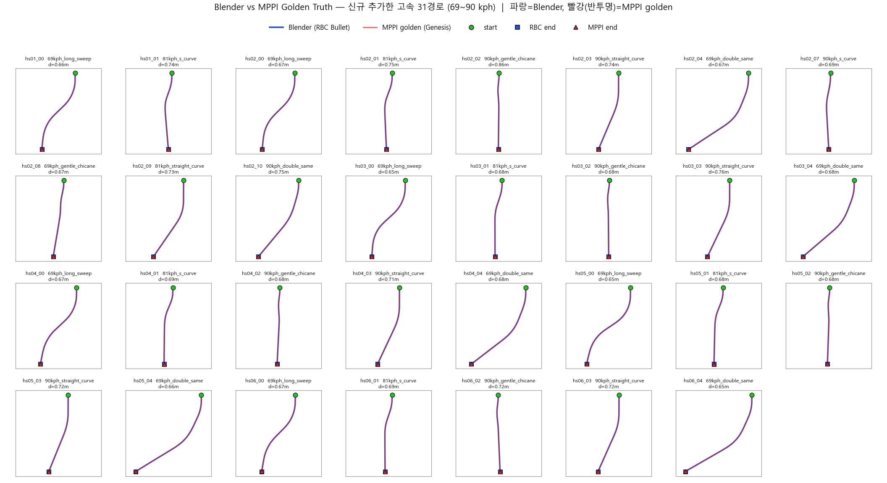
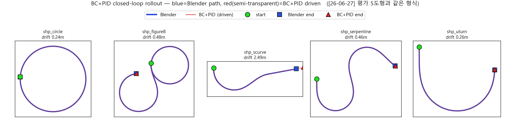

# 속도(throttle) 제어 분리 (BC → PID) + 조향 RL 잔차 — 고속 주행 대응

``조향은 BC가, 속도는 PID가, 제동은 RL이 맡는 구조로 변경``

---

## 1. 전체 구조


한 줄 요약: **조향 = BC 기본값 + (위험할 때만, 조금만 섞이는) RL 보정 / 스로틀 = PID 전담 / brake = RL 전담.**

- **BC (고정)**: 조향의 평상시 담당. 기존 학습본 그대로 사용 -> BC 성능이 하한으로 보존
- **RL 정책 (PPO)**: **조향 잔차 + brake** 담당. 이탈·외란처럼 BC가 못 따라가는 상황을 보정
- **위험도 게이트**: `ratio × 0.15 × min(v0/v, 1)²` (`v0` = 20 m/s = 72 kph 고정). 기존과 다르게 `min(v0/v, 1)²` 추가
  - 같은 조향 잔차의 크기라도 고속에서는 더 큰 영향을 받기 때문에(횡가속이 v²에 비례) 72 kph 위에서만 그만큼 영향력을 줄여주는 역할 -> 고속에서의 진동을 막기 위함.  
  (**7번**의 비교 영상 참조)
  - 실차에서의 속도감응형 조향(고속에서 조향비를 둔하게) 개념과 비슷
- **PID**: throttle 전담. **RL throttle 잔차는 완전 차단(`s_thr = 0`)** -> PID만으로도 속도 추종 성능이 충분함. 오히려 RL이 throttle에 개입했을 때 속도 추종 성능이 하향됨. 
- **brake**: RL이 전담(v3와 동일)

---

## 2. 개요 - BC + PID

한 줄 요약: **조향처럼 비선형적인 요소(고속일수록 원심력·언더스티어 증가)가 많은 것은 학습을 통해, 속도처럼 1차원 추종은 PID로 간단하게 구현.**

- v3까지는 BC가 s·t를 **둘 다** 하였지만 고속에서의 성능이 나오지 않음.  
그 원인이 BC(모방학습)라는 방식 자체의 구조적 한계(인과 혼동)여서 둘을 분리하여 속도는 **1차원 추종(PID)** 로 구현함.

### 2.1 고속에서의 문제점

BC가 s·t를 둘 다 내는 기존 구조에서의 결과:

| BC 학습셋 | dyn_spd16 (58 km/h) | dyn_spd20 (72 km/h) | dyn_spd25 (90 km/h) |
|---|---|---|---|
| 저속 153 | **0.708** | 145.3 | 262.2 |
| 153 + 고속 31 | **14.55** | 97.3 | 152.8 |

- 고속 데이터를 넣어도 **고속은 여전히 안 되고**(72 km/h 97 m), 오히려 잘 되던 **저속 58 km/h가 0.708 -> 14.55로 20배 악화**됨.

**원인은 학습 데이터의 상관 구조**:

| | 고속 골든 | 저속 골든 |
|---|---|---|
| corr(속도, 스로틀) | **−0.75** | −0.37 |
| \|스로틀\| < 0.05 비율 | 66.7 % | 45.7 % |

``고속 구간은 "속도가 높을수록 throttle 0"이라는 상관이 −0.75로 강함. BC 입력에 **절대속도**가 있으니 모델이 "고속 = 스로틀 0"을 인과로 착각   
-> 속도 오차가 생겨도 throttle을 0 근처에 고정해 복원하지 못함.(**Codevilla et al.(ICCV 2019)의 inertia problem**(정지 상태에서 "저속=가속 안 함"을 배워 재출발 못하는 현상)와 대칭)``

### 2.2 PID(Proportional–Integral–Derivative) / Feedforward

**PID = "목표와 현재의 차이(오차)에 비례해 밀어주는" 제어기.**

| 항 | 의미 | 우리 경우 |
|---|---|---|
| **P** (비례) | 오차에 비례해 밀어줌 | 목표속도보다 느리면 그만큼 throttle ↑ |
| **I** (적분) | 오차가 오래 쌓이면 추가로 밀어줌 | 실제 적분 대신 종방향 위치오차로 대체(이미 reference가 존재하므로) |
| **D** (미분) | 오차가 빠르게 줄면 미리 완화 | 오차의 변화율에 반응해 진동 억제(따로 항 존재x -> P항이 같은 역할을 수행) |

``-> throttle을 **속도 오차(P) + 종방향 위치 오차 feedback** 으로 구성. 위치항을 넣은 이유는 속도만 맞추면 순간속도는 맞아도 위치가 조금씩 밀려 쌓이기 때문 — "목표점보다 뒤처졌으면 조금 더 가속해 따라잡아라"가 위치항에 대응(기존에 했던 pure-pursuit와 같은 아이디어).``

**Feedforward**: Feedback은 "이미 벌어진 오차"에 반응하므로 항상 한 박자 늦음. 경로를 미리 줘 대처가 가능하도록 함.

```
throttle = k_ff·a_ref  +  k_p·(v_ref − v)  +  k_a·along_err
           └ FF ┘         └ P ┘              └ I 역할 ┘
```

| 항 | 무엇을 보나 | 하는 일 |
|---|---|---|
| `k_ff·a_ref` | 경로가 요구하는 **목표 가속** | 오차 나기 전에 정답의 대부분을 **미리** 넣음 (개루프) |
| `k_p·(v_ref − v)` | **속도오차** | 목표보다 느리면 그만큼 더 밟음 (feedback) |
| `k_a·along_err` | **종방향 위치오차** | 위치가 밀렸으면 따라잡음 (feedback) |

실험 결과(90 km/h):

| 스로틀 방식 | drift | v_err |
|---|---|---|
| PID (속도+위치) | 2.87 m | 0.07 |
| **PID + feedforward** | **0.985 m** | **0.049** |

---

## 3. 학습 경로 데이터셋

### 3.1 경로 모양과 속도

**기존 BC에 아래와 같은 고속 경로 31개 추가 학습**



| 그룹 | 경로 수 | 최고속도 (km/h) | 최대 횡가속 (m/s²) | 경로 길이 (m) |
|---|---|---|---|---|
| 저속 완만 (rnd) | **76** | 30~58 (평균 48) | 1.30 | 57~94 |
| 저속 회전 (mnv) | **77** | 17~52 (평균 27) | 1.38 | 48~105 |
| **고속 (hs)** | **31** | **69~90 (평균 80)** | 1.38 | 622~832 |
| **합계** | **184** | 17~90 | **전부 2.0 이하** | 48~832 |

- **속도 대역**: 저속셋은 58 km/h가 상한이고, 고속 31경로가 69·81·90 km/h 세 밴드를 채움 -> 학습 분포가 17~90 km/h로 확장됨.
- **도로규격 준수**: 184경로 전부 최대 횡가속 ≤1.38 m/s²로 한계 2.0 아래. 고속이라고 더 험한 게 아니라 **속도가 높은 만큼 곡률을 낮춰** 같은 한계 안에 들어옴.
- **속도 프로파일**: 모든 경로가 **v=0에서 출발**해 목표속도까지 가속한 뒤 유지

### 3.2 미학습 OOD 결과




| 도형 | 06-27 (BC) | BC+PID |
|---|---|---|
| circle | 0.67 m | **0.24** |
| figure8 | 0.59 m | **0.48** |
| scurve | 0.59 m | 2.49 |
| serpentine | 0.45 m | **0.46** |
| uturn | 0.44 m | **0.26** |

---

## 4. 학습 설정

**`rlsch_v4`** (정본, 26-08-02 학습 / 운용 체크포인트 = **it 2000**):

| 항목 | 값 |
|---|---|
| 알고리즘 | PPO (rsl_rl 2.2.4), actor/critic [256, 128] ELU, init_noise_std 0.2 |
| PPO 하이퍼파라미터 | lr 3e-4(adaptive, desired_kl 0.01), γ 0.99, GAE λ 0.95, clip 0.2, epochs 5, minibatch 4 |
| 환경 | `ResidualEnvV3Pid` (스로틀 baseline = PID+FF, `s_thr=0`), 1024 env GPU 배치, dt 0.025 (40 Hz) |
| BC baseline | `bc/model_chunk_all` — 저속 153 + 고속 31 통합 학습본 (§3) |
| 훈련 경로 | **175개** (rnd 76 + mnv 77 + hs 31 중 `winding`·`90kph_long_sweep` 제외) — 평가 31셀은 전부 홀드아웃 |
| 외란 랜덤화 (per-env) | lateral U(±2.0 m), heading U(±15°), 초기속도·torque 스케일, 랜덤 시작점(`t0_max_frac` 0.3) |
| 규약 | `no_reverse_above` 1.0 (전진 중 역토크 금지) |
| 규모 | 1024 env × 4,000 iter = 98.3 M env-step, **약 47분**, `save_interval 10` |


---

## 5. 결과 ① — 미학습 OOD 경로 (무외란)

| 표기 | 구성 | 의미 |
|---|---|---|
| **A** | 조향 BC + **스로틀 PID+FF** 
| **C** | A + **RL 조향 잔차 + brake**


파랑 = target(골든 경로), **빨강 = A**, **초록 = C**, ●=시작. 축은 target 기준이라 이탈한 A는 화면 밖으로 나감.


- **C는 19/19 완주, ctp 0.033~0.235 m.** A는 19셀 중 **13셀이 이탈**(ctp 7.2~58.9 m).
- **저속 5도형은 A도 완주했지만 고속에 대해서는 전혀 추종을 못함.**

---

## 6. 결과 ② — 외란 복귀

같은 경로에 **초기 횡오프셋 1.5~3 m** 또는 **헤딩오차 15°~20°** 를 주고 시작


- **A는 12/12 전부 이탈**, **C는 12/12 완주** 
- **`lag`가 대부분 ±0.2초 안** -> 밀린 상태에서 복귀하면서도 **목표속도를 동시에 지킴**. 유일한 예외가 `figure8 횡 3 m`(+1.79초)인데, 이는 **학습 외란 범위(±2 m) 밖**이라 복귀에 시간을 더 쓴 것.
- 학습 외란 상한(2 m)을 넘는 **횡 3 m**, 그리고 미학습 급곡률 + 외란 조합에서도 전부 복귀함.

### 전체 요약

| 시나리오 | 셀 | A 완주 | C 완주 | A ctp 범위 (m) | **C ctp 범위 (m)** | C lag (s) |
|---|---|---|---|---|---|---|
| 저속 5도형 (shp) | 9 | 5/9 | **9/9** | 0.03~27.4 | **0.033~0.322** | +0.13~+1.79 |
| 급곡률 5종 (oodb) | 10 | 1/10 | **10/10** | 0.05~95.2 | **0.062~0.286** | +0.12~+0.20 |
| 고속 신규 5종 (hsnew) | 8 | 0/8 | **8/8** | 7.2~81.8 | **0.139~0.249** | −0.03~+0.06 |
| 고속 급커브 4종 (brk01) | 4 | 0/4 | **4/4** | 15.6~40.6 | **0.139~0.218** | +0.18~+0.48 |
| **합계** | **31** | **6/31** | **31/31** | 0.03~95.2 | **≤ 0.322** | −0.03~+1.79 |

-> **미학습 31셀 전부 완주, ctp 최대 0.322 m.** 같은 배치·같은 물리에서 A(RL 없음)는 6/31.

---

## 7. 결과 ③ — 긴 경로 주행 영상 (고속 조향 진동 해결 + iteration 별 진화)

### 7.1 같은 iteration 비교 (it 2000)

| **min(v0/v, 1) 없음** — `rlsch_v3 @ it 2000` | **min(v0/v, 1) 적용** — `rlsch_v4 @ it 2000` |
|---|---|
| https://github.com/user-attachments/assets/ad2c2266-7816-48fd-9e12-a32f573fa664 | https://github.com/user-attachments/assets/a53cd9c1-6b9b-4e2d-bcfe-53c48cb24a95 |
| 시간 drift 평균 **0.75 m** / 최대 3.17 | 시간 drift 평균 0.87 m / 최대 3.47 |
| 90 kph 구간 **횡가속 ripple(떨림) 5.09 m/s²** | 90 kph 구간 **횡가속 ripple(떨림) 1.04 m/s²** (**−80 %**) |

### 7.2 iteration 별 진화

| **min(v0/v, 1) 없음** — `rlsch_v3` | **min(v0/v, 1) 적용** — `rlsch_v4` |
|---|---|
| https://github.com/user-attachments/assets/5074e4e3-eaa1-493c-b001-c47bbd4e6300 | https://github.com/user-attachments/assets/78976653-565e-4756-a1f7-236939734814 |

### 7.3 수치 — 5경로 × 두 iteration


| 경로 | 구간 평균속도 | **it 2000** 없음 -> 적용 | 변화 | **it 3990** 없음 -> 적용 | 변화 |
|---|---|---|---|---|---|
| dyn24_road (영상 경로) | 83~85 kph | 5.09 -> **1.04** | **−80 %** | 4.98 -> **2.90** | −42 % |
| brk01_00 (90 kph 급커브) | 80~82 kph | 5.05 -> **1.52** | **−70 %** | 6.13 -> **3.09** | −50 % |
| hsnew_01 (81 kph) | 80~81 kph | 4.92 -> **1.14** | **−77 %** | 5.39 -> **1.48** | −73 % |
| hsnew_02 (90 kph) | 88~89 kph | 6.65 -> **1.05** | **−84 %** | 6.26 -> **2.01** | −68 % |
| hsnew_03 (90 kph) | 89 kph | 6.89 -> **0.95** | **−86 %** | 6.55 -> **1.70** | −74 % |

- **5경로 모두 it 2000이 우세**
