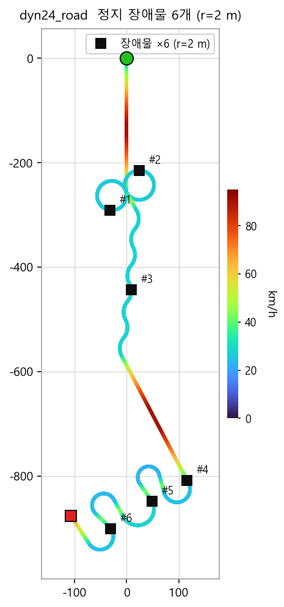
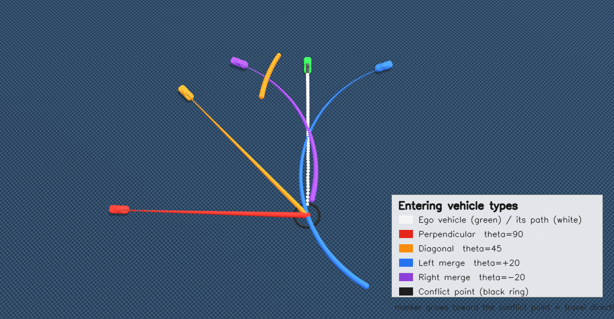

# 장애물 회피 RL — 정지 장애물 / 시야 제한 / 진입 차량

## 요약 (10줄 이내)

**지난 지시 (2026-08-07)** — 키워드 3줄
- 골든 데이터를 MPPI 에서 sweep table 로 전환한 라인으로 재학습·비교
- 남은 RL 과제(장애물) 착수
- 체크포인트는 회피·추종·진동 여러 축으로 비교해 선정

**합의 사항 → 상태**
- [완료] sweep 골든 BC + RL 확정 (`rlv2f_a`) — 31셀 31/31, 추종 오차 0.138 m
- [완료] 정지 장애물 회피 — 57.5% → 100% (40/40)
- [완료] 시야 제한 회피 — 가시거리 30 m 에서 100% (40/40)
- [미해결] 진입 차량 양보 (가로지르거나 끼어드는 차, **그림 2 참조**) 🔴

**이번 결과 / 막힌 것 / 다음**
- 결과: 정지 장애물 6개 경로 6/6 통과, 최소 여유 0.64 m
- 막힌 것: 진입 차량 양보 — 속도를 PID 가 정하고 RL 은 그 위에 잔차만 더해서, 정책이 감속을 내도 속도가 안 떨어짐 **판단 필요** 🔴
- 다음: 제동 명령이 PID 목표속도까지 낮추게 바꾼 재학습 결과 확인

---

## 1. 시험 조건



**그림 1.** `dyn24_road` 경로(색 = 순간속도)와 정지 장애물 6개 위치

한 줄 요약: **`dyn24_road`(941 m, 최고 90 km/h) 위에 반경 2 m 정지물 6개, 대조군은 같은 정책에 장애물 관측만 가린 것.**

- 장애물 위치: 경로 진행률 12 / 28 / 44 / 60 / 76 / 92 %
- **대조군을 잔차 0(BC+PID)으로 두면 안 됨** — 미학습 경로에서 추종 오차가 10.9 m 라 장애물 근처를 지나지 않음  
-> 관측만 가리면 주행 성능은 같고 장애물 정보만 없어짐. 차이가 곧 회피 능력
- 경로가 스스로 교차하는 구간은 제외. 고리(loop) 두 개가 겹쳐서, 진행률로 놓으면 다른 구간과 위치가 겹침 -> 도달 예정 30.6 초인 장애물에 14.7 초에 부딪힘

세 정책이 같은 물리 조건에서 동시 주행, 충돌 차량은 그 지점에 정지.

https://github.com/user-attachments/assets/879efe2d-091e-451d-87c9-fac3053f9013

---

## 2. 학습 단계별 결과

| 정책 | 통과 | 장애물별 최소 여유 [m] |
|---|---|---|
| it 200 | 2 / 6 | **0.03** (1번 충돌) |
| it 800 | 2 / 6 | 0.52, **0.06** (2번 충돌) |
| **it 1400** | **6 / 6** | 0.79, 2.64, 0.64, 0.74, 1.10, 0.73 |

- 회피 여유 0.03 -> 0.64 m 이상
- **학습이 단조롭게 좋아지지 않음**: it 400 통과 / 600 충돌 / 800 충돌 / 1000 통과 / 1200 통과 / 1600 충돌

---

## 3. 회피 거리 설계

한 줄 요약: **제동거리는 속도의 제곱, 조향거리는 속도에 선형 -> 40 km/h 위에서는 조향이 유일한 해가 됨.**

```
제동 한계점 (last point to brake)   d_LPB = v² / (2·a_brake)
조향 한계점 (last point to steer)   d_LPS = v·√(2·Δy / a_lat)      Δy = 회피에 필요한 횡변위
```

차량 상수는 시뮬레이션에서 직접 측정.

| 항목 | 측정값 | 설계값 (측정의 65~70%) |
|---|---|---|
| 제동 감속도 `a_brake` | 8.65 m/s² (0.88 g) | 6.0 |
| 횡가속도 `a_lat` | 11.0 m/s² (1.12 g) | 7.0 |

- 요레이트(yaw rate)로 횡가속도를 구하면 1.27~1.99 g 가 나오는데 미끄러지는 구간이 섞인 값.  
-> 속도가 유지된 정상 원선회(skidpad) 구간만 취해야 마찰 한계 안의 값이 나옴.

| 속도 | 제동거리 | 조향거리 | 대처 |
|---|---|---|---|
| 25 km/h | 4.0 m | 6.4 m | 제동 |
| **40 km/h** | **10.3 m** | **10.3 m** | 교차점 |
| 90 km/h | **52.1 m** | 23.2 m | 조향 (제동 불가) |

- 관측 범위는 90 km/h 제동거리 52 m 를 넘도록 **80 m** 로 설정

---

## 4. 회피율

| 설계 | 사전 인지 (가시 80 m) | 가림 (가시 30 m) | 31셀 완주 | 추종 오차 |
|---|---|---|---|---|
| 거리 기준 게이트 | 57.5% | — | 31/31 | — |
| 물리 기준 게이트 | 97.4% | — | 30/31 | 0.283 m |
| + 과이탈 억제 | **100%** (40/40) | — | 29/31 | 0.263 m |
| **+ 시야 제한 학습** | **100%** (40/40) | **100%** (40/40) | **31/31** | **0.197 m** |

- 가시거리 30 m + 90 km/h 는 제동거리 52 m 로 멈출 수 없고 조향거리 23 m 로만 피할 수 있는 구간. 이 조건에서 40/40
- **게이트를 언제 여는가가 핵심**. 초기 설계는 표면거리 6 m 안에서만 회피 기동을 허용했는데 90 km/h 에서 6 m 는 0.24 초.  
-> 회피 기동은 20~50 m 전에 시작해야 하는데 그 구간에서는 경로 이탈이 처벌됨. 게이트 기준을 조향거리 `d_LPS` 로 바꾸니 57.5% -> 100%

---

## 5. 진입 차량 — 미해결

### 5.1 진입 차량 정의



**그림 2.** 시뮬레이터 화면. 진입 차량은 **자차 경로를 가로지르거나 경로로 끼어드는 차**를 말함. 정지물처럼 서 있는 게 아니라 자차 도달 시각에 맞춰 교차 지점(검은 링)을 지나감. **네 칸은 각각 별개의 시나리오**로, 실제 구성은 자차(초록) 1대 + 진입 차량(빨강) 1대이고 유형은 θ·ω 값만 다름. 차량은 출발 위치에 있고, 표시가 굵어지는 쪽이 진행 방향.

- 차량 하나를 **속도 + 요레이트(yaw rate)** 로 굴리고, 교차 시점의 **진입각 θ**(경로 접선 기준)와 **요레이트 ω** 를 뽑음  
-> 네 유형이 하나의 식으로 표현됨. 별도 시나리오를 만들 필요가 없음

| 유형 | θ | ω | 실제 상황 |
|---|---|---|---|
| 직각 횡단 | 90° | 0 | 사거리 좌우에서 나오는 차 |
| 대각선 진입 | 45° | 0 | 비스듬한 합류로 |
| 왼쪽에서 합류 | −20° | +0.25 | 도로로 꺾어 들어옴 |
| 오른쪽에서 합류 | +20° | −0.25 | 반대쪽에서 꺾어 들어옴 |

- 교차 시점 상태에서 **시간을 거꾸로 적분**해 출발 위치를 정함 -> 어떤 궤적이든 정확히 그 시각에 그 지점을 지나므로 시험이 성립
- 지터 ±1 초로 "먼저 지나감 / 딱 겹침 / 늦게 옴"을 섞음 -> 안 섞으면 "무조건 정지"가 최적해가 됨

**교차점이 하나가 되도록 궤적에 세 가지 제약** — 초기 구현은 요레이트를 에피소드 내내 유지하고 θ·ω 부호를 따로 뽑아서, 진입 차량이 경로를 가로지른 뒤 되돌아왔음.

| 제약 | 이유 |
|---|---|
| 접근 중 방위 변화 \|ω·T\| ≤ 100° | T 가 길면(멀리서 출발) 원을 그림 |
| 교차점 통과 후 ω = 0 | 합류 차량은 도로에 올라탄 뒤 직진 |
| sign(ω) = −sign(θ) | 같은 부호면 가로질렀다 되돌아옴 |

- 자차와 두 번 이상 근접하는 경우 0.8% -> **0%**, 충돌 발생 env 21.9% -> 20.3% 로 학습 신호는 유지
- 경로 폴리라인 기준으로 세면 20.3% -> 12.5% 로 남지만, 굽은 경로에서 이미 지나간 구간 옆을 스치는 것까지 세어진 값. **그 시각에 자차가 있는 자리** 기준으로 세야 함
- 이 수정으로 충돌률은 바뀌지 않음 -> 아래 5.2 의 실패 원인은 아님

### 5.2 결과

한 줄 요약: **원인은 보상이 아니라 속도를 누가 정하느냐. 정책이 감속을 내도 속도가 안 떨어짐.**

- 맞는 대처는 **감속(필요시 정지) 후 통과**인데, 9회 시도 전부 충돌 9~10/10 으로 대조군과 동일
- 확인: 정책 대신 스로틀 잔차 −1 + 제동 1.0 을 **강제로** 넣음 -> 속도가 0 -> 16.3 m/s 로 계속 오름

| 구조 | 문제 |
|---|---|
| PID 가 스로틀 전담 | 기준속도(22 m/s)를 향해 계속 밀어붙임 |
| RL 은 잔차만 | 그 일부만 깎을 수 있어 못 이김 |
| 제동 게이트 | 기준속도보다 빠를 때만 허용 -> 기준속도에 닿으면 제동 0 |

-> 양보는 기준속도 **아래로** 내려가는 행동이라 PID 와 정면으로 싸워야 함. 정지 장애물은 조향 한 번으로 끝나 속도를 안 건드려도 됐고, 그래서 안 드러났음

**대응**: 제동 명령이 제동력만이 아니라 **PID 기준속도도 함께 낮추도록** 변경. 가속 페달을 떼고 제동을 거는 것과 같음. 재학습 결과 확인 중

- 목표속도를 **환경이 거리 계산으로** 낮추면 충돌이 9~10/10 -> 3~4/10 으로 줄지만, 관측을 가린 대조군도 3/10 이 됨.  
-> 환경이 대신 감속시킨 것이라 정책이 배운 게 아님. 지금은 **정책의 제동 명령**이 목표속도를 낮추게 해서 대조군이 이득을 못 보게 함.

---

## 6. 부수 확인

**행동 포화 (action saturation)** — 정책 평균 출력이 ±50~130 인데 행동은 [−1, 1] 로 잘림 -> 사실상 두 값만 내는 제어기.

| 체크포인트 | 탐색잡음 std | 출력층 가중치 평균 |
|---|---|---|
| 정상 (`rlv2f_a`) | 0.30 | **0.014** |
| 포화 (`obpid_f`) | 19.8 | 0.232 |
| std 만 초기화 | 0.19 | **0.232 그대로** |

- 잡음 크기만 되돌려서는 안 고쳐짐 -> 정상 체크포인트에서 다시 학습. 추종 오차 0.197 -> 0.148 m
- 정지 장애물 회피는 포화 상태에서도 100% 였음. 조향을 크게 한 번 트는 임무라 두 값으로 충분  
-> **한 임무 성적으로 정책 상태를 판단하면 안 됨**

**측정 지표** — 같은 시각 기준 거리(same-time drift)는 횡·종 오차가 섞여 주지표로 부적합.

- 같은 정책이 `dyn24_road` 에서 same-time drift 1.05 m, 경로까지 수직거리 0.15 m 로 7배 차이. 체크포인트 순위도 뒤바뀜  
-> **수직거리(m) + 앞섬·뒤처짐(m) + 속도오차(m/s)** 세 가지 병기

---

## 7. 다음

1. 제동 명령이 PID 기준속도까지 낮추게 바꾼 재학습 결과 확인 — 대조군 대비 개선 여부
2. 개선이 없으면 감속은 환경이 맡는 것으로 정리하고 RL 은 조향 회피·추종에 한정
3. 선행 차량(느린 앞차)은 별도 과제로 분리 — 추월 또는 차간거리 유지이지 회피가 아님. 현재 보상에 없음
