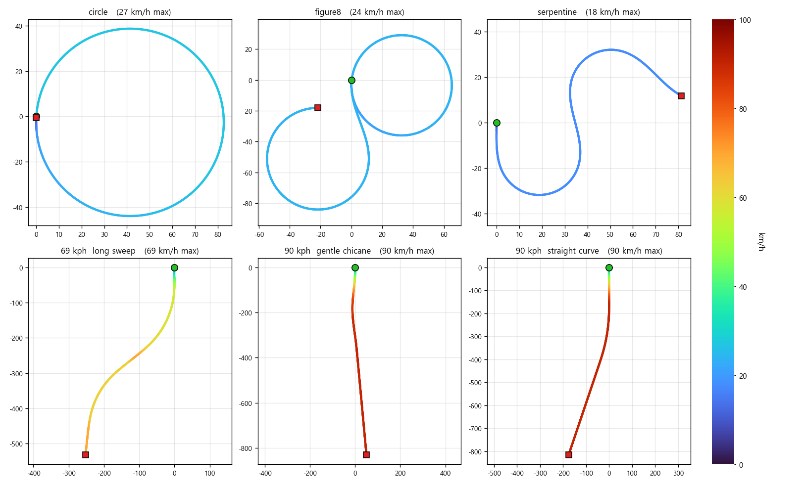
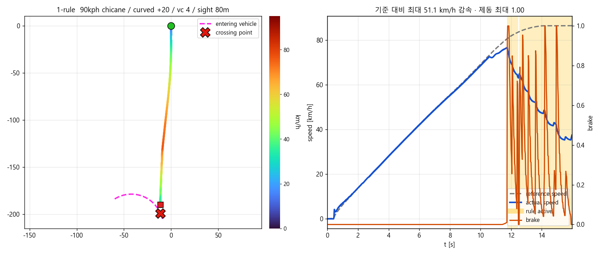
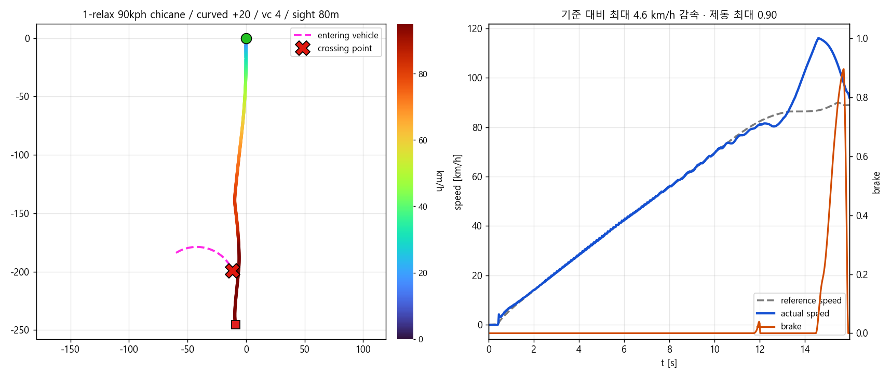
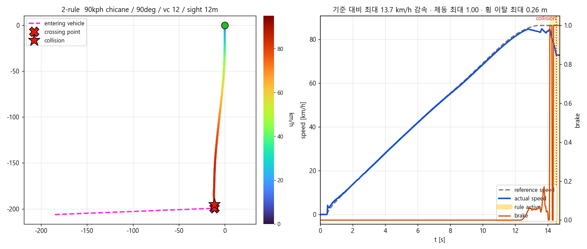
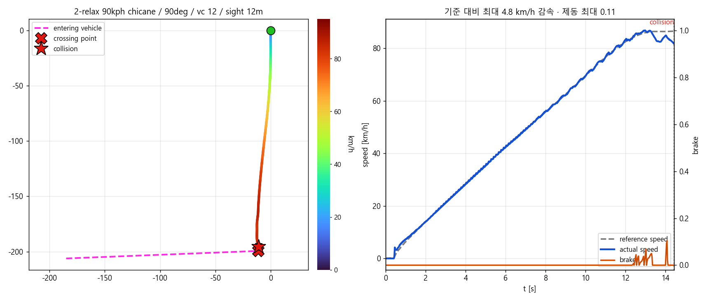
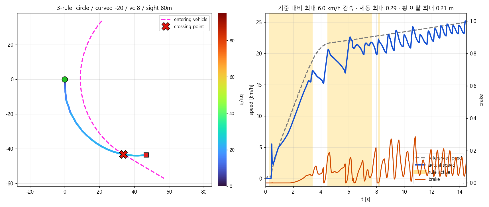
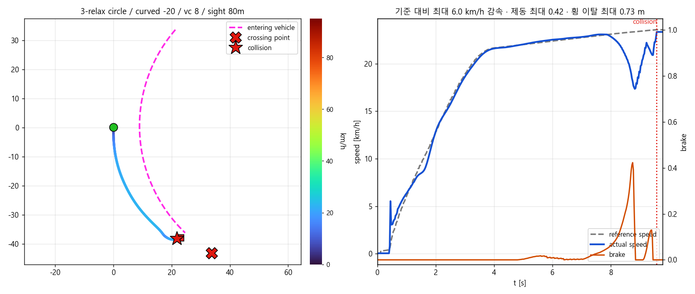

# 진입 차량 대응 RL — 규칙 정지 vs 완화 학습

## 요약

**합의 사항 → 상태**

- [완료] 규칙 대신 **시간 지연 벌점을 깎아** 제동을 쉽게 만든 학습(완화 학습)과 비교

**이번 결과 / 다음**

- 결과: **동시 도달**에서 규칙 **1.8%** vs 완화 학습 7.8%(물리적으로 설 수 있던 셀 기준). 지연도 규칙이 절반(+5.0 m vs +10.0 m)
- 결과: **완화 학습의 무충돌 456건 중 362건(79%)이 제동이 아니라 조향으로 비켜 간 것**(평균 횡 이탈 5.44 m). 규칙은 조향 회피 0건.  

- 다음: 현재 통과 판정은 발동률 1%라 거의 모든 상황에서 양보만 함. 먼저 가는 것이 맞는 상황에서는 **가속해 통과**하도록 판정과 동작을 다시 설계
- 다음: **완화 학습이 조향 대신 제동을 쓰게 하는 방안** — 진행 게이트는 이탈 허가라 제동 유도에 맞지 않음. 감속 권한 쪽(risk)을 건드리거나 횡 이탈에 별도 비용을 두는 방향으로 재실험

---

## 1. 설계

### 두 가지 접근

| | 규칙 | 완화 학습 |
|---|---|---|
| 정지 판단 | 환경이 물리 계산으로 **강제** | 정책이 스스로 |
| 제동 명령 | `max(정책, 규칙)` — 정책은 더 밟을 수는 있어도 못 품 | 정책 출력 그대로 |
| 학습 조건 | 기존과 동일 | 갈등 구간에서 **지연 벌점 80% 감면** + 진행 게이트를 제동거리 기준으로도 개방(현재 속도에서 제동으로 멈출 수 있는 구간까지는 페널티 x) |
| 의도 | RL이 못 하는 것을 규칙이 대신함 | 밟는 것이 손해가 아니게 만들어 **스스로 배우게** 함 |


### 정지 규칙(지난 보고서와 동일)

```
v_allow    = √(2 · 3.0 · (d − 3))        d = 교차 지점까지 거리, 3 m 앞에 정지
brake_rule = clamp(0.6 · (v − v_allow), 0, 1)
brake      = max(정책 제동, brake_rule)
```

교차점 3m 앞에 세우는 것을 기준 했을 때:

| 교차점까지 | 50 m | 30 m | 20 m | 10 m | 5 m | 3 m |
|---|---|---|---|---|---|---|
| v_allow | 60 km/h | 46 km/h | 36 km/h | 23 km/h | 12 km/h | 0 |

- 부딪힐 수 있는 상황에서 주행 차량의 속도가 v_allow(교차점 3m 앞에 멈출 수 있는 속도)를 넘지 않도록 brake = max(RL 정책 제동, brake_rule) 로 강제로 제한함.

---

## 2. 평가 조건

| 축 | 값 | 개수 |
|---|---|---|
| 자차 경로 | 저속 3(circle, figure8, serpentine) + 고속 3(69·90·90 kph) | 6 |
| 진입 유형 | 직각 90° · 대각선 45° · 곡선 진입 ±20° | 4 |
| 시작점에서 교차점까지 거리 | 60 m · 200 m | 2 |
| 시야 | 80 · 40 · 20 · 12 m | 4 |
| 간격 | −40 · −24 · 0 · +24 · +40 m | 5 |
| 진입차량 속도 | 4 · 8 · 12 m/s | 3 |

- **시야**: 차량이 진입 차량을 판단하기 시작한 거리.

- **간격**: 자차가 교차점을 지날 때 진입차가 교차점에서 떨어진 거리. - 양수 = 진입차가 나중에 옴. 0 m 는 동시 도달

| 자차 경로 6종 (속도색) | 진입 유형 4종 |
|---|---|
|  |  |
| 저속 3종은 곡률이 큰 형상(18~27 km/h), 고속 3종은 69·90·90 km/h | 초록 = 자차(흰 점선 = 자차 경로), 빨강 = 진입차, 검은 링 = 교차 지점. 네 유형 모두 자차 경로를 **한 번만** 가로 지름 |

---

## 3. 결과

### 3.1 규칙 vs 완화 비교

**물리적으로 못 서는 셀은 제외**했음 — 진입차를 처음 본 시점의 속도 `v`·거리 `d` 로 `v²/(2·6) ≥ d − 3` 이면 어떤 정책으로도 못 서는 조건(고속·짧은 시야). 전체 2620셀 중 약 1220셀이 여기 해당하며, 규칙 39건·완화 학습 30건이 그 안에서 발생함.

| 간격 | **규칙** | 완화 학습 |
|---|---|---|
| **동시 도달 (0 m)** | **8 / 438 (1.8%)** | 34 / 438 (7.8%) |
| \|간격\| 24 m | 4 / 565 (0.7%) | 4 / 565 (0.7%) |
| \|간격\| 40 m | **0 / 397 (0.0%)** | 2 / 397 (0.5%) |
| **전체** | **12 / 1400 (0.9%)** | 40 / 1400 (2.9%) |
| 지연 평균 | **+5.0 m** | +10.0 m |

- 양보가 반드시 필요한 동시 도달에서 규칙이 **4.3배** 안전함(1.8% vs 7.8%)
- 지연도 규칙이 **절반**. 완화 학습은 더 위험하면서 더 느림
- 여유 구간(\|간격\| 40 m)에서는 둘 다 사실상 0건 — 과잉 개입으로 사고를 만들지는 않음


### 3.2 제동회피 vs 조향회피


| 구성 | 무충돌 | 제동 회피 | **조향 회피** | 그냥 통과 |
|---|---|---|---|---|
| 규칙 | 473 | **467 (99%)** | **0 (0%)** | 6 (1%) |
| 완화 학습 | 456 | 94 (21%) | **362 (79%)** | 0 |

동시 도달 셀 전체 평균(충돌 포함):

| 구성 | 기준 대비 감속 | 횡 이탈 | 제동 최대 |
|---|---|---|---|
| 규칙 | **7.06 m/s** | **0.51 m** | **0.98** |
| 완화 학습 | 1.46 m/s | **5.44 m** | 0.18 |

- **완화 학습의 무충돌 456건 중 362건(79%)이 조향 회피**임. 평균 횡 이탈 5.44 m 로 차선을 벗어남
- 규칙은 **조향 회피 0건**, 평균 제동 0.98 로 일관되게 제동으로 풂


---

## 4. 주행 영상

장면마다 그림 두 장(왼쪽 규칙 / 오른쪽 완화 학습)과 영상 두 개를 붙임. 그림은 **자차 주행 경로를 순간속도로 색칠**한 것이고, 자홍 점선 = 진입차 궤적, X = 교차 지점, ★ = 충돌 지점임. 감속했는지는 경로 색이 파랑 쪽으로 내려가는 것으로 보임.

| 장면 | | 감속 | 제동 최대 | **횡 이탈 최대** |
|---|---|---|---|---|
| ① | 규칙 | **−58.8 km/h** | **1.00** | 0.90 m |
| ① | 완화 학습 | −4.6 km/h | 0.62 | **5.77 m** |
| ② | 규칙 | **−13.7 km/h** | **1.00** | 0.26 m |
| ② | 완화 학습 | −4.8 km/h | 0.11 | **0.85 m** |
| ③ | 규칙 | −6.0 km/h | 0.29 | 0.21 m |
| ③ | 완화 학습 | −6.0 km/h | 0.42 | **0.73 m** |

- ①②(고속)에서 규칙은 제동을 **끝까지(1.00)** 쓰고 크게 감속함. 완화 학습은 감속이 **4.6~4.8 km/h** 에 그침
- ③(저속)은 감속량이 둘 다 −6.0 km/h 로 같음. 완화 학습은 제동을 **오히려 먼저 걸었다가 놓고 조향으로 갈아타면서** 충돌함(아래 참고)
- 횡 이탈은 세 장면 모두 완화 학습이 **3~6배** 큼

### ① 둘 다 성공 — 90 kph, 곡선 진입 +20°, 동시 도달, 진입 4 m/s, 시야 80 m

| | 충돌 | 최소 여유 | 규칙 개입 | 제동 최대 | 기준 대비 감속 |
|---|---|---|---|---|---|
| 규칙 | 없음 | 10.27 m | 11.7 s 부터 | **1.00** | **−51.1 km/h** (77 → 36) |
| 완화 학습 | 없음 | 2.82 m | — | 0.90 (막판) | −4.6 km/h |

- **가장 뚜렷한 대비.** 규칙은 교차점 앞에서 제동을 끝까지 밟아 절반 아래로 줄임
- 완화 학습은 감속이 아니라 **기준속도(88 km/h)를 넘어 116 km/h 까지 가속**해 먼저 빠져나감. 충돌은 없었으나 양보한 것이 아님
- 최소 여유도 규칙 10.27 m vs 완화 2.82 m 로 3.6배 차이

| 규칙 | 완화 학습 |
|---|---|
|  |  |

**영상 — 규칙**

https://github.com/user-attachments/assets/6eadbd22-0f1d-4b09-89db-c835940751df

**영상 — 완화 학습**

https://github.com/user-attachments/assets/33ae49e4-0b0f-4b75-943b-84fed8d789e9


### ② 둘 다 실패 — 90 kph, 직각 횡단, 동시 도달, 진입 12 m/s, **시야 12 m**

| | |충돌 시 자차 속도  첫 감지 |
|---|---|---|
| 규칙 | 20.2 m/s (73 kph) | 12 m 앞 · 필요 제동거리 46 m |
| 완화 학습 | 21.5 m/s (77 kph) |  12 m 앞 · 필요 제동거리 39 m |

- **물리적으로 못 서는 조건.** 73 kph 로 달리는데 진입차가 12 m 앞에서 처음 보임


| 규칙 | 완화 학습 |
|---|---|
|  |  |

**영상 — 규칙**

https://github.com/user-attachments/assets/e7f88e50-4bd4-425a-a4cd-10acf4fe75d2

**영상 — 완화 학습**

https://github.com/user-attachments/assets/e1fcdb8d-0bbc-4c5c-84a0-7959b34394d3


### ③ 규칙만 성공 — 원형 경로, 곡선 진입 −20°, 동시 도달, 진입 8 m/s, 시야 80 m

| | 충돌 | 규칙 개입 | 제동 최대 | 기준 대비 감속 |
|---|---|---|---|---|
| 규칙 | 없음 | 0~8 s (교차점 부근에서는 꺼짐) | 0.29 | −6.0 km/h |
| 완화 학습 | **있음** | — | 0.42 | −6.0 km/h |

- **감속량은 둘이 같음**(−6.0 km/h). 완화 학습이 제동을 오히려 더 밟았음(0.42 vs 0.29). 이 장면의 차이는 감속이 아님

| t [s] | 조향 | 제동 | 횡 이탈 | 진입차까지 |
|---|---|---|---|---|
| 8.53 | +0.18 | 0.22 | −0.35 m | 7.1 m |
| 8.83 | **−0.40** | 0.11 | −0.71 m | 6.6 m |
| 9.43 | −0.78 | 0.10 | +0.05 m | 4.3 m |
| 9.58 | −0.77 | 0.00 | **+0.67 m** | **충돌** |

- **충돌 직전 조향이 튄 것이 원인.** 완화 학습의 조향이 8.5 s 에 +0.18 이었다가 0.3 s 만에 −0.40 으로 **부호가 뒤집힘**. 조향 변화율이 평시 0.14/s 에서 **6.29/s 로 45배**

| 규칙 | 완화 학습 |
|---|---|
|  |  |

**영상 — 규칙**

https://github.com/user-attachments/assets/62f182aa-1756-42ce-9a2a-5a4caeba3f57

**영상 — 완화 학습**

https://github.com/user-attachments/assets/a7f2b9d3-2366-4c65-8a4c-9ddf83920cda


## 5. TODO

- 현재 통과 판정은 발동률 1%라 거의 모든 상황에서 양보만 함. 먼저 가는 것이 맞는 상황에서는 **가속해 통과**하도록 판정과 동작을 다시 설계
- **완화 학습이 조향 대신 제동을 쓰게 하는 방안** — 진행 게이트는 이탈 허가라 제동 유도에 맞지 않음. 감속 권한 쪽(risk)을 건드리거나 횡 이탈에 별도 비용을 두는 방향으로 재실험
