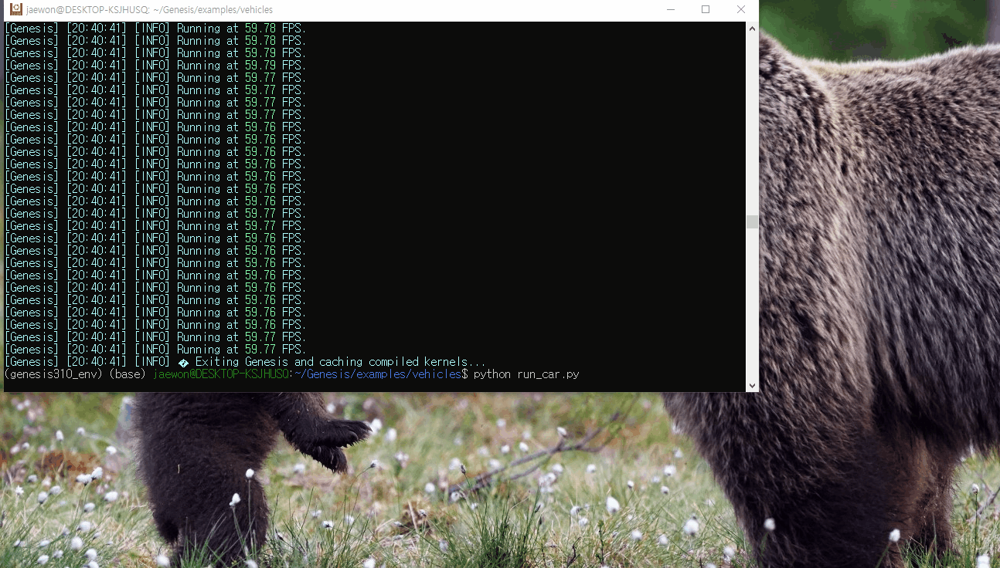

# Genesis 자동차 URDF(Unified Robot Description Format) Joint 문제 분석

>  Genesis 엔진에서 URDF를 이용해 간단한 자동차(차체 + 4개의 바퀴)를 구현하고, joint를 통해 바퀴가 차체에 부착된 상태로 회전하도록 설정하려고 하였지만, 아래와 같이 차제와 바퀴가 연결되지 않음(joint에서 문제 발생)



이와 같은 문제 해결을 위해 다음과 같은 방법으로 해결하려 함.

## 1. 축 불일치 문제

```<origin rpy="1.57 0 0">``` 때문에 cylinder(바퀴)가 위 그림과 같이 됨 -> 이 경우 cylinder의 회전축은 X축이 됨. * rpy = "roll pitch yaw" , 1.57은 radius로 약 x 축으로 90도 회전됨.

하지만 joint에서는 <axis xyz="0 0 1"/> Z축을 지정하여 ink의 실제 기하학 축과 joint 축이 안 맞아서 제약이 무시됨.

그래서 해결책으로 ```<axis="1 0 0">``` 으로 바꿈.

-> 하지만 기존의 문제는 해결되지 않고 오히려 바퀴가 바닥과의 충돌로 둥둥 떠다니는 상태가 됨.

## 2. collision 겹침 문제

chassis 박스와 wheel cylinder 위치가 살짝 겹쳐 있을 수 있음 -> 겹치면 joint solver가 초기화 단계에서 깨져서 joint가 무시됨.

> 다음과 같은 문제일 수 있어 바퀴 위치를 약간 띄워두면 안정성이 올라간다하여 다음과 같은 좌표 ```<origin xyz="0.5 0.3 0.1" rpy="1.57 0 0"/>``` 에서 x 좌표 값을 0.52로 살짝 밀어냄.   
-> 하지만 문제가 해결되지 않은 채 그대로 실햄됨.

## 3. 결론

- URDF 문법상 문제는 없음.
- Genesis의 URDF Parser가 continuous joint를 solver 제약으로 반영하지 않음. 
> `URDF Parser`: XML 파일을 읽고 해석해서, 시뮬레이터 내부 데이터 구조로 변환하는 프로그램/모듈.


## 4. 해결 방안 

### 1. MJCF(.xml) 포맷 사용

- MuJoCo 호환 포맷이라 Genesis 엔진에서 joint 지원이 더 안정적.

- 자동차와 같이 joint 의존도가 큰 구조에는 권장.

### 2. Python 코드에서 constraint 직접 추가

- URDF로 shape만 불러오고, ```scene.add_constraint(type="hinge", parent=..., child=..., axis=...)``` 방식으로 hinge joint를 걸어줌. -> 현재 Genesis 로보틱스 예제들이 이 방식을 사용
> `hinge joint`: 두 개의 부품을 연결해서 한 축(axis) 주위로만 회전할 수 있게 만드는 조인트  
URDF에서의 `revolute joint`와 비슷